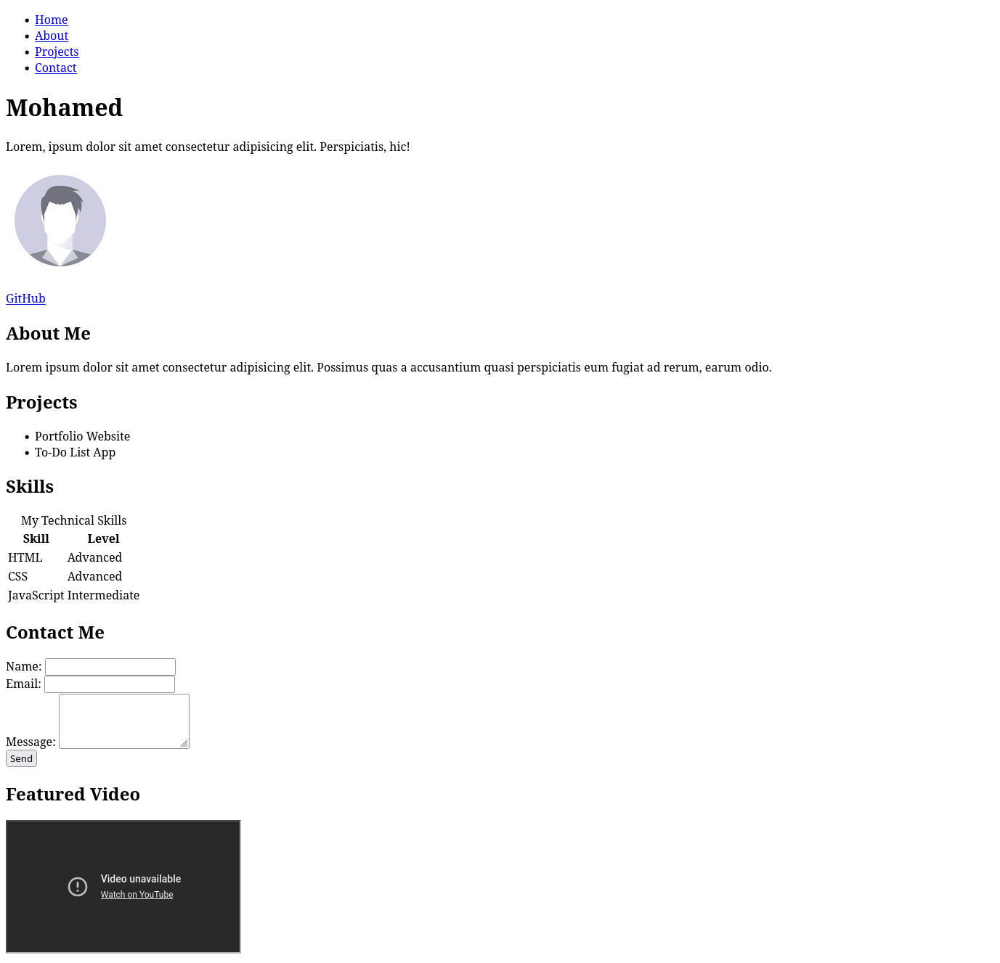

## Assignment: Personal Portfolio Page

Create a personal portfolio web page that includes:

- Your name and a short bio
- A profile image
- Links to your social media or GitHub
- At least two sections (e.g., About Me, Projects)
- Navigation links at the top of the page.
    - Those links should move you to the sections you created in the previous step (e.g., Home, About, Projects, Contact)
- A table listing your skills or education
- A contact form (name, email, message)
- Use semantic HTML elements where appropriate

---

**Bonus:**

- Add an embedded YouTube video or map
- Add a favicon and meta description

{width=70%}
