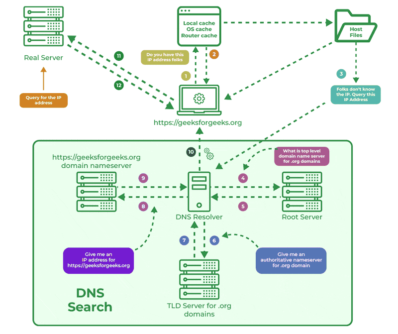
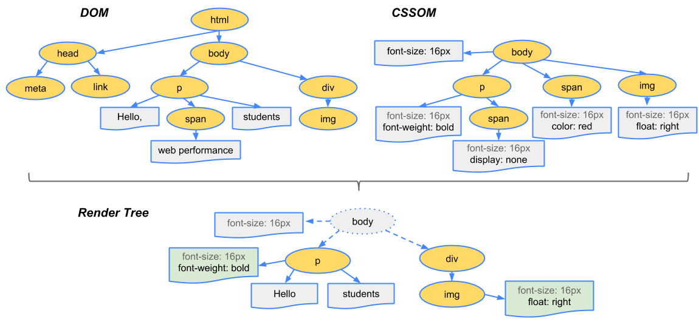

# Request-Response Lifecycle in Web Browsers

## **Step 1: User Enters the URL**

The process begins when a user enters a URL, like `google.com` into the browser's address bar or clicks a link. The browser parses this URL to determine if it's a web address, a search query, or a local file. For a web address, the browser confirms the protocol, such as HTTP or HTTPS, and gets ready to translate the domain name into an IP address.

## **Step 2: Domain Name System (DNS) Resolution**

{width=70%}

To find the server's actual location, the browser needs its IP address and performs a DNS lookup. DNS, the Domain Naming System, acts like the internet's phone book.

- First, the system checks its local cache to see if it has resolved this address recently.
- If not, it contacts the designated DNS server, which was likely assigned when the computer got its IP address from a DHCP server. This DNS server is often managed by an ISP or a dedicated provider like Google or Cloudflare.
- The DNS server returns the IP address for the domain, guiding the browser to the server's location.
- A user can manually override this by adding an entry to the system's "hosts" file, which can add a name for a local IP address or override an address for a remote site. Entries in the hosts file take precedence over DNS lookups.

## **Step 3: Establishing a Connection**

With the IP address, the browser establishes a connection using the Transmission Control Protocol (TCP). TCP is a reliable, connection-oriented protocol, unlike the connectionless User Datagram Protocol (UDP) where data packets are sent without receipt verification. TCP's reliability is crucial for web pages, as a missing packet in an HTML document could lead to a corrupted page.

TCP initiates this with a three-way handshake:

1.  **SYN**: The browser sends a SYN packet with a unique random sequence number to request a connection.
2.  **SYN/ACK**: The server replies with a SYN/ACK packet, acknowledging the request and providing its own sequence number.
3.  **ACK**: The client sends an ACK packet, acknowledging the server's sequence number, which officially establishes the connection.

If the site uses HTTPS, an SSL/TLS handshake immediately follows the TCP handshake to create a secure, encrypted channel. This involves exchanging encryption algorithms and agreeing on a shared secret key, with the server's identity authenticated via a digital certificate. This encryption is vital for protecting sensitive data like passwords or payment details. Because the SSL channel is created before the HTTP request is sent, an ISP can see the IP addresses you visit but cannot see the specific URLs on secure sites, as that information is encrypted.

## **Step 4: Sending the HTTP Request**

Now connected, the browser sends an HTTP GET request for the HTML of the page the user entered. This request contains headers with essential metadata.

- **User-Agent**: This header identifies the browser, which allows the server to customize its response based on the client's capabilities, such as its rendering settings.
- **Cookies**: These are small data pieces the server previously stored on the browser, used to recognize returning users, manage sessions, or store preferences.
- **Caching Headers**: These allow the browser to inform the server if it already has some resources stored locally and only needs updates if they have changed, which can speed up load times.

The request travels across the internet, forwarded by multiple networks and routers, until it arrives at the server's queue.

## **Step 5: Server Receives and Processes the Request**

When the request reaches the server, it's handled by web server software like Apache or Nginx. The request might be directed to backend systems if the page is dynamically generated.

## **Step 6: Backend Processing (Optional)**

If the page requires personalized or dynamic content, like a user's dashboard, a profile page, or search results, the server does more than just send a static file.

- It might query a database to get user-specific data like recent activities or saved settings.
- It may execute application logic or business rules to decide what content to show.
- It could call other services, such as payment processors, recommendation engines, or advertising services, to add relevant data to the page.

## **Step 7: Generating the Response**

After processing, the server creates an HTTP response, which includes:

- A status code, such as 200 for success or 404 for not found.
- Headers, like Content-Type to specify the data format, and caching instructions.
- The response body, which contains the page's HTML and any inline CSS or JavaScript. At its simplest, this looks just like an HTML file opened in a text editor like Notepad.

## **Step 8: Sending the HTTP Response**

The complete response travels back through routers across the internet to the user's machine.

## **Step 9: Receiving the Response**

As the browser receives the response data, it begins loading the page. The response headers inform the browser about content type, encoding, caching directives, cookies, and security policies. Since the data arrives in packets, the browser can begin handling it even before the entire response has been received. This enables a faster, more progressive rendering, meaning that while more data is still arriving, the browser can start to understand and prepare to render the page's structure.

## **Step 10: HTML Parsing and Resource Requests**

The browser's rendering engine takes over, immediately parsing the HTML document line by line. This process builds a Document Object Model (DOM), a tree-like structure in memory where each HTML element becomes a node. As the HTML is parsed, the browser finds references to external resources like CSS files, JavaScript files, and images. It then issues additional HTTP requests to retrieve them, often concurrently to reduce loading time. As CSS files arrive, the browser builds a second tree, the CSS Object Model (CSSOM), which represents the styling rules. With both the DOM and CSSOM trees, the browser can determine the layout and then "paint" the pixels on the screen. This progressive loading allows users to see content appear bit by bit. If JavaScript is present, it can modify the DOM and CSSOM in real-time, causing the rendering engine to recalculate the layout and repaint parts of the screen.

## **Step 11: The Rendering Engine**

With the files in hand, the rendering engine turns the code into the final visual layout.

1.  First, it combines the DOM (structure) and the CSSOM (styling) to form the **render tree**. This tree contains only the visible elements on the page, excluding things like `<head>` tags.

{width=80%}

2.  Next, in the **layout calculation stage**, the engine determines the precise location and dimensions of every element in the render tree. It calculates sizes based on CSS rules, accounting for responsive design like flexbox and grids. For example, if elements are set to adjust based on screen size, the engine calculates these adjustments here.
3.  Once the layout is set, the engine moves to the **paint phase**, translating the layout into actual pixels on the screen. Each visual part—text, images, borders, shadows—is painted according to its properties. The engine converts this into layers and issues drawing instructions to the GPU.
4.  Modern browsers use **layer compositing** for this. Elements with complex effects like animations, 3D transformations, or opacity changes are separated into individual layers. The GPU can then manage these layers independently, boosting performance by only updating the parts of the screen that change.

## **Step 12: GPU Processing and Display**

Finally, the GPU processes these drawing instructions from the rendering engine, updating its frame buffer with the final image that gets displayed on your screen. This intricate system of processes works together seamlessly to bring a web page to life.
