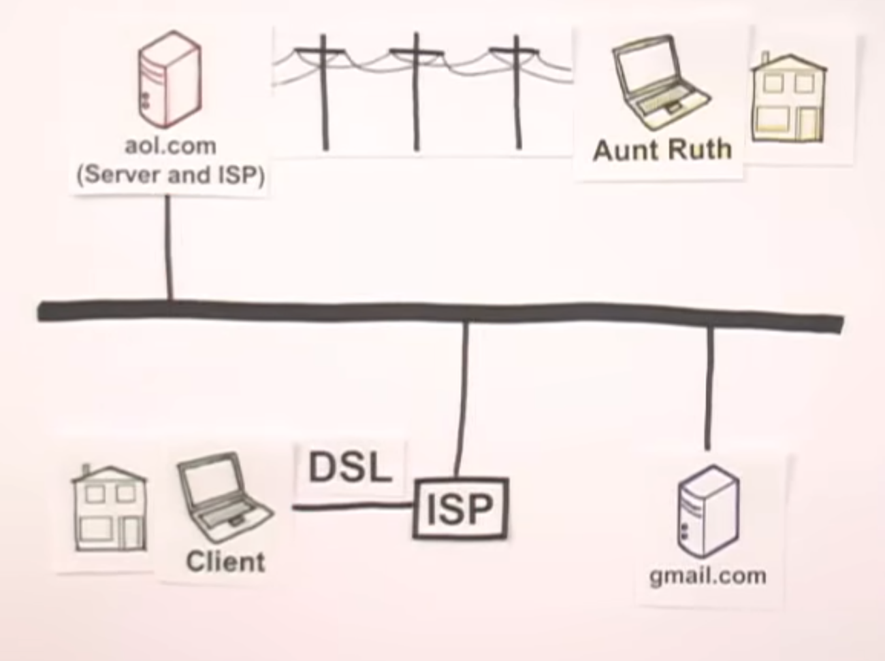
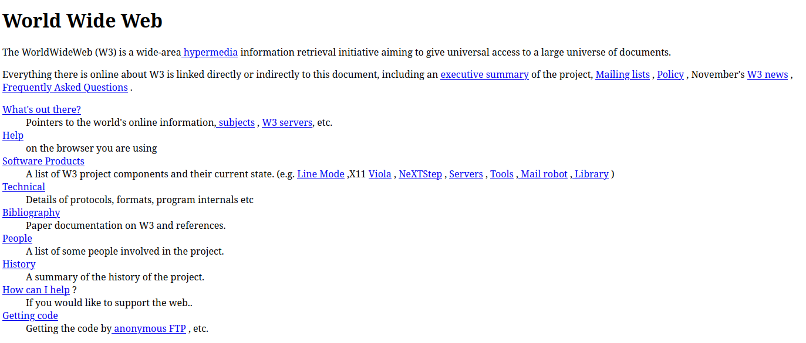
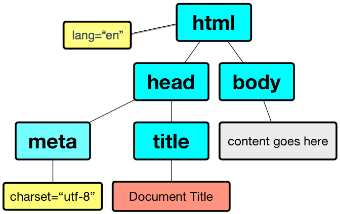
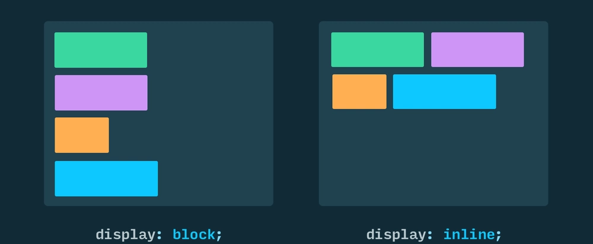

<style>
  h1{
    font-size: 45px !important;
    margin-top: 230px;
  }
  
  h2{
    margin-bottom: 10px;
  }

  pre, .slidev-code-wrapper{
    max-height: 100%;
    overflow: scroll;
  }

  /* .slidev-layout{
    overflow: scroll
  } */
</style>

<div class="text-5xl">Client Side Technologies</div>

<div class="text-l">Mohamed Emary</div>
<div class="text-sm">
  <a href="mailto:mohamed.ahmed.emary@gmail.com" target="_blank">
      <carbon:email /> Mohamed.ahmed.emary@gmail.com
    </a>
</div>

<div class="abs-br m-6 text-xl">
  <a href="https://github.com/MohamedEmary" target="_blank" class="slidev-icon-btn">
    <carbon:logo-github />
  </a>
  <a href="https://linkedin.com/in/MohamedEmary" target="_blank" class="slidev-icon-btn">
    <carbon:logo-linkedin />
  </a>
  <a href="mailto:mohamed.ahmed.emary@gmail.com" target="_blank" class="slidev-icon-btn">
    <carbon:email />
  </a>
</div>

---

<div class="text-4xl mb-3">Content:</div>

<toc/>

---

# Introduction

---

## What is Internet & How it Started?

- Internet is not WWW (World Wide Web)
- ARPA (Advanced Research Projects Agency) & ARPANET 1969
- To connects American universities and research institutions.

<!--

Cold War Era

- ARPANET used packet switching to send data between computers.
- In 1983, ARPANET transitioned to the TCP/IP protocol suite, which is still used today.
  - TCP/IP stands for Transmission Control Protocol/Internet Protocol.

- The first web browser, WorldWideWeb, was created by Tim Berners-Lee in 1990.
- In 1991, the first website was created by Tim Berners-Lee.
- The World Wide Web became publicly accessible in 1993.

-->

---

## How the Internet Works in 5 Minutes

<!-- Start the vid at 46s -->

<Youtube id="7_LPdttKXPc" width="70%" height="70%" class="m-auto mt-4" />

---

### Sending/Receiving Data



---

### Dividing Data Into Packets


---

### Routing Packets


---

## How DNS Request Works

<!-- Start the vid at 45s -->

<Youtube id="72snZctFFtA" width="70%" height="70%" class="m-auto mt-4" />

---

### DNS Lookup Steps for `www.example.com.`


---

### DNS Caching in Windows

Windows stores DNS records to speed up future requests.

Type the following in Windows CMD to get a list of cached DNS records:

```
ipconfig /displaydns
```


---

You can edit the hosts file to **_override_** a domain name, or add a custom domain to a local IP address.

Any address there takes precedence over DNS lookups.

- Windows hosts file `C:\Windows\System32\drivers\etc\hosts`
- Linux hosts file `/etc/hosts`

---

## Request/Response Life Cycle

<Youtube id="hWyBeEF3CqQ" width="70%" height="70%" class="m-auto mt-4" />

---

<div class="text-2xl mb-3">Steps:</div>

1. User Enters the URL
2. Domain Name System (DNS) Resolution
3. Establishing a Connection
4. Sending the HTTP Request
5. Server Receives and Processes the Request
6. Backend Processing (Optional)
7. Generating the Response
8. Sending the HTTP Response
9. Receiving the Response
10. HTML Parsing and Resource Requests
11. The Rendering Engine
12. GPU Processing and Display

<!--
## TCP/IP

<Youtube id="OTwp3xtd4dg" width="70%" height="70%" class="m-auto mt-4" />
 -->

---

# HTML

---

## Brief History of HTML

- HTML was invented by **Tim Berners-Lee** in 1991 while working at CERN.
- The first version allowed scientists to share documents via the World Wide Web.
- In 1998, the [W3C](https://www.w3.org/) took over HTML development, focusing on web standards.
- **HTML5** was finalized in 2014, introducing modern features for multimedia, graphics, and APIs.

<a target="_blank" href="https://en.wikipedia.org/wiki/Tim_Berners-Lee"></a>

---

- The first web page ever created by Tim Berners-Lee.:

<a target="_blank" href="https://www.w3.org/History/19921103-hypertext/hypertext/WWW/TheProject.html"></a>

---

## What is HTML?

- HTML stands for **HyperText Markup Language**
- HTML describes the **structure** of a web page using elements (tags)

---

## Basic HTML Document Structure

```html
<!DOCTYPE html>
<html>
  <head>
    <title>Page Title</title>
  </head>
  <body>
    <!-- Content goes here -->
  </body>
</html>
```



---

## Essential HTML Elements

- Headings: `<h1>` to `<h6>`
- Paragraphs: `<p>`
- Line breaks: `<br>`, Horizontal rules: `<hr>`
- Comments: `<!-- comment -->`

```html
<h1>This is a Heading</h1>
<p>This is a paragraph of text.</p>
<hr />
<!-- This is a comment -->
```

---

## Important HTML Attributes

- `id`: Unique identifier for an element
- `class`: Assigns one or more class names for styling
- `style`: Inline CSS styles
- `title`: Tooltip text shown on hover
- `alt`: Alternative text for images (improves accessibility)
- `href`: URL for links
- `src`: Source file for images, videos, scripts, etc.
- `type`: Specifies the type of input, button, or script
- `value`: Sets the value of an input or button
- `name`: Name of the input (used in form submission)
- `disabled`: Disables an element
- `data-*`: Custom data attributes for storing extra information

---

## Text Formatting

- Bold: `<b>`, `<strong>`
- Italic: `<i>`, `<em>`
- Underline: `<u>`
- Superscript: `<sup>`, Subscript: `<sub>`
- Lists: `<ul>`, `<ol>`, `<li>`, `<dl>`, `<dt>`, `<dd>`

```html
<p><strong>Bold</strong> and <em>italic</em> and <u>underline</u></p>
<ul>
  <li>Item 1</li>
  <li>Item 2</li>
</ul>
<ol>
  <li>First</li>
  <li>Second</li>
</ol>
```

---

### Exercise: Text Formatting

Create a short paragraph about your favorite food. Make the food name bold, add an italic description, and use an unordered list for at least two ingredients.

---

## Links and Navigation

- Anchor tag: `<a href="url">Link</a>`
- Absolute vs. relative URLs
- Open in new tab: `target="_blank"`

```html
<a href="https://www.example.com" target="_blank">Visit Example</a>
<a href="about.html">About Us</a>
```

---

### Exercise: Links & Navigation

Add a link to your favorite website. Make it open in a new tab. Below it, add a link to a local file called `contact.html`.

---

## Images and Media

- Images: ``
- Video: `<video src="movie.mp4" controls></video>`
- Audio: `<audio src="sound.mp3" controls></audio>`
- Embedding content: `<iframe src="url"></iframe>`

```html

<video src="movie.mp4" controls></video>
<audio src="sound.mp3" controls></audio>
<!-- YouTube embed example -->
<iframe
  width="300"
  height="200"
  src="https://www.youtube.com/embed/dQw4w9WgXcQ"
  allowfullscreen></iframe>
```

---

### Exercise: Images & Media

Insert an image of your favorite place. Add a short alt description. (Optional: Embed a YouTube video about that place.)

---

### Block vs Inline Elements

- **Block elements**: Start on a new line and take up the full width (e.g., `<div>`, `<p>`, `<h1>`, `<ul>`, `<table>`)
- **Inline elements**: Do not start on a new line and only take up as much width as needed (e.g., `<span>`, `<a>`, ``, `<strong>`, `<em>`)

```html
<div>This is a block element</div>
<span>This is an inline element</span>
```



---

### HTML Entities

- Used to display reserved characters (e.g., `<`, `>`, `&`, `"`, `©`)
- Example: `&lt;`, `&gt;`, `&amp;`, `&quot;`, `&copy;`

```html
<p>&lt;div&gt; is a block element.</p>
<p>Copyright &copy; 2025</p>
```

---

### Comments and Whitespace

- Comments: `<!-- This is a comment -->`
- Whitespace in HTML is generally ignored, but use indentation for readability

```html
<!-- This is a comment -->
<p>This has extra spaces.</p>
```

---

### File Paths in HTML

- **Absolute path**: `/images/pic.jpg` (from root)
- **Relative path**: `images/pic.jpg` (from current file)

```html


```

---

### Embedding External Content

- `<iframe src="url"></iframe>` for embedding other web pages

```html
<iframe src="https://www.wikipedia.org" width="400" height="200"></iframe>
```

---

## Tables

- Table: `<table>`
- Main Parts: `<thead>`, `<tbody>`, `<tfoot>`
- Rows: `<tr>`, Cells: `<td>`, Headers: `<th>`
- Captions, merging cells: `rowspan`, `colspan`

---

```html
<table>
  <caption>
    Front-end web developer course 2021
  </caption>
  <thead>
    <tr>
      <th scope="col">Person</th>
      <th scope="col">Most interest in</th>
      <th scope="col">Age</th>
    </tr>
  </thead>
  <tbody>
    <tr>
      <th scope="row">Chris</th>
      <td>HTML tables</td>
      <td>22</td>
    </tr>
    <tr>
      <th scope="row">Dennis</th>
      <td>Web accessibility</td>
      <td>45</td>
    </tr>
    <tr>
      <th scope="row">Sarah</th>
      <td>JavaScript frameworks</td>
      <td>29</td>
    </tr>
    <tr>
      <th scope="row">Karen</th>
      <td>Web performance</td>
      <td>36</td>
    </tr>
  </tbody>
  <tfoot>
    <tr>
      <th scope="row" colspan="2">Average age</th>
      <td>33</td>
    </tr>
  </tfoot>
</table>
```

---

### Exercise: Tables

Create a table with two columns: "Country" and "Capital". Add three rows for different countries.

---

## Forms and User Input

- Form: `<form action="" method="">`
- Inputs: `<input type="text">`, `<input type="checkbox">`, `<input type="radio">`
- Labels: `<label>`, Textarea: `<textarea>`, Select: `<select>`
- Submit button: `<button type="submit">`

```html
<form action="#" method="post">
  <fieldset>
    <legend>Contact Form</legend>
    <label for="name">Name:</label>
    <input type="text" id="name" name="name" />
    <br />
    <label for="email">Email:</label>
    <input type="email" id="email" name="email" />
    <br />
    <label for="message">Message:</label>
    <textarea id="message" name="message"></textarea>
    <br />
    <button type="submit">Send</button>
  </fieldset>
</form>
```

---

### Form & Form Input Attributes

Form Attributes:

- `action`: URL to send form data
- `method`: HTTP method (GET or POST)

Form Input Attributes:

- `type`: Type of input (text, email, checkbox, etc.)
- `name`: Name of the input (used in form submission)
- `id`: Unique identifier for the input
- `for`: Associates label with input
- `placeholder`: Placeholder text
- `value`: Default value for the input
- `minlength` & `maxlength`: Minimum/Maximum number of characters allowed

---

- `multiple`: Specifies that a user can enter more than one value in an input element.
- `accept`: Specifies the types of files that the server accepts.
- `rows`: Specifies the visible number of lines in a textarea element.
- `cols`: Specifies the visible width of a textarea element.
- `min` & `max`: Specifies the minimum/maximum value allowed in an input element.
- `checked`: Pre-selects a checkbox or radio button
- `selected`: Pre-selects an option in a dropdown
- `required`: Makes an input mandatory
- `readonly` Specifies that an input field is read-only.

---

### Input Types

- `text`: Used to create plain text input fields.
- `password`: Used to create password input fields.
- `email`: Used to create email input fields.
- `number`: Used to create numeric input fields.
- `date`: Used to create date input fields.
- `color`: Used to create color input fields.
- `url`: Used to create URL (links) input fields.
- `tel`: Used to create telephone number input fields.
- `search`: Used to create search input fields.
- `file`: Used to create file upload input fields.
- `radio`: Used to create radio buttons.
- `checkbox`: Used to create checkboxes.
- `submit`: Used to create form submit buttons.

---

- `reset`: Used to create form data reset buttons.
- `button`: Used to create buttons that do nothing.
- `range`: Used to create a range of numeric values.

---

### Exercise: Forms

Create a form with a text input for your favorite color and a submit button. Add a label for the input.

---

## Assignment: Personal Portfolio Page

Create a personal portfolio web page that includes:

- Your name and a short bio
- A profile image
- Navigation links (e.g., Home, About, Projects, Contact)
- At least two sections (e.g., About Me, Projects)
- A table listing your skills or education
- A contact form (name, email, message)
- Use semantic HTML elements where appropriate
- Add comments in your code
- Make sure your page is well-structured and visually organized

**Bonus:**

- Add links to your social media or GitHub
- Use an embedded YouTube video or map
- Add a favicon and meta description
