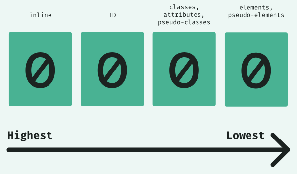
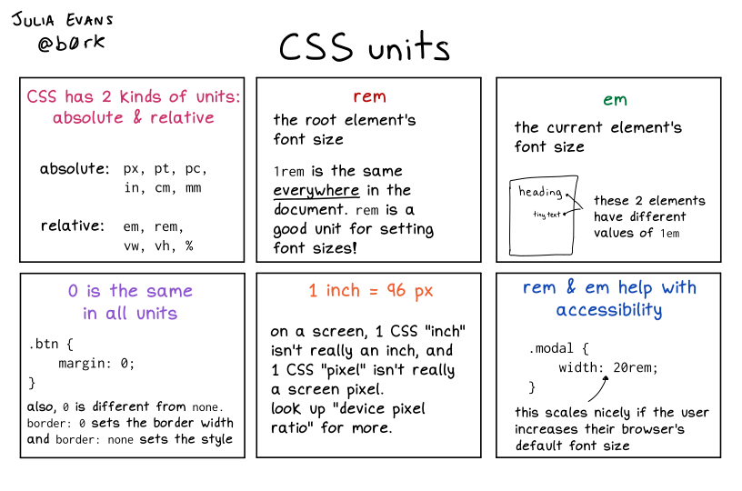
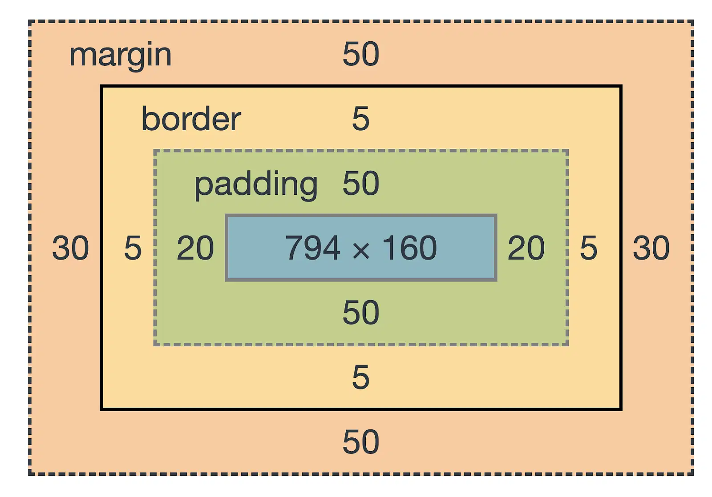
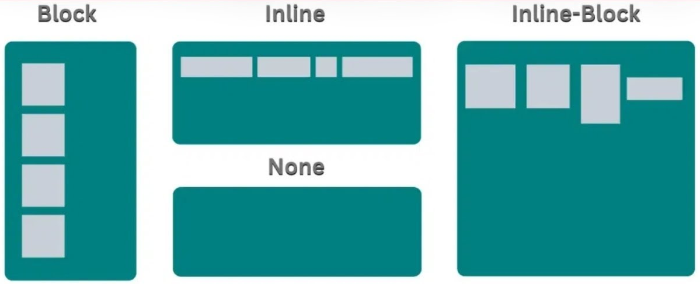
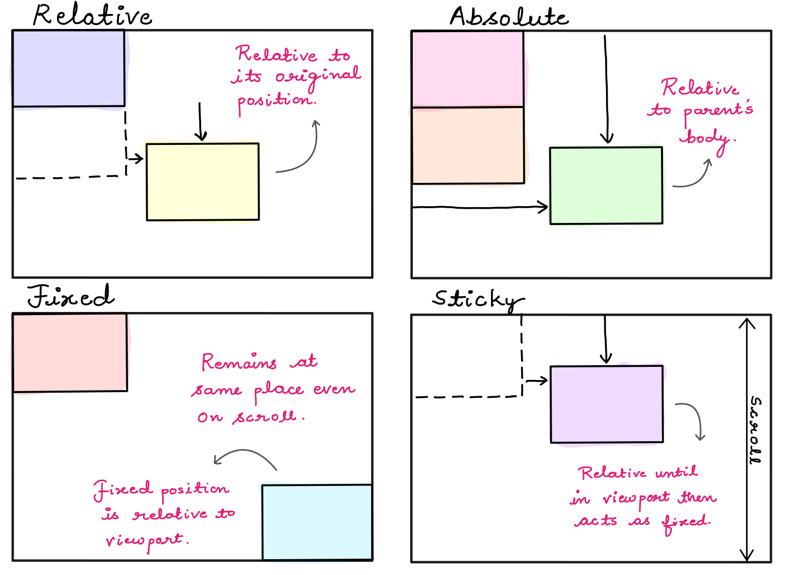

# CSS

---

## What is CSS?

- **CSS** stands for Cascading Style Sheets
- Used to style and layout web pages

---

## CSS **_Rule_** Syntax

```css
selector {
    property: value;
}
```

---

## Ways to Add CSS

- **Inline:**

```html
<div style="color: red;">Text</div>
```

- **Internal:**

```html
<style>
    p {
        color: blue;
    }
</style>
```

- **External:**

```html
<link rel="stylesheet" href="styles.css" />
```

---

## Selectors

[CSS Selectors Cheatsheet](https://github.com/MohamedEmary/ITI-client-side-tech/blob/main/other/client-side-tech/css/CSS%20Selector%20Cheat%20Sheet%20-%20Dark.pdf)

- **Universal:**

```css
* {
    margin: 0;
    padding: 0;
}
```

- **Element:**

```css
p {
    color: green;
}
```

---

- **Class:**

```css
.my-class {
    font-size: 20px;
}
```

- **ID:**

```css
#my-id {
    background: yellow;
}
```

- **Attribute:**

```css
input[type="text"] {
    border: 1px solid #ccc;
}
```

---

- **Descendant:**

```css
div p {
    color: red;
}
```

- **Direct Child:**

```css
ul > li {
    list-style: none;
}
```

- **Adjacent Sibling:**

```css
h2 + p {
    margin-top: 0;
}
```

---

- **General Sibling:**

```css
h2 ~ p {
    color: blue;
}
```

- **OR Selector:**

```css
h1,
h2,
h3 {
    font-family: Arial, sans-serif;
}
```

- **And Selector:**

```css
h1.my-class {
    color: purple;
}
```

---

- **Pseudo-class:** Represent a state of an element.

```css
a:hover {
    color: orange;
}
```

- **Pseudo-element:** Represent a part of an element.

```css
p::first-letter {
    font-size: 200%;
}
```

- **Negation `:not`:**

```css
input:not([type="submit"]) {
    border: 1px solid red;
}
```

---

- **Attribute starts with:**

```css
a[href^="https"] {
    color: green;
}
```

- **Attribute ends with:**

```css
img[src$=".png"] {
    border: 2px solid #333;
}
```

- **Attribute contains:**

```css
a[href*="github"] {
    font-weight: bold;
}
```

---

## CSS Specificity

- **Specificity** determines which CSS rule is applied by the browsers when multiple rules could apply to the same element.
- It is calculated based on different types of selectors.

---

### Specificity Calculation

Specificity is usually represented as four values:  
**(inline style, IDs, classes/attributes/pseudo-classes, elements/pseudo-elements)**



---

### Specificity Examples

- `ul#nav li.active a`  
  Specificity: **0, 1, 1, 3**
    - 0 inline styles
    - 1 ID (`#nav`)
    - 1 class (`.active`)
    - 3 elements (`ul`, `li`, `a`)

- `body.ie7 .col_3 h2 ~ h2`  
  Specificity: **0, 0, 2, 3**
    - 0 inline styles
    - 0 IDs
    - 2 classes (`.ie7`, `.col_3`)
    - 3 elements (`body`, `h2`, `h2`)

---

- `<li style="color: red;">`  
  Specificity: **1, 0, 0, 0**
    - 1 inline style
    - 0 IDs
    - 0 classes
    - 0 elements

- `ul > li ul li ol li:first-letter`  
  Specificity: **0, 0, 0, 7**
    - 0 inline styles
    - 0 IDs
    - 0 classes
    - 7 elements/pseudo-elements

---

### Key Points

- **Inline styles** have the highest specificity.
- **IDs** are more specific than classes, attributes, or pseudo-classes.
- **Classes, attributes, and pseudo-classes** are more specific than elements or pseudo-elements.
- If two selectors have the same specificity, the one that comes last in the CSS is applied.
- `!important` can override any specificity, but be careful when using it.

---

## Colors

```css
color: red;
color: #ff0000;
color: rgb(255, 0, 0);
color: rgba(255, 0, 0, 0.5);
color: hsl(0, 100%, 50%);
```

<!--
HUE
SATURATION
LIGHTNESS
-->

---

## CSS Units

**Relative vs Absolute Units:**

- **Absolute units** (like `px`) always represent the same physical size, regardless of the user's settings or device.
- **Relative units** (like `em`, `rem`, `%`, `vh`, `vw`) scale based on another value, such as the parent element's size, the root font size, or the viewport.
- Relative units helps make your layout more flexible and responsive across different devices and screen sizes.

---



---

**Example Units:**

- `px`: Pixel which is a fixed unit representing a single dot on the screen.
- `em`: Relative to the font-size of the element.
- `rem`: Relative to the font-size of the root element (usually `<html>`).
- `%`: Relative to the parent element's size.
- `vh`: Relative to 1% of the viewport height.
- `vw`: Relative to 1% of the viewport width.

[CSS Units MDN](https://developer.mozilla.org/en-US/docs/Learn_web_development/Core/Styling_basics/Values_and_units)

---

## The Box Model

```css
div {
    width: 200px;
    padding: 10px;
    border: 2px solid black;
    margin: 20px;
}
```



---

## Margin & Padding

- **Shorthand Syntax:**

```css
margin: [top] [right] [bottom] [left]; /* clockwise order */
padding: [top] [right] [bottom] [left];
```

- **Example:**

```css
margin: 10px 20px 30px 40px;
padding: 5px 10px;
```

- **Separate Properties:**

```css
margin-top: 10px;
margin-right: 20px;
margin-bottom: 30px;
margin-left: 40px;
padding-top: 5px;
padding-right: 10px;
```

---

## Border

- **Shorthand Syntax:**

```css
border: [width] [style] [color];
```

- **Example:**

```css
border: 2px solid #333;
```

- **Separate Properties:**

```css
border-width: 2px;
border-style: solid;
border-color: #333;

/* Other border properties */
border-radius: 5px;
```

---

## Display

```css
display: block;
display: inline;
display: inline-block;
display: none;
/* We will cover in a later section */
display: flex;
display: grid;
```



---

## Font

- **Shorthand Syntax:**

```css
font: [style] [weight] [size]/[line-height] [family];
```

- **Example:**

<!-- prettier-ignore-start -->

```css
font: italic bold 16px/1.5 Arial, sans-serif;
```
<!-- prettier-ignore-end -->

- **Separate Properties:**

```css
font-style: italic;
font-weight: bold;
font-size: 16px;
line-height: 1.5;
font-family: Arial, sans-serif;
```

---

## Other Typography Styles

```css
text-align: center;
text-decoration: underline;
text-transform: uppercase;
letter-spacing: 2px;
word-spacing: 5px;
```

---

## Assignment: Mini Blog Post Styling

```html
<div id="blog-post">
    <h1 class="post-title">My CSS Journey</h1>
    <h2 class="post-subtitle">Selectors and Specificity</h2>
    <p class="intro">CSS makes the web beautiful!</p>
    <div class="content">
        <p>Paragraph one. <span class="highlight">Important!</span></p>
        <p>Paragraph two. <a href="https://github.com/">Visit GitHub</a></p>
        <ul class="list">
            <li>Universal selector</li>
            <li>Class selector</li>
            <li id="special-item">ID selector</li>
            <li>Attribute selector</li>
        </ul>
        <input type="text" placeholder="Type here" />
        <input type="submit" value="Submit" />
    </div>
</div>
```

---

### Instructions

1. Set all elements’ `box-sizing` to `border-box`.
 <!--  all elements = * -->
2. Make all `<h1>` elements have a color of `#2c3e50`.
3. Set the font size of the post title to `2.5rem` and make its text uppercase.
4. Give the list item with the special ID a background color of `yellow`.
5. Make all links inside the content area green.
6. Remove the bullet points from all list items that are direct children of the list.
7. Add a red border to all text input fields.
 <!-- input[type="text"] border 1px solid red -->
8. When the user hovers over any highlighted text, change its color to orange.
9. Make the first letter of the intro paragraph twice as large as the rest of the text.
 <!-- :first-element 2em -->
10. Make all input fields except the submit button have a background color of `#f0f0f0`.
    <!-- input:not([type="submit"]) background-color #f0f0f0 -->
11. Set both the post title and post subtitle to use the font family `Arial, sans-serif`.
    <!-- h1, h2 font-family Arial, sans-serif -->
12. If `<h2>` element has `.post-subtitle` class, set its color to purple.
<!-- h2.post-subtitle color purple -->

---

13. In the HTML, override the post title color (in question 2) using an inline style (e.g., `style="color: red;"`). Then, in your CSS, write a more specific rule to change it back to `#2c3e50`.
14. Add `20px` padding, `10px` margin, and a `2px solid #333` border to the content area (`<div>` element with `.content` class).
15. Set the width of the content area to `80%` and its max-width to `600px`.
16. Center the text of the intro paragraph and underline it.
17. Make the highlighted text display as inline-block and add `10px` horizontal margin.

---

**Instructions:**

- For each task, choose the most appropriate CSS selector and property.
- Comment your CSS code to indicate which instruction you are fulfilling.
- Use the provided HTML structure for your work.

**Deliverables:**

- `blog.html`
- `blog.css` (with your CSS code)

---

## Background

- **Shorthand Syntax:**

```css
background: [color] [image] [repeat] [position] / [size];
```

- **Example:**

```css
background: #f0f0f0 url("image.jpg") no-repeat center/cover;
```

- **Separate Properties:**

```css
background-color: #f0f0f0;
background-image: url("image.jpg");
background-repeat: no-repeat;
background-position: center;
background-size: cover;
```

---

## CSS Functions

CSS functions are special keywords that perform calculations or return values for CSS properties.

### Common CSS Functions

- **`calc()`**  
  Performs calculations to determine CSS property values.

```css
width: calc(100% - 50px);
margin-top: calc(2em + 10px);
```

- **`var()`**  
  Uses the value of a custom property (CSS variable).

```css
:root {
    --main-color: #3498db;
}
color: var(--main-color);
```

---

- **`rgb()`, `rgba()`, `hsl()`, `hsla()`**  
  Define colors using red/green/blue or hue/saturation/lightness.

```css
background: rgb(255, 0, 0);
background: rgba(255, 0, 0, 0.5);
background: hsl(120, 100%, 50%);
background: hsla(120, 100%, 50%, 0.3);
```

- **`url()`**  
  Specifies a file path for images, fonts, etc.

```css
background-image: url("background.jpg");
font-family: url("font.woff2");
```

- **`min()`, `max()`, `clamp()`**  
  Set values within a range.

```css
width: min(50vw, 400px);
font-size: clamp(1rem, 2vw, 2rem);
```

---

### More CSS Functions

- **`repeat()`** (for CSS Grid)
- **`linear-gradient()`**, **`radial-gradient()`** (backgrounds)

```css
background: linear-gradient(to right, red, yellow);
background: radial-gradient(circle, red, blue);
```

[See more CSS functions on MDN](https://developer.mozilla.org/en-US/docs/Web/CSS/CSS_functions)

---

## Flexbox

### **Container Properties**

```css
.container {
    display: flex;
    /* row | row-reverse | column | column-reverse */
    flex-direction: row;
    /* flex-start | flex-end | center | space-between | space-around | space-evenly */
    justify-content: center;
    /* stretch | flex-start | flex-end | center | baseline */
    align-items: center;
    /* stretch | flex-start | flex-end | center | space-between | space-around */
    align-content: stretch;
    /* nowrap | wrap | wrap-reverse */
    flex-wrap: wrap;
    /* space between items */
    gap: 10px;
}
```

<!-- What is baseline: https://stackoverflow.com/a/34611670 -->

---

### **Item Properties**

- **Shorthand Syntax:**

```css
flex: [grow] [shrink] [basis];
```

- **Example:**

```css
flex: 1 1 100px;
```

- **Separate Properties:**

```css
flex-grow: 1;
flex-shrink: 1;
flex-basis: 100px;
```

<!-- flex-shrink is used along with flex-basis -->

---

```css
.item {
    /* flex-grow flex-shrink flex-basis */
    flex: 1 1 100px;
    /* auto | flex-start | flex-end | center | baseline | stretch */
    align-self: flex-end;
    /* controls item order */
    order: 2;
}
```

---

### **Common Use Cases:**

- Centering content vertically and horizontally
- Creating navigation bars
- Building responsive one dimensional layouts

> Chrome Dev Tools have flexbox visualizations to help you understand how flex properties are applied.

---

### Flexbox Cheatsheet


---

### Sites to Create Flexbox Layouts

- [CSS Generator](https://cssgenerator.pl/en/flexbox-generator/)
- [CSS Layout Generator](https://layout.bradwoods.io/)

<br>

### Flexbox Playground

- [Flexbox Playground](https://flexbox-seven.vercel.app/)

<br>

### Flexbox Game

- [Flexbox Froggy](https://flexboxfroggy.com/)

---

## Responsive Design

- **Media Queries:**

```css
@media (max-width: 600px) {
    body {
        background: lightblue;
    }
}
```

- **Viewport meta tag:**

```html
<meta name="viewport" content="width=device-width, initial-scale=1.0" />
```

> The viewport `meta` tag allows device width to map to the width CSS property, which essentially means that device pixels correctly map to CSS pixels, allowing elements and fonts to correctly scale on mobile devices. Without this, a pixel is not a pixel in the traditional sense.
>
> [See this](https://stackoverflow.com/a/47742613)

---

## Pseudo-classes & Pseudo-elements

- **Pseudo-classes:**

```css
a:hover {
    color: orange;
}
input:focus {
    border-color: blue;
}
```

- **Pseudo-elements:**

```css
p::first-line {
    font-weight: bold;
}
div::before {
    content: "★ ";
}
```

---

## Positioning

CSS positioning allows you to control the placement of elements on the page.

- `position: static`: default, follows normal flow
- `position: relative`: offset from its normal position
- `position: absolute`: positioned relative to the nearest positioned ancestor
- `position: fixed`: positioned relative to the viewport
- `position: sticky`: toggles between relative and fixed based on scroll

**Related Properties:**

- `top`, `right`, `bottom`, `left`: Offsets the element when position is not static.
- `inset`: Shorthand for `top`, `right`, `bottom`, and `left`.
- `z-index`: Controls stacking order (only works on positioned elements).

---

**Example:**

```css
div {
    position: absolute;
    top: 20px;
    left: 40px;
    z-index: 10;
}
```

---

**CSS Positioning Cheatsheet:**



---

<!-- ## Assignment: Responsive Card Layout -->

```html
<div class="card-container">
    <div class="card">
        <span class="badge">New</span>
        <h2>Card Title 1</h2>
        <p>
            This is the first card. It contains some text and a floating badge.
        </p>
        <button>Read More</button>
    </div>
    <div class="card">
        <span class="badge">Sale</span>
        <h2>Card Title 2</h2>
        <p>
            This is the second card. Try resizing the window to see the layout
            change.
        </p>
        <button>Read More</button>
    </div>
    <div class="card">
        <span class="badge">Hot</span>
        <h2>Card Title 3</h2>
        <p>
            This is the third card. The badge should always stay in the
            top-right corner.
        </p>
        <button>Read More</button>
    </div>
</div>
```

---

### 2. CSS Tasks (`cards.css`)

- **Flexbox Layout:**
    1. Use Flexbox to display the cards in a row on large screens, and stack them in a column on screens smaller than 700px.
    2. Add a gap of `24px` between cards.
    3. Center the cards horizontally and vertically within the viewport.

- **Card Styling:**
    1. Give each card a fixed width (`300px`), padding (`20px`), border-radius (`12px`), and a subtle box-shadow.
    2. Use Flexbox inside each card to space the content vertically (title, text, button).

- **Badge Positioning:**
    1. Use `position: absolute` to place the `.badge` in the top-right corner of each card.
    2. Make sure the card has `position: relative` so the badge is positioned correctly.
    3. Style the badge with a background color, white text, and some padding.

---

- **Button Styling:**
    1. Style the button to look modern (rounded corners, background color, hover effect).

- **Responsiveness:**
    1. Use a media query to stack the cards vertically on screens smaller than 700px.

## Deliverables

- `cards.html`
- `cards.css`

---

## Grid

### **Container Properties**

```css
.grid-container {
    display: grid;
    grid-template-columns: 1fr 2fr 1fr; /* column sizes */
    grid-template-rows: 100px auto; /* row sizes */
    gap: 10px 20px; /* row-gap column-gap */
    grid-template-areas:
        "header header header"
        "sidebar main main";
}
```

---

### **Container Items Alignment Properties**

```css
.grid-container {
    justify-items: center; /* align items in the column */
    align-items: stretch; /* align items in the row */
    justify-content: center; /* align whole grid horizontally */
    align-content: stretch; /* align whole grid vertically */
}
```

<!-- TODO: what is the difference between `justify-content`, `align-content`, `justify-items`, and `align-items`? -->

- **`justify-content`**: Aligns the entire grid horizontally within the container (when grid is smaller than container).
- **`align-content`**: Aligns the entire grid vertically within the container (when grid is smaller than container).
- **`justify-items`**: Aligns individual items horizontally within their grid area.
- **`align-items`**: Aligns individual items vertically within their grid area.

---

#### **Difference between `fr` and `auto`**

- **`fr` (fractional unit):**  
  Distributes available space in the grid container. Each `fr` unit takes a share of the remaining space after other columns (like those sized with `auto` or fixed units) are allocated.

- **`auto`:**  
  Sizes the column based on its content—just enough to fit the largest item in that column.

**Example:**

```css
grid-template-columns: auto 1fr 2fr;
```

- The **first column** (`auto`) will be just wide enough for its content.
- The **second column** (`1fr`) will take 1 part of the remaining space.
- The **third column** (`2fr`) will take 2 parts of the remaining space.

---

### **Grid Functions: `repeat()` and `minmax()`**

- **`repeat()`**  
  Allows you to repeat columns or rows without writing them out multiple times.

```css
grid-template-columns: repeat(3, 1fr);
/* Same as: 1fr 1fr 1fr */
```

- **`minmax()`**  
  Sets a minimum and maximum size for a track (column or row).

```css
grid-template-columns: 1fr minmax(150px, 2fr) 1fr;
```

- The second column will be at least 150px wide, but can grow up to 2fr.

---

### **Grid Auto Rows**

- **`grid-auto-rows`**  
  Sets the size of rows that are created automatically (when you have more items than defined rows).

```css
.grid-container {
    grid-auto-rows: 120px;
}
```

- All implicit rows will be 120px tall.

---

### **Grid Row Gap & Column Gap**

- **`row-gap`** and **`column-gap`**  
  Control the spacing between grid rows and columns.

```css
.grid-container {
    row-gap: 20px;
    column-gap: 40px;
}
```

- Or use the shorthand:

```css
.grid-container {
    gap: 20px 40px; /* row-gap column-gap */
}
```

---

#### **Example:**

```css
.grid-container {
    display: grid;
    grid-template-columns: repeat(4, minmax(100px, 1fr));
    grid-auto-rows: 80px;
    row-gap: 15px;
    column-gap: 25px;
    justify-content: center;
    align-content: stretch;
}
```

---

### **Item Properties**

- **Shorthand Syntax:**

```css
grid-column: [start] / [end];
grid-row: [start] / [end];
```

- **Example:**

```css
grid-column: 1 / 3;
grid-row: 2 / 4;
```

- **Separate Properties:**

```css
grid-column-start: 1;
grid-column-end: 3;
grid-row-start: 2;
grid-row-end: 4;
```

---

#### **Aligning Individual Grid Items**

- **`align-self`**  
  Aligns a grid item vertically within its grid area (overrides the container's `align-items`).

```css
.grid-item {
    align-self: center; /* start | end | center | stretch */
}
```

- **`justify-self`**  
  Aligns a grid item horizontally within its grid area (overrides the container's `justify-items`).

```css
.grid-item {
    justify-self: end; /* start | end | center | stretch */
}
```

---

#### **Spanning Multiple Columns or Rows**

- Use the `span` keyword to make an item span multiple columns or rows.

```css
.grid-item {
    grid-column: span 2; /* spans 2 columns */
    grid-row: span 3; /* spans 3 rows */
}
```

- Or specify the number of columns/rows directly:

```css
.grid-item {
    grid-column: 2 / span 3; /* starts at column 2, spans 3 columns */
    grid-row: 1 / span 2; /* starts at row 1, spans 2 rows */
}
```

---

```css
.grid-item {
    grid-column: 1 / 3; /* start / end line */
    grid-row: 2; /* row number */
    grid-area: header; /* named area */
    justify-self: end; /* align item horizontally */
    align-self: center; /* align item vertically */
}
```

---

### **Common Use Cases:**

- Page layouts (header, sidebar, main, footer)
- Complex two-dimensional layouts

---

### Grid Cheatsheet


---

### Sites to Create Grid Layouts

- [CSS Layout Generator](https://layout.bradwoods.io/)
- [CSS Grid Generator](https://cssgridgenerator.io/)
