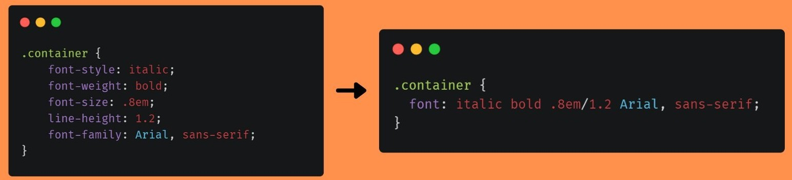
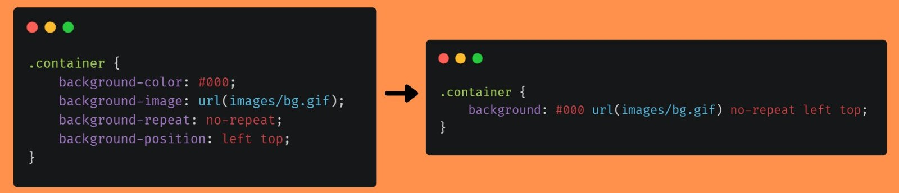
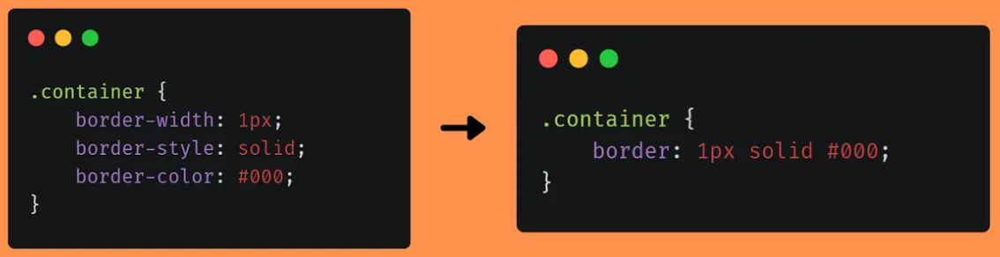

# CSS

---

## What is CSS?

- **CSS** stands for Cascading Style Sheets
- Used to style and layout web pages

---

## CSS **_Rule_** Syntax

```css
selector {
    property: value;
}
```

---

## Ways to Add CSS

- **Inline:**

```html
<div style="color: red;">Text</div>
```

- **Internal:**

```html
<style>
    p {
        color: blue;
    }
</style>
```

- **External:**

```html
<link rel="stylesheet" href="styles.css" />
```

---

## Selectors

[CSS Selectors Cheatsheet](https://github.com/MohamedEmary/ITI-client-side-tech/blob/main/other/client-side-tech/css/CSS%20Selector%20Cheat%20Sheet%20-%20Dark.pdf)

- **Universal:**

```css
* {
    margin: 0;
    padding: 0;
}
```

- **Element:**

```css
p {
    color: green;
}
```

---

- **Class:**

```css
.my-class {
    font-size: 20px;
}
```

- **ID:**

```css
#my-id {
    background: yellow;
}
```

- **Attribute:**

```css
input[type="text"] {
    border: 1px solid #ccc;
}
```

---

- **Descendant:**

```css
div p {
    color: red;
}
```

- **Direct Child:**

```css
ul > li {
    list-style: none;
}
```

- **Adjacent Sibling:**

```css
h2 + p {
    margin-top: 0;
}
```

---

- **General Sibling:**

```css
h2 ~ p {
    color: blue;
}
```

- **OR Selector:**

```css
h1,
h2,
h3 {
    font-family: Arial, sans-serif;
}
```

- **And Selector:**

```css
h1.my-class {
    color: purple;
}
```

---

- **Pseudo-class:**

```css
a:hover {
    color: orange;
}
```

- **Pseudo-element:**

```css
p::first-letter {
    font-size: 200%;
}
```

- **Negation `:not`:**

```css
input:not([type="submit"]) {
    border: 1px solid red;
}
```

---

- **Attribute starts with:**

```css
a[href^="https"] {
    color: green;
}
```

- **Attribute ends with:**

```css
img[src$=".png"] {
    border: 2px solid #333;
}
```

- **Attribute contains:**

```css
a[href*="github"] {
    font-weight: bold;
}
```

---

## Colors & Units

- **Colors:**

```css
color: red;
color: #ff0000;
color: rgb(255, 0, 0);
color: rgba(255, 0, 0, 0.5);
color: hsl(0, 100%, 50%);
```

<!--
HUE
SATURATION
LIGHTNESS
-->

- **Units:**
    - `px`: Pixel which is a fixed unit representing a single dot on the screen.
    - `em`: Relative to the font-size of the element.
    - `rem`: Relative to the font-size of the root element (usually `<html>`).
    - `%`: Relative to the parent element's size.
    - `vh`: Relative to 1% of the viewport height.
    - `vw`: Relative to 1% of the viewport width.

---

## The Box Model

```css
div {
    width: 200px;
    padding: 10px;
    border: 2px solid black;
    margin: 20px;
}
```


---

## Display

```css
display: block;
display: inline;
display: inline-block;
display: none;
/* We will cover in a later section */
display: flex;
display: grid;
```


---

## Font

```css
body {
    /* shorthand */
    font:
        italic bold 16px/1.5 Arial,
        sans-serif;
    font-family: Arial, sans-serif;
    font-size: 16px;
    font-weight: bold;
    font-style: italic;
    line-height: 1.5;

    text-align: center;
    text-decoration: underline;
}
```

---



---

## Background

```css
div {
    /* shorthand */
    background: #f0f0f0 url("image.jpg") no-repeat center/cover;
    background-color: #f0f0f0;
    background-image: url("image.jpg");
    background-repeat: no-repeat;
    background-position: center;
}
```



---

## Border

```css
div {
    /* shorthand */
    border: 2px solid #333;

    border-width: 2px;
    border-style: solid;
    border-color: #333;

    border-radius: 8px;
}
```

<!-- box-shadow: 2px 2px 8px #aaa; -->



---

## Flexbox

- **Container Properties:**

```css
.container {
    display: flex;
    /* row | row-reverse | column | column-reverse */
    flex-direction: row;
    /* flex-start | flex-end | center | space-between | space-around | space-evenly */
    justify-content: center;
    /* stretch | flex-start | flex-end | center | baseline */
    align-items: center;
    /* stretch | flex-start | flex-end | center | space-between | space-around */
    align-content: stretch;
    /* nowrap | wrap | wrap-reverse */
    flex-wrap: wrap;
    /* space between items */
    gap: 10px;
}
```

---

- **Item Properties:**

```css
.item {
    /* flex-grow flex-shrink flex-basis */
    flex: 1 1 100px;
    /* auto | flex-start | flex-end | center | baseline | stretch */
    align-self: flex-end;
    /* controls item order */
    order: 2;
}
```

---

### **Common Use Cases:**

- Centering content vertically and horizontally
- Creating navigation bars
- Building responsive one dimensional layouts

---

### Flexbox Cheatsheet


---

## Sites to Create Flexbox Layouts

- [CSS Generator](https://cssgenerator.pl/en/flexbox-generator/)
- [CSS Layout Generator](https://layout.bradwoods.io/)

---

## Grid

- **Container Properties:**

```css
.grid-container {
    display: grid;
    grid-template-columns: 1fr 2fr 1fr; /* column sizes */
    grid-template-rows: 100px auto; /* row sizes */
    gap: 10px 20px; /* row-gap column-gap */
    grid-template-areas:
        "header header header"
        "sidebar main main";
    justify-items: center; /* align items horizontally */
    align-items: stretch; /* align items vertically */
}
```

---

- **Item Properties:**

```css
.grid-item {
    grid-column: 1 / 3; /* start / end line */
    grid-row: 2; /* row number */
    grid-area: header; /* named area */
    justify-self: end; /* align item horizontally */
    align-self: center; /* align item vertically */
}
```

---

### Common Use Cases:

- Page layouts (header, sidebar, main, footer)
- Complex two-dimensional layouts

---

### Grid Cheatsheet


---

## Sites to Create Grid Layouts

- [CSS Layout Generator](https://layout.bradwoods.io/)
- [CSS Grid Generator](https://cssgridgenerator.io/)

---

## Responsive Design

- **Media Queries:**

```css
@media (max-width: 600px) {
    body {
        background: lightblue;
    }
}
```

- **Viewport meta tag:**

```html
<meta name="viewport" content="width=device-width, initial-scale=1.0" />
```

---

## Pseudo-classes & Pseudo-elements

- **Pseudo-classes:**

```css
a:hover {
    color: orange;
}
input:focus {
    border-color: blue;
}
```

- **Pseudo-elements:**

```css
p::first-line {
    font-weight: bold;
}
div::before {
    content: "★ ";
}
```

---

## Transitions & Animations

- **Transition:**

```css
button {
    transition: background 0.3s;
}
button:hover {
    background: green;
}
```

---

- **Animation:**

```css
@keyframes slide {
    from {
        left: 0;
    }
    to {
        left: 100px;
    }
}
.box {
    position: relative;
    animation: slide 2s infinite alternate;
}
```

---

## Margin & Padding

- **Shorthand Syntax:**

```css
margin: [top] [right] [bottom] [left];
padding: [top] [right] [bottom] [left];
```

- **Example:**

```css
margin: 10px 20px 30px 40px;
padding: 5px 10px;
```

- **Separate Properties:**

```css
margin-top: 10px;
margin-right: 20px;
margin-bottom: 30px;
margin-left: 40px;
padding-top: 5px;
padding-right: 10px;
```

---

## Border

- **Shorthand Syntax:**

```css
border: [width] [style] [color];
```

- **Example:**

```css
border: 2px solid #333;
```

- **Separate Properties:**

```css
border-width: 2px;
border-style: solid;
border-color: #333;
```

---

## Background

- **Shorthand Syntax:**

```css
background: [color] [image] [repeat] [position] / [size];
```

- **Example:**

```css
background: #f0f0f0 url("image.jpg") no-repeat center/cover;
```

- **Separate Properties:**

```css
background-color: #f0f0f0;
background-image: url("image.jpg");
background-repeat: no-repeat;
background-position: center;
background-size: cover;
```

---

## Font

- **Shorthand Syntax:**

```css
font: [style] [weight] [size]/[line-height] [family];
```

- **Example:**

```css
font:
    italic bold 16px/1.5 Arial,
    sans-serif;
```

- **Separate Properties:**

```css
font-style: italic;
font-weight: bold;
font-size: 16px;
line-height: 1.5;
font-family: Arial, sans-serif;
```

---

## Flex

- **Shorthand Syntax:**

```css
flex: [grow] [shrink] [basis];
```

- **Example:**

```css
flex: 1 1 100px;
```

- **Separate Properties:**

```css
flex-grow: 1;
flex-shrink: 1;
flex-basis: 100px;
```

---

## Grid

- **Shorthand Syntax:**

```css
grid-column: [start] / [end];
grid-row: [start] / [end];
```

- **Example:**

```css
grid-column: 1 / 3;
grid-row: 2 / 4;
```

- **Separate Properties:**

```css
grid-column-start: 1;
grid-column-end: 3;
grid-row-start: 2;
grid-row-end: 4;
```

---

## Animation

- **Shorthand Syntax:**

```css
animation: [name] [duration] [timing-function] [delay] [iteration-count]
    [direction] [fill-mode] [play-state];
```

- **Example:**

```css
animation: slide 2s infinite alternate;
```

- **Separate Properties:**

```css
animation-name: slide;
animation-duration: 2s;
animation-iteration-count: infinite;
animation-direction: alternate;
```

---

## Transition

- **Shorthand Syntax:**

```css
transition: [property] [duration] [timing-function] [delay];
```

- **Example:**

```css
transition: background 0.3s;
```

- **Separate Properties:**

```css
transition-property: background;
transition-duration: 0.3s;
```

---

## Positioning

CSS positioning allows you to control the placement of elements on the page.

- `position: static`: default, follows normal flow
- `position: relative`: offset from its normal position
- `position: absolute`: positioned relative to the nearest positioned ancestord
- `position: fixed`: positioned relative to the viewport
- `position: sticky`: toggles between relative and fixed based on scroll

**Related Properties:**

- `top`, `right`, `bottom`, `left`: Offsets the element when position is not static.
- `inset`: Shorthand for `top`, `right`, `bottom`, and `left`.
- `z-index`: Controls stacking order (only works on positioned elements).

---

**Example:**

```css
div {
    position: absolute;
    top: 20px;
    left: 40px;
    z-index: 10;
}
```

---

**CSS Positioning Cheatsheet:**


