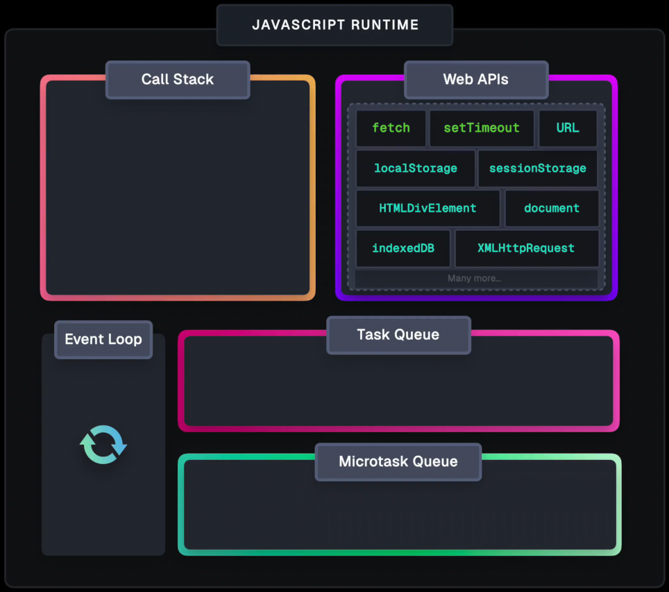
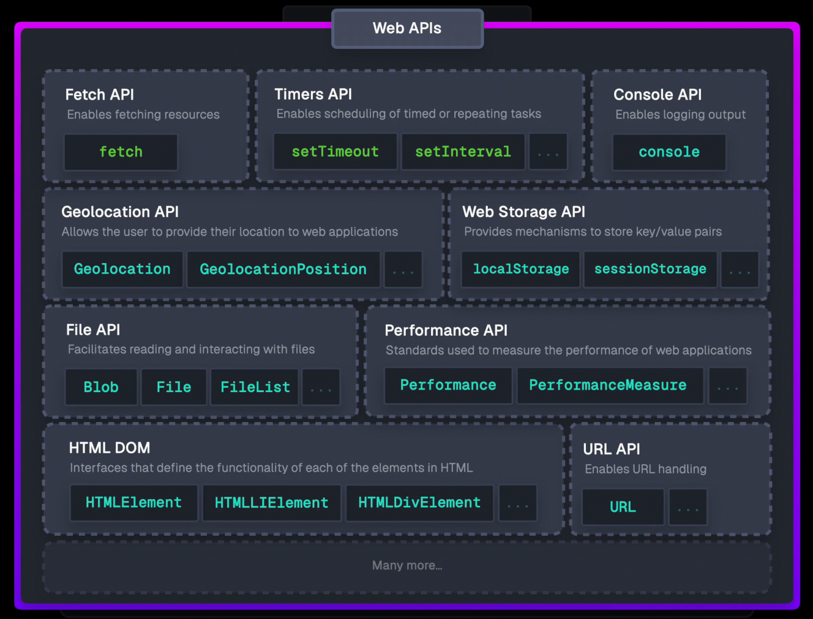

## `"use strict"`

- Early JavaScript was very forgiving-easy to write, but easy to make mistakes!
- Common issues:
    - Undeclared variables: `x = 5;`
    - Duplicate parameters: `function sum(x, x) {}`
    - Reserved words as names: `var let = 5;`
- **Strict mode** (ES5+): catches these errors early.
- Enable with:

```js
"use strict";
```

- Place at the top of a script or function.
- Classes and modules are always strict by default.

---

## Hoisting

- JavaScript moves variable and function declarations to the top of their scope during compilation.
- Only declarations are hoisted, not initializations.

```js
console.log(a); // undefined
var a = 10;
```

- If you use a variable without declaring it, you'll get an error:

```js
console.log(a); // ReferenceError
```

---

### Hoisting with Functions

- Function declarations are hoisted, so you can call them before their definition:

```js
greet("World");
function greet(name) {
    console.log("Hello " + name);
}
```

- Function expressions are NOT hoisted (only the variable is):

```js
// Error: greet is not a function
greet("World");
var greet = function (name) {
    console.log("Hello " + name);
};
```

---

## Scope

- **Scope**: Where a variable is accessible.
- Two main types: **global** and **local** (function) scope.

### Global Scope

- Declared outside any function/block; accessible everywhere.

```js
var a = 10;
function getNum() {
    console.log(a); // 10
}
getNum();
```

---

### Local Scope

- Declared inside a function; only accessible there.

```js
function getNum() {
    var a = 10;
}
console.log(a); // ReferenceError
```

- Functions can access global variables, but not vice versa.

---

### `var` and Block Scope

- `var` is NOT block-scoped (only function-scoped):

```js
if (true) {
    var x = 5;
}
console.log(x); // 5
```

- Only functions create a new scope for `var`.

---

## Scope & Hoisting: Quiz Examples

### Example 1

```js
var a = 10;
function myFunction() {
    var a = 20;
    console.log(a);
}
myFunction();
console.log(a);
```

---

### Example 2

```js
var a = 10;
function myFunction() {
    console.log(a);
    a = 20;
}
myFunction();
console.log(a);
```

---

### Example 3

```js
var a = 10;
function myFunction() {
    console.log(a);
    var a = 20;
}
myFunction();
console.log(a);
```

---

### Example 4

```js
function foo() {
    function bar() {
        return 3;
    }
    function bar() {
        return 8;
    }
    return bar();
}
console.log(foo());
```

---

### Example 5

```js
function foo() {
    var bar = function () {
        return 3;
    };
    return bar();
    var bar = function () {
        return 8;
    };
}
console.log(foo());
```

---

### Example 6

```js
function foo() {
    function bar() {
        return 3;
    }
    return bar();
    function bar() {
        return 8;
    }
}
console.log(foo());
```

---

### Example 7

```js
function foo() {
    return bar();

    function bar() {
        return 3;
    }
    var bar = function () {
        return 8;
    };
}
console.log(foo());
```

---

### Example 8

```js
console.log(foo());
var foo = function () {
    return bar();
    function bar() {
        return 3;
    }
    var bar = function () {
        return 8;
    };
};
```

---

### Self Inovked Function

JS developers tried to avoid global scope pollution by using self-invoked functions (IIFE).

IIFEs create a new scope for our code so we can use variables without polluting the global scope.

```js
(function () {
    // function body
})();
```

---

# ECMAScript 6 (ES6)

---

## `let` & `const`

- `let` and `const` are new ways to declare variables (ES6).
- `let`: block-scoped, cannot redeclare in same scope.
- `const`: block-scoped, cannot be reassigned.
- `var`: function-scoped (avoid in modern JS).

---

```js
{
    let x = 5;
    var y = 10;
    // x only inside block, y is global
}
// console.log(x); // Error
console.log(y); // 10

let a = 40;
// let a = 45; // Error
const z = 20;
// z = 30; // Error
```

---

### Temporal Dead Zone (TDZ)

- `let`/`const` are not accessible before declaration.

```js
console.log(x); // ReferenceError
let x = 5;
```

---

## for...of & const

- `const` works in `for...of` because each loop creates a new block scope.

```js
const arr = [1, 2, 3];
for (const item of arr) {
    console.log(item);
}
```

> Use `let` or `const`-avoid `var`!

---

## Default Parameters

- Set default values for function parameters.

```js
function greet(name = "World") {
    console.log(`Hello, ${name}!`);
}
greet(); // Hello, World!
```

- Old way:

```js
function greet(name) {
    name = name || "World";
}
```

---

## Template Literals

- Use backticks (`` ` ``) for flexible strings.
- Embed variables: `${expression}`
- Multiline support.

```js
let name = "Mohamed";
let age = 30;
let msg = `Hello, ${name}! You are ${age} years old.`;
```

---

## Destructuring Assignment

### Array Destructuring

```js
let [a, b, c] = [1, 2, 3];
let [x, , y] = [1, 2, 3]; // skip
let [first, ...rest] = [1, 2, 3, 4];
```

### Object Destructuring

```js
let person = { name: "Mohamed", age: 30 };
let { name, age } = person;
let { name: n, age: a } = person;
```

---

## The `this` Keyword

- In a method: `this` = the object
- In a function (non-strict): `this` = global object
- In a function (strict): `this` = undefined
- In event handlers: `this` = the element

```js
let person = {
    firstName: "Mohamed",
    lastName: "Ahmed",
    fullName() {
        return this.firstName + " " + this.lastName;
    },
};
```

---

## Arrow Functions

- Shorter syntax for functions
- No own `this`-inherits from parent scope

```js
let add = (a, b) => a + b;
let square = (x) => x * x;
let greet = () => "Hello!";
```

---

### Arrow Functions & `this`

- Arrow functions solve `this` issues in nested functions.

```js
let obj = {
    getThis: function () {
        let inner = () => console.log(this);
        inner();
    },
};
```

---

## Set

- Collection of **unique values**
- No duplicates allowed

```js
let set = new Set([1, 2, 3, 1]);
set.add(4);
set.has(2); // true
set.delete(1);
set.size; // 3
```

- Convert to array: `Array.from(set)`

---

## Map

- Collection of **key-value pairs**
- Keys can be any type
- Maintains insertion order

```js
let map = new Map([
    ["name", "Mohamed"],
    ["age", 30],
]);
map.set("city", "Cairo");
map.get("name"); // Mohamed
map.delete("age");
map.size; // 2
```

- Convert object to map: `new Map(Object.entries(obj))`
- Convert map to object: `Object.fromEntries(map)`

---

## Map Iteration

```js
for (const [key, value] of map) {
    console.log(key, value);
}
```

---

## Array/Object Destruction Examples

```js
// 1. Simple array destructuring
let [a, b] = [1, 2];
// a = 1, b = 2

// 2. Skipping elements
let [x, , y] = [10, 20, 30];
// x = 10, y = 30

// 3. Using rest operator
let [first, ...rest] = [1, 2, 3, 4];
// first = 1, rest = [2, 3, 4]

// 4. Default values
let [m = 5, n = 10] = [undefined, 7];
// m = 5, n = 7
```

---

```js
// 5. Nested array destructuring
let [p, [q, r]] = [1, [2, 3]];
// p = 1, q = 2, r = 3

// 6. Simple object destructuring
let { name, age } = { name: "Ali", age: 25 };
// name = "Ali", age = 25

// 7. Renaming variables and default values
let { x: foo = 100, y: bar = 200 } = { x: 5 };
// foo = 5, bar = 200

// 8. Nested object destructuring
let person = { id: 1, info: { first: "Sara", last: "Khaled" } };
let {
    info: { first, last },
} = person;
// first = "Sara", last = "Khaled"
```

---

Nested object with array inside

```js
let user = {
    id: 42,
    profile: {
        name: "Omar",
        contacts: [
            { type: "email", value: "omar@mail.com" },
            { type: "phone", value: "123456" },
        ],
    },
};
// name = "Omar", email = "omar@mail.com", phone = "123456"
```

---

## Object References and Copying

- Primitives (string, number, boolean, etc.) are copied by value.
- Objects are copied by reference.

---

### Copying Primitives

- Copying a primitive creates a new independent value:
    ```js
    let message = "Hello!";
    let phrase = message;
    // Both variables store "Hello!"
    ```

---

### Copying Objects by Reference

- Copying an object variable copies the reference, not the object itself:
    ```js
    let user = { name: "John" };
    let admin = user; // both reference the same object
    admin.name = "Pete";
    console.log(user.name); // Pete
    ```

---

### Comparison by Reference

- Two objects are equal only if they reference the same object:
    ```js
    let a = {};
    let b = a;
    console.log(a === b); // true
    let c = {};
    console.log(a === c); // false
    ```

---

### Const Objects Can Be Modified

- `const` objects can have their properties changed:
    ```js
    const user = { name: "John" };
    user.name = "Pete"; // allowed
    // user = { name: "Alice" }; // Error
    ```

---

### Cloning and Merging: Object.assign

- Use `Object.assign(dest, ...sources)` to copy properties:
    ```js
    let user = { name: "John" };
    let permissions1 = { canView: true };
    let permissions2 = { canEdit: true };
    Object.assign(user, permissions1, permissions2);
    // user = { name: "John", canView: true, canEdit: true }
    ```
- For cloning:
    ```js
    let user = { name: "John", age: 30 };
    let clone = Object.assign({}, user);
    ```

---

### Clonning Using `...` Operator

- You can also clone objects using the spread operator:
    ```js
    let user = { name: "John", age: 30 };
    let clone = { ...user };
    clone.name = "Pete";
    console.log(user.name); // John
    console.log(clone.name); // Pete
    ```

---

### Shallow vs Deep Cloning

- Shallow cloning copies only top-level properties:
    ```js
    let user = { name: "John", sizes: { height: 182, width: 50 } };
    let clone = Object.assign({}, user);
    console.log(user.sizes === clone.sizes); // true
    ```
- Deep cloning copies nested objects too.

---

### Cloning Objects with JSON

- You can clone objects using `JSON.parse(JSON.stringify(obj))`:
    ```js
    let user = { name: "John", age: 30 };
    let clone = JSON.parse(JSON.stringify(user));
    clone.name = "Pete";
    console.log(user.name); // John
    console.log(clone.name); // Pete
    ```
- Note: This method only works for data that can be represented in JSON (no functions, `undefined`, or circular references).

---

### Deep Cloning: structuredClone

- Use `structuredClone(obj)` for deep cloning:
    ```js
    let user = { name: "John", sizes: { height: 182, width: 50 } };
    let clone = structuredClone(user);
    console.log(user.sizes === clone.sizes); // false
    ```
- Supports circular references:
    ```js
    let user = {};
    user.me = user;
    let clone = structuredClone(user);
    console.log(clone.me === clone); // true
    ```
- Does not support functions or `undefined` properties.

---

## Symbol Type

- Only two primitive types can be object property keys:
    - `string`
    - `symbol`
- Other types (e.g., number, boolean) are auto-converted to string.

---

### What is a Symbol?

- A **symbol** is a unique identifier.
- Created with `Symbol()`:
    ```js
    let id = Symbol();
    ```
- Can have an optional description (for debugging):
    ```js
    let id = Symbol("id");
    ```

---

### Symbol Uniqueness

- Symbols with the same description are still unique:
    ```js
    let id1 = Symbol("id");
    let id2 = Symbol("id");
    console.log(id1 === id2); // false
    ```

---

### Symbols Don’t Auto-Convert to String

- Symbols cannot be implicitly converted to strings:
    ```js
    let id = Symbol("id");
    alert(id); // TypeError
    alert(id.toString()); // Symbol(id)
    alert(id.description); // id
    ```

---

### “Hidden” Properties with Symbols

- Symbols can be used as object keys for hidden properties:
    ```js
    let user = { name: "John" };
    let id = Symbol("id");
    user[id] = 1;
    console.log(user[id]); // 1
    ```
- No accidental overwrites or conflicts with other code.

---

### Symbols in Object Literals

- Use square brackets for symbol keys:
    ```js
    let id = Symbol("id");
    let user = {
        name: "John",
        [id]: 123,
    };
    ```

---

### Symbol Properties Are Skipped by for...in

- Symbolic properties are not iterated by `for...in` or `Object.keys`:
    ```js
    let id = Symbol("id");
    let user = { name: "John", [id]: 123 };
    for (let key in user) console.log(key); // name
    console.log(user[id]); // 123
    ```

---

### Global Symbols

- Use `Symbol.for(key)` for global, shared symbols:
    ```js
    let id = Symbol.for("id");
    let idAgain = Symbol.for("id");
    console.log(id === idAgain); // true
    ```
- Retrieve key with `Symbol.keyFor(symbol)`.

---

## Optional Chaining `?.`

- The optional chaining operator `?.` allows safe access to nested object properties.
- If the value before `?.` is `null` or `undefined`, the expression short-circuits and returns `undefined`.
    ```js
    let user = {};
    console.log(user.address?.street); // undefined, no error
    ```
- Useful for accessing deep properties without checking each level.
    ```js
    let user = { address: { street: "Main St" } };
    console.log(user.address?.street); // "Main St"
    ```
- Can be used with function calls:
    ```js
    let user = {};
    user.sayHi?.(); // does nothing, no error
    ```

---

## Nullish Coalescing Operator `??`

Nullish Coalescing Operator `??` is used when you only want to check for `null` or `undefined`. It returns the right-hand value if the left-hand value is `null` or `undefined`.

```js
let name = null;
let userName = name ?? "Guest";
console.log(userName); // "Guest"
```

- Differs from `||` (logical OR), which returns right-hand value for any falsy left-hand value (e.g., `0`, `""`, `false`).
    ```js
    let count = 0;
    let result = count ?? 10; // 0
    let result2 = count || 10; // 10
    ```

---

## Generator Functions & `yield`

- Generator functions allow you to pause and resume execution.
- Defined with `function*` syntax:
    ```js
    function* gen() {
        yield 1;
        yield 2;
        yield 3;
    }
    ```
- Calling a generator returns an iterator:
    ```js
    let iterator = gen();
    console.log(iterator.next()); // { value: 1, done: false }
    console.log(iterator.next()); // { value: 2, done: false }
    console.log(iterator.next()); // { value: 3, done: false }
    console.log(iterator.next()); // { value: undefined, done: true }
    ```

---

### The `yield` Keyword

- `yield` pauses the function and returns a value.
- The function can be resumed with `.next()`.

---

### Generator Example: Infinite Sequence

```js
function* infinite() {
    let i = 0;
    while (true) {
        yield i++;
    }
}
let gen = infinite();
console.log(gen.next().value); // 0
console.log(gen.next().value); // 1
```

---

### Using `throw` in Generators

- You can inject errors into a generator using `.throw()`.
- The generator will catch the error at the current `yield`.
    ```js
    function* gen() {
        try {
            yield 1;
        } catch (e) {
            console.log("Caught:", e.name);
            console.log("Caught:", e.message);
        }
    }
    let iterator = gen();
    iterator.next(); // { value: 1, done: false }
    iterator.throw(new Error("Something went wrong"));
    ```

---

### Using `return` in Generators

- The `.return()` method ends the generator early and returns a value.
- All further calls to `.next()` will be done.
    ```js
    function* gen() {
        yield 1;
        yield 2;
    }
    let iterator = gen();
    console.log(iterator.next()); // { value: 1, done: false }
    console.log(iterator.return("Finished")); // { value: 'Finished', done: true }
    console.log(iterator.next()); // { value: undefined, done: true }
    ```

---

```js
function* genfunc() {
    let increment;
    let id = 0;

    while (true) {
        try {
            increment = yield id;
        } catch (e) {
            console.log(e.name);
            console.log(e.message);
        }

        if (increment) {
            id += increment;
        } else {
            id++;
        }
    }
}
```

---

## Assignment

1. Write code to extract the first and third elements from the array `[10, 20, 30]` into variables `x` and `y`, and set `z` to 100 if the fourth element is missing.

2. Write code to extract property `a` from `{ a: 5 }` into variable `foo`, and property `b` into variable `bar` with a default value of 20.

3. Write code to extract the name, email, and phone from the nested object `user` below using destructuring:

```js
let user = {
    id: 42,
    profile: {
        name: "Omar",
        contacts: [
            { type: "email", value: "omar@mail.com" },
            { type: "phone", value: "123456" },
        ],
    },
};
```

---

4. Write code to demonstrate that assigning one object to another variable creates a reference, not a copy. Show that changing a property via one variable affects the other.

5. Write code to clone an object with a nested object using `Object.assign`, then change a nested property in the clone and show the effect on the original.

6. Write code to deep clone an object with a nested object using `structuredClone`, then change a nested property in the clone and show the effect on the original.

7. Write code to destructure an array `[undefined, 2, 3]` into variables `a`, `b`, `c`, and `d`, with defaults for missing values.

8. Write code to clone an object using the spread operator, then change a property in the clone and show the original is unchanged.

9. Write code to compare two objects by reference and show the result for both same and different objects.

10. Write code to clone an object using `JSON.parse(JSON.stringify(obj))`, then change a property in the clone and show the original is unchanged.

---

11. Write code to deep clone an object with a circular reference using `structuredClone`, and show that the circular reference is preserved in the clone.

12. Write code to show that you can modify properties of a `const` object, but cannot reassign the variable.

13. Write code to add a symbol-keyed property to an object, access it, and show that it does not appear in `Object.keys` or `for...in`.

14. Write code to create two global symbols with the same key and show that they are equal.

15. Write code to safely access a nested property using optional chaining.

16. Write code to assign a default value using the nullish coalescing operator if a variable is `null` or `undefined`.

17. Write a generator function that yields 1 and 2, and show how to get both values and the final `undefined`.

18. Write a generator function that catches an error thrown into it and returns a string. Show how to throw the error and get the result.

19. Write a generator function that yields two values, then ends early using `.return()` and shows the result.

---

## JavaScript Modules

- **Modules** allow you to split code into reusable files.
- Each module has its own scope.

---

- Use `export` to expose variables/functions/classes:

    ```js
    // math.js
    export function add(a, b) {
        return a + b;
    }
    export const PI = 3.14;

    // or write the export at the end
    export { add, PI };
    ```

- Use `import` to use them in another file:

    ```js
    import { add, PI } from "./math.js";

    // to import functions with a different name
    import { add as sum, PI as pi } from "./math.js";
    ```

---

- Modules are supported in browsers (with `<script type="module">`).

> Note: You should use live server to run modules in the browser.

---

## Blocking vs Non-blocking

- **Blocking**: Code execution stops and waits for a task to finish before moving on.
    - Example: `alert("Hello")` blocks the code until the user clicks "OK".
    - Blocking code can freeze the UI.
- **Non-blocking**: Code can start a task and continue running other code while waiting for the task to finish.
    - Example: `setTimeout(() => console.log("Done"), 1000)` allows the code to continue running while waiting for the timeout.
    - Non-blocking code keeps apps responsive.

---

## Synchronous vs Asynchronous

- **Synchronous**: Tasks are performed one after another. Each step waits for the previous one to finish.
    - Example:
        ```js
        console.log("A");
        console.log("B");
        // Output: A B
        ```
    - Synchronous code is simple but can block the main thread.
- **Asynchronous**: Tasks can start and finish at different times. The program can continue running while waiting for tasks to complete.
    - Example:
        ```js
        console.log("A");
        setTimeout(() => console.log("B"), 1000);
        console.log("C");
        // Output: A C B
        ```
    - Asynchronous code uses callbacks, promises, or async/await.

---

## Single-threaded vs Multithreaded

- **Single-threaded**: Only one task runs at a time. JavaScript runs on a single main thread.
    - All code shares the same thread, so only one thing happens at a time.
    - If a task takes too long, it can block everything else.
- **Multithreaded**: Multiple tasks run in parallel on different threads.
    - Possible with Web Workers (in browsers).
    - Useful for heavy computations or background tasks.

---

## JavaScript: Single-threaded, Non-blocking, Asynchronous

- **JavaScript is:**
    1. Single-threaded: All code runs on one main thread.
    2. Non-blocking: Uses the event loop to handle tasks without freezing the main thread.
    3. Asynchronous: Can run tasks in the background and respond when they're done (using callbacks, promises, async/await).
- The **event loop** lets JS handle many tasks efficiently, like responding to user input, network requests, and timers, all without blocking the main thread.

---

## JS Runtime Environment vs JS Engine

- **JS Engine**: The part that reads and executes JavaScript code. Examples: V8 (Chrome, Node.js), SpiderMonkey (Firefox), JavaScriptCore (Safari).
    - Handles parsing, compiling, and running JS code.
- **JS Runtime Environment**: The engine plus all the extra features provided by the host (browser).
    - Includes APIs like DOM (for web pages), timers (`setTimeout`), networking, file system, etc.
    - The runtime lets you build real applications by providing tools beyond the core language.
- In summary: The engine runs JS code; the runtime provides everything else you need to build apps.

---

## Microtasks and Macrotasks

- JavaScript uses an **Event Loop** and two task queues:

Macrotasks:

- `setTimeout()` and `setInterval()` callbacks.
- I/O operations (e.g., network requests, file reading).
- UI rendering and user interactions (e.g., click events).

Microtasks:

- Promise callbacks (`.then()`, `.catch()`, `.finally()`).
- Code after an `await` expression.
- `queueMicrotask()`.
- `MutationObserver` callbacks.

---

- **Order of Execution**:
    1. Current synchronous code (call stack)
    2. All micro tasks
    3. One macro task
    4. Repeat steps 2-3

---

### Examples: Understanding Task Order

Example 1:

```js {monaco-run}
console.log("Start"); // 1

setTimeout(() => {
    console.log("Timeout"); // 5
}, 0);

Promise.resolve().then(() => console.log("Promise 1")); // 3

queueMicrotask(() => {
    console.log("Microtask"); // 4
});

console.log("End"); // 2
```

---

Example 2: Synchronous Code

```js {monaco-run}
console.log("First");
console.log("Second");
console.log("Third");
```

---

Example 3: Macro Task (setTimeout)

```js {monaco-run}
console.log("Start");
setTimeout(() => console.log("Timeout"), 0);
console.log("End");
```

---

Example 4: Micro Task vs Macro Task

```js {monaco-run}
console.log("Start");
setTimeout(() => console.log("Timeout"), 0);
Promise.resolve().then(() => console.log("Promise"));
console.log("End");
```

---

Example 5: Multiple Tasks of Each Type

```js {monaco-run}
console.log("Start");

Promise.resolve().then(() => console.log("Promise 1"));
Promise.resolve().then(() => console.log("Promise 2"));

setTimeout(() => console.log("Timeout 1"), 0);
setTimeout(() => console.log("Timeout 2"), 0);

console.log("End");
```

---

Example 6: Nested Tasks

```js {monaco-run}
console.log("Start");

setTimeout(() => console.log("Timeout 1"), 0);

Promise.resolve()
    .then(() => {
        console.log("Promise 1");
        setTimeout(() => console.log("Timeout 2"), 0);
        return Promise.resolve();
    })
    .then(() => console.log("Promise 2"));

console.log("End");
```

---

Example 7: Async/Await and Task Order

```js {monaco-run}
async function foo() {
    console.log("1");
    await Promise.resolve();
    console.log("2");
}

console.log("Start");
foo();
Promise.resolve().then(() => console.log("3"));
console.log("End");
```

---

Example 8: Nested Promise and Timeout

```js {monaco-run}
console.log("Start");

Promise.resolve()
    .then(() => {
        console.log("Promise 1");
        return Promise.resolve();
    })
    .then(() => {
        console.log("Promise 2");
        setTimeout(() => console.log("Timeout 1"), 0);
    });

setTimeout(() => {
    console.log("Timeout 2");
    Promise.resolve().then(() => console.log("Promise 3"));
}, 0);

console.log("End");
```

---

### Why This Matters

- Understanding task queues helps with:
    - Optimizing application performance
    - Avoiding race conditions
    - Managing UI updates efficiently
    - Debugging async code behavior
- Micro tasks have priority over macro tasks
- Each macro task starts with a fresh micro task queue

---

### JS Runtime Environment



---

### Web APIs



---

## Callback Hell

- **Callback hell** happens when you have many nested callbacks, making code hard to read and maintain.
- Common in older async JS (e.g., with `setTimeout`, AJAX, etc.).
- Example:
    ```js
    setTimeout(() => {
        console.log("Step 1");
        setTimeout(() => {
            console.log("Step 2");
            setTimeout(() => {
                console.log("Step 3");
            }, 1000);
        }, 1000);
    }, 1000);
    // Hard to read and debug!
    ```
- Callback hell makes error handling and logic flow difficult.

---

## Promises: The Singer and the Fans Analogy

- Imagine you’re a famous singer. Fans want your new song, but it’s not ready yet.
- You promise to send it when it’s published. Fans give you their emails (subscribe).
- When the song is ready, everyone gets it. If something goes wrong, fans are notified.
- In programming:
    - The "singer" is the code that produces a result (maybe after some time).
    - The "fans" are code that wants the result when it’s ready.
    - The **promise** is the subscription list that connects them.

---

## What is a Promise?

- A **promise** is a special JavaScript object that links producing code (singer) and consuming code (fans).
- The producing code does something (maybe takes time), then calls `resolve(result)` for success or `reject(error)` for failure.
- The consuming code can subscribe to the result using `.then`, `.catch`, and `.finally`.

---

## Promise States

- **Pending**: The job is still running.
- **Fulfilled**: The job finished successfully (`resolve`).
- **Rejected**: The job failed (`reject`).

---

## Creating a Promise

- The syntax:
    ```js
    let promise = new Promise(function (resolve, reject) {
        // producing code (the singer)
        // call resolve(value) if successful
        // call reject(error) if failed
    });
    ```
- Example: a promise that resolves after 1 second:
    ```js
    let promise = new Promise(function (resolve, reject) {
        setTimeout(() => resolve("done"), 1000);
    });
    ```
- Example: a promise that rejects after 1 second:
    ```js
    let promise = new Promise(function (resolve, reject) {
        setTimeout(() => reject(new Error("Whoops!")), 1000);
    });
    ```

---

## Using Promises: `.then`, `.catch`, `.finally`

- `.then(success, error)` runs when the promise is fulfilled.
    ```js
    promise.then((result) => alert(result));
    ```
- `.catch(error)` is shorthand for handling errors:
    ```js
    promise.catch((error) => alert(error));
    ```
- `.finally()` runs no matter what, for cleanup:
    ```js
    promise.finally(() => alert("Promise finished"));
    ```

---

## Example: Callback vs Promise

- Old way (callback):

```js
let i = 1;
const ul = document.querySelector("ul");

setTimeout(() => {
    ul.innerHTML += `<li>Item ${i++}</li>`;
    setTimeout(() => {
        ul.innerHTML += `<li>Item ${i++}</li>`;
        setTimeout(() => {
            ul.innerHTML += `<li>Item ${i++}</li>`;
        }, 1000);
    }, 1000);
}, 1000);
```

---

- With promises:

```js
const ul = document.querySelector("ul");
let i = 1;
function addLi() {
    return new Promise((resolve, reject) => {
        setTimeout(() => {
            const li = document.createElement("li");
            li.textContent = `Item ${i++}`;
            ul.appendChild(li);
            resolve("item added successfully");
        }, 1000);
    });
}
addLi().then(addLi).then(addLi).then(addLi);
```

- Promises make it easier to read, chain, and handle errors compared to callbacks.

---

## Example: Promise Chaining

- You can chain `.then()` calls to run multiple async steps in order

```js
function wait(ms) {
    return new Promise((resolve) => setTimeout(resolve, ms));
}
```

---

```js
wait(1000)
    .then(() => {
        console.log("Step 1");
        return wait(1000);
    })
    .then(() => {
        console.log("Step 2");
        return wait(1000);
    })
    .then(() => {
        console.log("Step 3");
    });
```

- Each `.then()` waits for the previous step to finish before running the next.
- This makes async code readable and avoids callback hell.

---

## Async/Await

- **async/await** is a modern way to write asynchronous code that looks like synchronous code.
- `async` makes a function return a promise.
- `await` pauses the function until the promise settles (fulfilled or rejected).
- Analogy: You order food (async function), then you wait for it to arrive (`await`).

---

## Example: Using async/await

```js
function wait(ms) {
    return new Promise((resolve) => setTimeout(resolve, ms));
}

async function runSteps() {
    await wait(1000);
    console.log("Step 1");
    await wait(1000);
    console.log("Step 2");
    await wait(1000);
    console.log("Step 3");
}

runSteps();
```

- The code runs step by step, but each step waits for the previous one to finish.

---

## Fetch API

- The **Fetch API** lets you make network requests (like getting data from a server) easily in modern browsers.
- It returns a promise, so you can use `.then()` or `async/await`.
- Commonly used to get JSON data from APIs.

---

## Example: Fetch with async/await

```js
async function getUser() {
    const response = await fetch(
        "https://jsonplaceholder.typicode.com/users/1"
    );
    const user = await response.json();
    console.log(user);
}

getUser();
```

- `fetch` gets the data from the server.
- `await response.json()` converts the response to a JS object.
- The code is easy to read and handles async tasks step by step.
