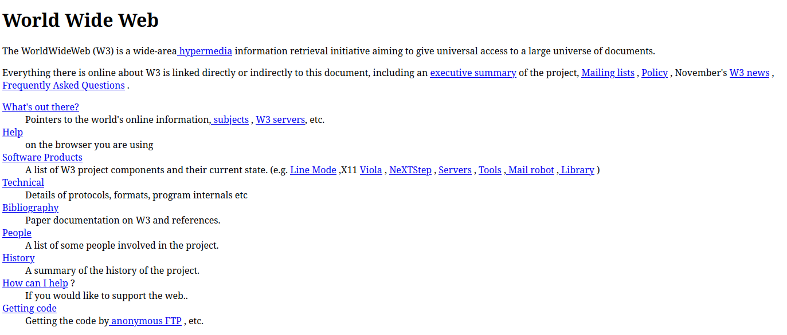
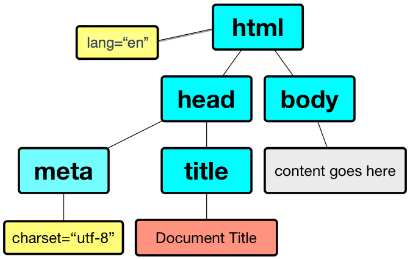
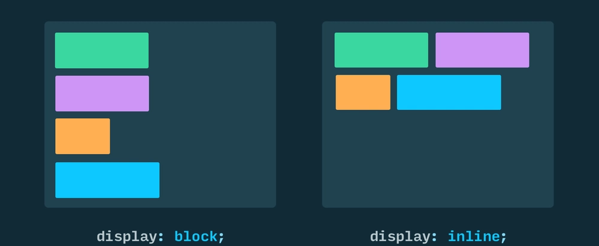
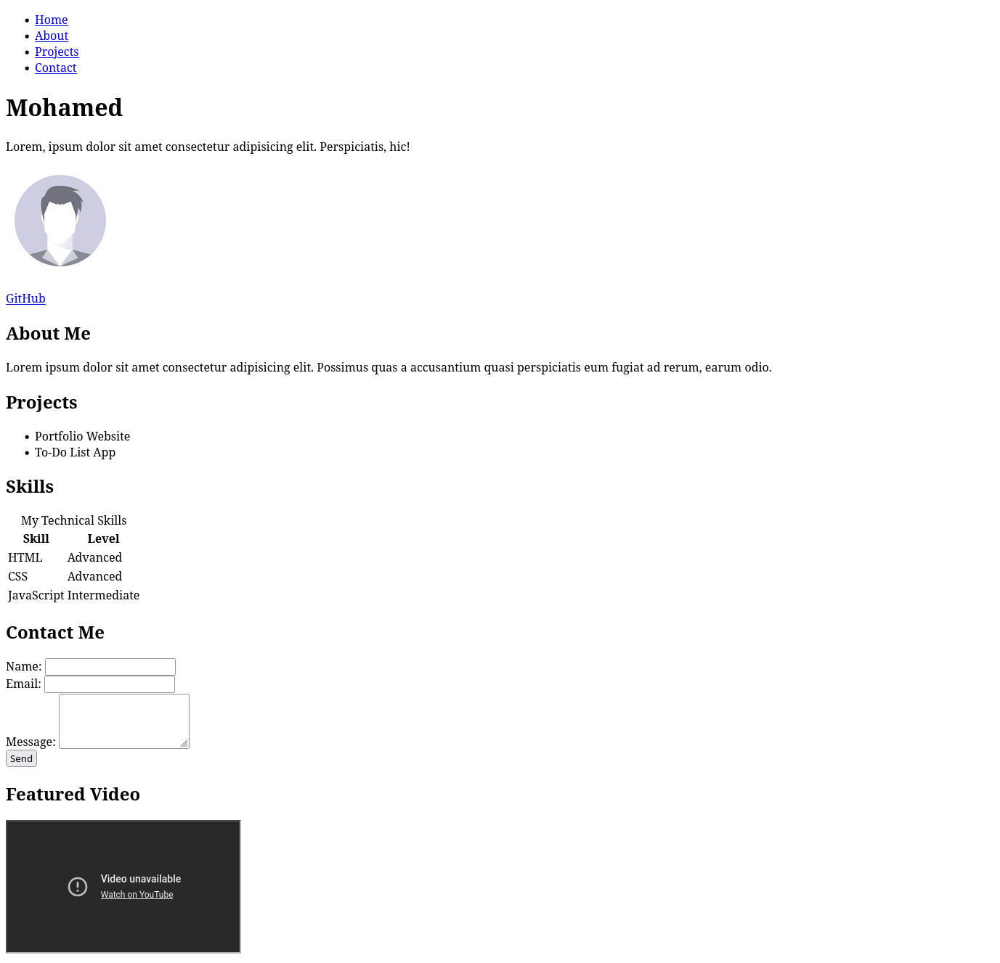

# HTML

---

## Brief History of HTML

- HTML was invented by **Tim Berners-Lee** in 1991 while working at CERN.
- The first version allowed scientists to share documents via the World Wide Web.
- In 1998, the [W3C](https://www.w3.org/) took over HTML development, focusing on web standards.
- **HTML5** was finalized in 2014, introducing modern features for multimedia, graphics, and APIs.

<a target="_blank" href="https://en.wikipedia.org/wiki/Tim_Berners-Lee"></a>

---

- The first web page ever created by Tim Berners-Lee.:

<a target="_blank" href="https://www.w3.org/History/19921103-hypertext/hypertext/WWW/TheProject.html"></a>

---

## What is HTML?

- HTML stands for **HyperText Markup Language**
- HTML describes the **structure** of a web page using elements (tags)

---

## Basic HTML Document Structure

````md magic-move {lines: true}
```html {*}
<!DOCTYPE html>
```

```html {*|2-3}
<!DOCTYPE html>
<html></html>
```

```html {*|3}
<!DOCTYPE html>
<html>
    <head></head>
</html>
```

```html {*|4-5}
<!DOCTYPE html>
<html>
    <head>
        <title>Page Title</title>
        <meta charset="UTF-8" />
    </head>
</html>
```

```html {*|7}
<!DOCTYPE html>
<html>
    <head>
        <title>Page Title</title>
        <meta charset="UTF-8" />
    </head>
    <body></body>
</html>
```

```html {*|8|*}
<!DOCTYPE html>
<html>
    <head>
        <title>Page Title</title>
        <meta charset="UTF-8" />
    </head>
    <body>
        <!-- Content goes here -->
    </body>
</html>
```
````



<!--

**Example of what can go wrong:**

Imagine you have a webpage with the following content:

```html
<p>Mpape امبابي 🐢</p>
```

If the browser fails to correctly identify the character set as UTF-8, it might default to an older, more limited encoding like `ISO-8859-1` (also known as Latin-1). In such a case, the output could look something like this:

```
¡Hola, Mundo!
This costs €50.
I â&#157;¤ï¸&#143; HTML.
```

-->

---

## Essential HTML Elements

- Headings: `<h1>` to `<h6>`
- Paragraphs: `<p>`
- Line breaks: `<br>`, Horizontal rules: `<hr>`
- Comments: `<!-- comment -->`

```html
<h1>This is a Heading</h1>
<p>This is a paragraph of text.</p>
<hr />
<!-- This is a comment -->
```

---

## Important HTML Attributes

- `id`: Unique identifier for an element
- `class`: Assigns one or more class names for styling
- `style`: Inline CSS styles
- `title`: Tooltip text shown on hover
- `alt`: Alternative text for images (improves accessibility)
- `href`: URL for links
- `src`: Source file for images, videos, scripts, etc.
- `type`: Specifies the type of input, button, or script
- `value`: Sets the value of an input or button
- `name`: Name of the input (used in form submission)
- `disabled`: Disables an element
- `data-*`: Custom data attributes for storing extra information

---

## Text Formatting

- Bold: `<b>`, `<strong>`
- Italic: `<i>`, `<em>`
- Underline: `<u>`
- Superscript: `<sup>`, Subscript: `<sub>`
- Lists: `<ul>`, `<ol>`, `<li>`

````md magic-move {lines: true}
```html {*}
<p>This is plain text</p>
```

```html {*|1}
<p><strong>Bold text</strong></p>
```

```html {*|1}
<p><strong>Bold</strong> and <em>italic</em></p>
```

```html {*|1}
<p><strong>Bold</strong> and <em>italic</em> and <u>underline</u></p>
```

```html {*|2-5}
<p><strong>Bold</strong> and <em>italic</em> and <u>underline</u></p>
<ul>
    <li>Item 1</li>
    <li>Item 2</li>
</ul>
```

```html {*|6-9}
<p><strong>Bold</strong> and <em>italic</em> and <u>underline</u></p>
<ul>
    <li>Item 1</li>
    <li>Item 2</li>
</ul>
<ol>
    <li>First</li>
    <li>Second</li>
</ol>
```
````

<!-- ---

### Exercise: Text Formatting

Create a short paragraph about your favorite food. Make the food name bold, add an italic description, and use an unordered list for at least two ingredients. -->

---

## Links and Navigation

- Anchor tag: `<a href="url">Link</a>`
- Absolute vs. relative URLs
- Open in new tab: `target="_blank"`

```html
<a href="https://www.example.com" target="_blank">Visit Example</a>
<a href="about.html">About Us</a>
```

<!-- ---

### Exercise: Links & Navigation

Add a link to your favorite website. Make it open in a new tab. Below it, add a link to a local file called `contact.html`. -->

---

## Images and Media

- Images: ``
- Video: `<video src="movie.mp4" controls></video>`
- Audio: `<audio src="sound.mp3" controls></audio>`

```html

<video src="movie.mp4" controls></video>
<audio src="sound.mp3" controls></audio>
```

<!-- ---

### Exercise: Images & Media

Insert an image of your favorite place. Add a short alt description. (Optional: Embed a YouTube video about that place.) -->

---

### Block vs Inline Elements

- **Block elements**: Start on a new line and take up the full width (e.g., `<div>`, `<p>`, `<h1>`, `<ul>`, `<table>`)
- **Inline elements**: Do not start on a new line and only take up as much width as needed (e.g., `<span>`, `<a>`, ``, `<strong>`, `<em>`)

```html
<div>This is a block element</div>
<span>This is an inline element</span>
```



---

### HTML Entities

- Used to display reserved characters (e.g., `<`, `>`, `&`, `"`, `©`)
- Example: `&lt;`, `&gt;`, `&copy;`

```html
<p>&lt;div&gt; is a block element.</p>
<p>Copyright &copy; 2025</p>
```

---

### File Paths in HTML

- **Absolute path**: `/images/pic.jpg` (from root)
- **Relative path**: `images/pic.jpg` (from current file)

```html


```

---

### Embedding External Content

- `<iframe src="url"></iframe>` for embedding other web pages

```html
<iframe src="https://www.wikipedia.org" width="400" height="200"></iframe>
```

---

## Tables

- Table: `<table>`
- Main Parts: `<thead>`, `<tbody>`, `<tfoot>`
- Rows: `<tr>`, Cells: `<td>`, Headers: `<th>`
- Captions, merging cells: `rowspan`, `colspan`

---

````md magic-move {lines: true}
```html {*}
<table></table>
```

```html {*|2-4}
<table>
    <caption>
        Client-Side Technologies Course @ ITI
    </caption>
</table>
```

```html {*|5}
<table>
    <caption>
        Client-Side Technologies Course @ ITI
    </caption>
    <thead></thead>
</table>
```

```html {*|6-10}
<table>
    <caption>
        Client-Side Technologies Course @ ITI
    </caption>
    <thead>
        <tr>
            <th scope="col">Person</th>
            <th scope="col">Most interest in</th>
            <th scope="col">Age</th>
        </tr>
    </thead>
</table>
```

```html {*|12}
<table>
    <caption>
        Client-Side Technologies Course @ ITI
    </caption>
    <thead>
        <tr>
            <th scope="col">Person</th>
            <th scope="col">Most interest in</th>
            <th scope="col">Age</th>
        </tr>
    </thead>
    <tbody></tbody>
</table>
```

```html {*|13-17}
<table>
    <caption>
        Client-Side Technologies Course @ ITI
    </caption>
    <thead>
        <tr>
            <th scope="col">Person</th>
            <th scope="col">Most interest in</th>
            <th scope="col">Age</th>
        </tr>
    </thead>
    <tbody>
        <tr>
            <th scope="row">Chris</th>
            <td>HTML tables</td>
            <td>22</td>
        </tr>
    </tbody>
</table>
```

```html {*}
<table>
    <caption>
        Client-Side Technologies Course @ ITI
    </caption>
    <thead>
        <tr>
            <th scope="col">Person</th>
            <th scope="col">Most interest in</th>
            <th scope="col">Age</th>
        </tr>
    </thead>
    <tbody>
        <tr>
            <th scope="row">Chris</th>
            <td>HTML tables</td>
            <td>22</td>
        </tr>
        <tr>
            <th scope="row">Dennis</th>
            <td>Web accessibility</td>
            <td>45</td>
        </tr>
        <tr>
            <th scope="row">Sarah</th>
            <td>JavaScript frameworks</td>
            <td>29</td>
        </tr>
        <tr>
            <th scope="row">Karen</th>
            <td>Web performance</td>
            <td>36</td>
        </tr>
    </tbody>
</table>
```

```html {34-39|*}
<table>
    <caption>
        Client-Side Technologies Course @ ITI
    </caption>
    <thead>
        <tr>
            <th scope="col">Person</th>
            <th scope="col">Most interest in</th>
            <th scope="col">Age</th>
        </tr>
    </thead>
    <tbody>
        <tr>
            <th scope="row">Chris</th>
            <td>HTML tables</td>
            <td>22</td>
        </tr>
        <tr>
            <th scope="row">Dennis</th>
            <td>Web accessibility</td>
            <td>45</td>
        </tr>
        <tr>
            <th scope="row">Sarah</th>
            <td>JavaScript frameworks</td>
            <td>29</td>
        </tr>
        <tr>
            <th scope="row">Karen</th>
            <td>Web performance</td>
            <td>36</td>
        </tr>
    </tbody>
    <tfoot>
        <tr>
            <th scope="row" colspan="2">Average age</th>
            <td>33</td>
        </tr>
    </tfoot>
</table>
```
````

<!-- ---

### Exercise: Tables

Create a table with two columns: "Country" and "Capital". Add three rows for different countries. -->

---

## Forms and User Input

- Form: `<form action="" method="">`
- Inputs: `<input type="text">`, `<input type="checkbox">`, `<input type="radio">`
- Labels: `<label>`, Textarea: `<textarea>`, Select: `<select>`
- Submit button: `<button type="submit">`

````md magic-move {lines: true}
```html {*}
<form></form>
```

```html {*|1}
<form action="#" method="post"></form>
```

```html {*|2}
<form action="#" method="post">
    <fieldset></fieldset>
</form>
```

```html {*|2-4}
<form action="#" method="post">
    <fieldset>
        <legend>Contact Form</legend>
    </fieldset>
</form>
```

```html {*|4-5}
<form action="#" method="post">
    <fieldset>
        <legend>Contact Form</legend>
        <label for="name">Name:</label>
        <input type="text" id="name" name="name" />
    </fieldset>
</form>
```

```html {*|6-8}
<form action="#" method="post">
    <fieldset>
        <legend>Contact Form</legend>
        <label for="name">Name:</label>
        <input type="text" id="name" name="name" />
        <br />
        <label for="email">Email:</label>
        <input type="email" id="email" name="email" />
    </fieldset>
</form>
```

```html {*|9-11}
<form action="#" method="post">
    <fieldset>
        <legend>Contact Form</legend>
        <label for="name">Name:</label>
        <input type="text" id="name" name="name" />
        <br />
        <label for="email">Email:</label>
        <input type="email" id="email" name="email" />
        <br />
        <label for="message">Message:</label>
        <textarea id="message" name="message"></textarea>
    </fieldset>
</form>
```

```html {*|12-13|*}
<form action="#" method="post">
    <fieldset>
        <legend>Contact Form</legend>
        <label for="name">Name:</label>
        <input type="text" id="name" name="name" />
        <br />
        <label for="email">Email:</label>
        <input type="email" id="email" name="email" />
        <br />
        <label for="message">Message:</label>
        <textarea id="message" name="message"></textarea>
        <br />
        <button type="submit">Send</button>
    </fieldset>
</form>
```
````

---

### Form & Form Input Attributes

Form Attributes:

- `action`: URL to send form data
- `method`: HTTP method

Other Form Methods:

- `GET`: Used to retrieve data. Appends data to URL (not secure, limited length).
- `POST`: Sends data in request body (more secure, no length limit)
- `PUT`: Used to update existing resources.
- `DELETE`: Used to delete resources.

---

Form Input Attributes:

- `type`: Type of input (text, email, checkbox, etc.)
- `name`: Name of the input (used in form submission)
- `id`: Unique identifier for the input
- `for`: Associates label with input
- `placeholder`: Placeholder text
- `value`: Default value for the input
- `minlength` & `maxlength`: Minimum/Maximum number of characters allowed
- `multiple`: Specifies that a user can enter more than one value in an input element.
- `accept`: Specifies the types of files that the server accepts.
- `rows`: Specifies the visible number of lines in a textarea element.
- `cols`: Specifies the visible width of a textarea element.

---

- `min` & `max`: Specifies the minimum/maximum value allowed in an input element.
- `checked`: Pre-selects a checkbox or radio button
- `selected`: Pre-selects an option in a dropdown
- `required`: Makes an input mandatory
- `readonly` Specifies that an input field is read-only.

---

### Input Types

- `text`: Used to create plain text input fields.
- `password`: Used to create password input fields.
- `email`: Used to create email input fields.
- `number`: Used to create numeric input fields.
- `date`: Used to create date input fields.
- `color`: Used to create color input fields.
- `url`: Used to create URL (links) input fields.
- `tel`: Used to create telephone number input fields.
- `search`: Used to create search input fields.
- `file`: Used to create file upload input fields.
- `radio`: Used to create radio buttons.
- `checkbox`: Used to create checkboxes.
- `submit`: Used to create form submit buttons.

---

- `reset`: Used to create form data reset buttons.
- `button`: Used to create buttons that do nothing.
- `range`: Used to create a range of numeric values.

<!-- ---

### Exercise: Forms

Create a form with a text input for your favorite color and a submit button. Add a label for the input. -->

---

## Assignment: Personal Portfolio Page

Create a personal portfolio web page that includes:

- Your name and a short bio
- A profile image
- Links to your social media or GitHub
- At least two sections (e.g., About Me, Projects)
- Navigation links at the top of the page.
    - Those links should move you to the sections you created in the previous step (e.g., Home, About, Projects, Contact)
- A table listing your skills or education
- A contact form (name, email, message)
- Use semantic HTML elements where appropriate

---

**Bonus:**

- Add an embedded YouTube video or map
- Add a favicon and meta description

