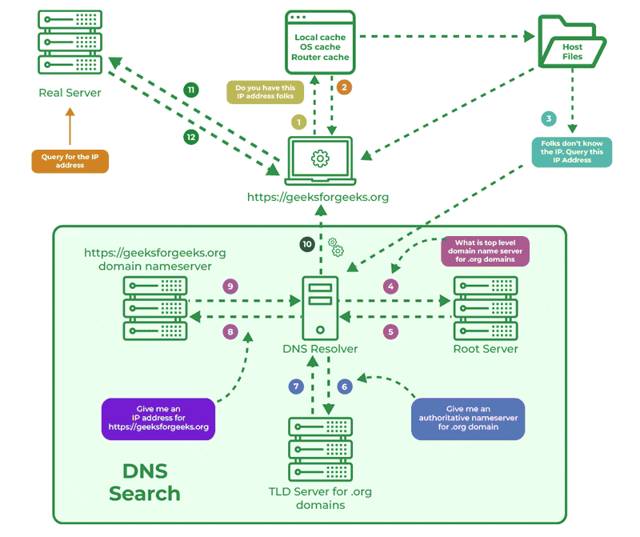
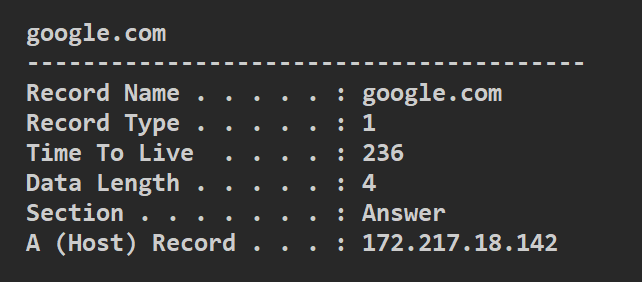

# Introduction

---

## What is Internet & How it Started?

- ARPA (Advanced Research Projects Agency) & ARPANET 1969
- To connects American universities and research institutions.
- Internet is simply a wire and any two computers connected to it can communicate.
  - Internet is actually a network of networks.
- Internet is not WWW (World Wide Web)

<!--

Cold War Era

- ARPANET used packet switching to send data between computers.
- In 1983, ARPANET transitioned to the TCP/IP protocol suite, which is still used today.
  - TCP/IP stands for Transmission Control Protocol/Internet Protocol.

- The first web browser, WorldWideWeb, was created by Tim Berners-Lee in 1990.
- In 1991, the first website was created by Tim Berners-Lee.
- The World Wide Web became publicly accessible in 1993.

-->

---

## Request/Response Life Cycle

<Youtube id="hWyBeEF3CqQ" width="70%" height="70%" class="m-auto mt-4" />

---

<div class="text-2xl mb-3">Steps:</div>

1. User Enters the URL
2. <span v-click>Domain Name System (DNS) Resolution</span>
3. <span v-click>Establishing a Connection</span>
4. <span v-click>Sending the HTTP Request</span>
5. <span v-click>Server Receives and Processes the Request</span>
6. <span v-click>Backend Processing (Optional)</span>
7. <span v-click>Generating the Response</span>
8. <span v-click>Sending the HTTP Response</span>
9. <span v-click>Receiving the Response</span>
10. <span v-click>HTML Parsing and Resource Requests</span>
11. <span v-click>The Rendering Engine</span>
12. <span v-click>GPU Processing and Display</span>

> <a href="https://github.com/MohamedEmary/ITI-client-side-tech/blob/main/other/client-side-tech/PDFs/req-res-lifecycle.pdf" target="_blank">PDF of the steps in details</a>

<!--
BE processing for things like:

- Querying DB
- Call other services like recommendation engines or advertising services

========================================

Req contains:

- Status code
- Header
- Body


Show them response data in browser network tab

========================================

Display images for the tree structure of CSSOM and DOM

Req header includes things like:

- user-agent
- cookies
- caching header
-->

---

## How DNS Works

<!-- Start the vid at 45s -->

<Youtube id="72snZctFFtA" width="70%" height="70%" class="m-auto mt-4" />

---

### DNS Lookup Steps for `www.example.com.`



---

### DNS Caching in Windows

Windows stores DNS records to speed up future requests.

Type the following in Windows CMD to get a list of cached DNS records:

```
ipconfig /displaydns
```



---

You can edit the hosts file to **_override_** a domain name, or add a custom domain to a local IP address.

Any address there takes precedence over DNS lookups.

- Windows hosts file `C:\Windows\System32\drivers\etc\hosts`
- Linux hosts file `/etc/hosts`

<!--
## TCP/IP

<Youtube id="OTwp3xtd4dg" width="70%" height="70%" class="m-auto mt-4" />
 -->
