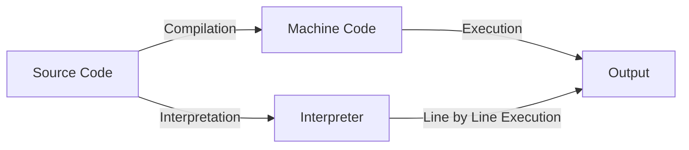

# JavaScript

---

## Brief History of JavaScript

- Created by Brendan Eich at Netscape in 1995 in Just 10 days.
- Originally called **Mocha**, then **LiveScript**, finally **JavaScript**
- Standardized as **ECMAScript**

---

## Compiled vs. Interpreted Languages

- **Compiled:** Code is translated to machine code before running (e.g., C, C++)
- **Interpreted:** Code is read and executed line by line (e.g., JavaScript, Python)
- **JavaScript** was traditionally interpreted, but now uses modern engines

---

## Compilation vs. Interpretation: Step-by-Step



- **Compilation:** Source code is fully translated to machine code before execution.
- **Interpretation:** Source code is executed line by line by an interpreter.

---

## The V8 Engine

- **V8** is Google Chrome’s JavaScript engine (also used in Node.js)
- Translates JS code into machine code using **JIT (Just-In-Time) compilation**
- **Why is it fast?**
    - Uses JIT (Just-In-Time) compilation to turn JS into machine code while running
    - Optimizes code that runs often
- Google Chrome and why google dominates the web

---

## Ways to Add JavaScript to a Page

- **Inline:**
    ```html
    <button onclick="alert('Hello!')">Click me</button>
    ```
- **Internal:**
    ```html
    <script>
        console.log("Hello from internal JS!");
    </script>
    ```
- **External:**
    ```html
    <script src="script.js"></script>
    ```

---

## `alert` & `console.log`

- **alert(message):**
    - Displays a popup dialog with the message.
    - Pauses script execution until the user closes the dialog.
    - `alert` is a method of the `window` object in browsers.
    - Example: `alert('Hello!');`
- **console.log(message):**
    - Prints the message to the browser's console.
    - `console` is a global object available in browsers.
        - `log` is a method of the `console` object.
    - Does not interrupt the user or pause execution.
    - Example: `console.log('Hello!');`

---

## JavaScript Operators

- **Arithmetic:** `+`, `-`, `*`, `/`, `%`, `++`, `--`
- **Assignment:** `=`, `+=`, `-=`, `*=`, `/=`, `%=`
    ```js
    var x = 5;
    x += 2; // x = 7
    ```
- **String Concatenation:**
    ```js
    var name = "Ali";
    var msg = "Hello, " + name + "!";
    ```

---

## Data Types & Loosely Typed Nature

- **Primitive Types:** `number`, `string`, `boolean`, `undefined`, `null`
- **Objects:** arrays, functions, objects
- **Loosely Typed:**
    - Variables can hold any type
    - Types can change at runtime
    ```js
    var x = 5;
    x = "now a string";
    ```

---

## Ways to Add Strings

- **Single quotes:** `'hello'`
- **Double quotes:** `"hello"`

---

## Comparison Operators

- `==` (loose equality, type coercion)
- `===` (strict equality, no type coercion)
- `!=`, `!==`
- `>`, `<`, `>=`, `<=`

---

## Logical Operators

- `&&` (AND)
- `||` (OR)
- `!` (NOT)

---

## Truthy and Falsy Values

- **Falsy:** `false`, `0`, `""`, `null`, `undefined`, `NaN`
- **Truthy:** Everything else

```js
if ("hello") {
    /* truthy */
}
if (0) {
    /* falsy */
}
```

---

## NaN, null, and undefined

### What is NaN?

- **NaN** stands for "Not-a-Number".
- It is the result of an invalid or undefined mathematical operation.
- Example cases:
    ```js
    var a = 0 / 0; // NaN
    var b = parseInt("hello"); // NaN
    var c = Math.sqrt(-1); // NaN
    var d = "abc" - 5; // NaN
    ```

---

### What is null?

- **null** is an assignment value that represents "no value" or "nothing".
- It is set intentionally by the programmer.
- Example:
    ```js
    var x = null;
    var y = document.getElementById("notfound"); // returns null if not found
    ```

---

### What is undefined?

- **undefined** means a variable has been declared but not assigned a value.
- It is the default value for uninitialized variables.
- Example:
    ```js
    var z;
    console.log(z); // undefined
    function foo() {}
    var result = foo(); // undefined (no return)
    var obj = {};
    console.log(obj.prop); // undefined
    ```

---

### Differences

- **NaN**: Result of invalid math; type is number.
- **null**: Intentional absence of value; type is object.
- **undefined**: Variable declared but not assigned; type is undefined.

---

## Conditional Statements

- **if / else if / else:**
    ```js
    if (score > 90) {
        console.log("Excellent");
    } else if (score > 70) {
        console.log("Good");
    } else {
        console.log("Try again");
    }
    ```

---

- **Nesting:**
    ```js
    if (age > 18) {
        if (hasID) {
            // allowed
        }
    }
    ```

---

## Switch Statements

```js
var color = "red";
switch (color) {
    case "red":
        console.log("Stop");
        break;
    case "green":
        console.log("Go");
        break;
    default:
        console.log("Unknown color");
}
```

---

- **Nesting:**
    ```js
    switch (type) {
        case "fruit":
            switch (name) {
                case "apple":
                    // ...
                    break;
            }
            break;
    }
    ```

---

## Loops in JavaScript

### for loop

```js
for (var i = 0; i < 5; i++) {
    console.log(i);
}
```

- **Initialization:** `var i = 0` (runs once at the start)
- **Condition:** `i < 5` (checked before each loop)
- **Step:** `i++` (runs after each loop)

#### What if you remove parts?

- **No initialization:**
    ```js
    var i = 0;
    for (; i < 5; i++) { ... }
    ```
- **No condition:** (infinite loop unless you break)
    ```js
    for (var i = 0;; i++) { ... }
    ```

---

- **No step:**
    ```js
    for (var i = 0; i < 5;) { ... i++; }
    ```
- **All omitted:**
    ```js
    for (;;) { ... } // infinite loop
    ```

---

### while loop

```js
var i = 0;
while (i < 5) {
    console.log(i);
    i++;
}
```

### do...while loop

```js
var i = 0;
do {
    console.log(i);
    i++;
} while (i < 5);
```

---

### `continue` vs `break` in Loops

- **`break`:** Exits the loop immediately.
- **`continue`:** Skips the current iteration and continues with the next one.

```js {monaco-run}
for (var i = 0; i < 5; i++) {
    if (i === 2) continue; // skips 2
    if (i === 4) break; // stops at 4
    console.log(i);
}
```

---

## Assignment

- Write an HTML file with a button. When the button is clicked, show an alert with your name.
- Create a variable and change its value from a number to a string. Print both values using `console.log`.
- Write a function that takes two numbers and prints their sum using `console.log`.
- Use an if/else statement to check if a number is positive, negative, or zero. Print the result.
- Write a for loop that prints numbers from 1 to 10.
- Write a while loop that prints numbers from 10 down to 1.
- Use a switch statement to print a message for different colors (red, green, blue, other).
- Write code that produces NaN, null, and undefined, and print their values using `console.log`.
- Write a function that takes a string and tries to convert it to a number. Print the result and check if it is NaN.
- Create an object and try to access a property that does not exist. Print the result.

---

- Write a function with no return statement. Call it and print the result.
- Write a nested if statement to check if a number is even and positive. Print a message for each case.
- Write a loop that sums all numbers from 1 to 100 and prints the result.

---

## confirm & prompt

- **confirm(message):** Shows OK/Cancel dialog, returns true/false.
    ```js
    var ok = confirm("Are you sure?");
    ```
- **prompt(message, default):** Shows input dialog, returns string or null.
    ```js
    var name = prompt("Enter your name:", "Ali");
    ```

---

## Functions

- **Parameters:** Variables in function definition.
- **Arguments:** Values passed to the function when called.

- **Function Declaration:**
    ```js
    function add(a, b) {
        return a + b;
    }
    ```
- **Function Expression:**
    ```js
    var multiply = function (a, b) {
        return a * b;
    };
    ```

---

### Functional Programming

JS supports functional programming with first-class functions, closures, and higher-order functions.

This means functions can be passed as arguments, returned from other functions, and assigned to variables.

---

First-class functions means that functions can be:

- Assigned to a variable
- Passed as an argument to another function
- Returned from another function
- Stored in arrays or objects

```js
function greet(name) {
    return function () {
        console.log("Hello, " + name);
    };
}

var greetAli = greet("Ali");
greetAli(); // "Hello, Ali"
```

---

## var Scope

- `var` is function-scoped, not block-scoped.

```js {monaco-run}
function test() {
    if (true) {
        var x = 10;
    }
    console.log(x); // 10
}
test();
```

---

Closure

```js {monaco-run}
function outer() {
    var x = 10;
    function inner() {
        console.log(x); // inner "remembers" x
    }
    return inner;
}
var fn = outer();
fn(); // prints 10
```

---

## Objects

- **Definition:**
    ```js
    var person = {
        name: "Ali",
        age: 25,
        greet: function () {
            console.log("Hello!");
        },
    };
    ```
- **Accessing Properties:**
    ```js
    console.log(person.name);
    console.log(person["age"]);
    ```

---

## Math Object

- Provides mathematical constants and functions.
    ```js
    Math.PI; // 3.1415...
    Math.round(2.7); // 3
    Math.random(); // random number 0-1
    Math.max(1, 5, 3); // 5
    ```

---

## parseInt vs Number

- **parseInt(string):** Parses up to first non-digit, returns integer.
    ```js
    parseInt("42px"); // 42
    parseInt("abc"); // NaN
    ```
- **Number(string):** Converts entire string, returns number or NaN.
    ```js
    Number("42"); // 42
    Number("42px"); // NaN
    ```

---

## toString vs toFixed

- **toString():** Converts value to string.
    ```js
    var n = 123;
    n.toString(); // "123"
    ```
- **toFixed(digits):** Formats number with fixed decimals.
    ```js
    var n = 3.14159;
    n.toFixed(2); // "3.14"
    ```

---

## NaN, isNaN, and Infinity

- **NaN:** Not-a-Number, result of invalid math.
- **isNaN(value):** Checks if value is NaN.
    ```js
    isNaN("abc"); // true
    ```
- **Infinity:** Result of dividing by zero.
    ```js
    1 / 0; // Infinity
    -1 / 0; // -Infinity
    ```

---

## Infinity \* 0, Infinity / Infinity, Infinity - Infinity

- **Infinity \* 0:** NaN
- **Infinity / Infinity:** NaN
- **Infinity - Infinity:** NaN
    ```js
    Infinity * 0; // NaN
    Infinity / Infinity; // NaN
    Infinity - Infinity; // NaN
    ```

---

## Negative Zero

- JavaScript has -0 and 0.
    ```js
    var a = -0;
    var b = 0;
    a === b; // true
    1 / a; // -Infinity
    1 / b; // Infinity
    ```

---

## Ternary Operator

- Short form of if/else.
    ```js
    var result = score > 50 ? "Pass" : "Fail";
    ```

---

## Dates and Dealing with Them

- **Create a Date:**
    ```js
    var now = new Date();
    var d = new Date("2025-07-10");
    ```
- **Get Parts:**
    ```js
    now.getFullYear();
    now.getMonth(); // 0-based
    now.getDate();
    now.getHours();
    ```

---

## Data Type Functions

- **String Methods:**
    - `length`: Returns the length of the string.
    - `toUpperCase()`: Converts to uppercase.
    - `toLowerCase()`: Converts to lowercase.
    - `indexOf(substring)`: Finds the index of a substring.
    - `substring(start, end)`: Extracts part of a string.
    - `replace(search, replacement)`: Replaces part of a string.
    - Example:
        ```js
        var s = "Hello World";
        s.length; // 11
        s.toUpperCase(); // "HELLO WORLD"
        s.indexOf("World"); // 6
        s.replace("World", "JS"); // "Hello JS"
        ```

---

- **Number Methods:**
    - `toFixed(digits)`: Formats with fixed decimals.
    - `toString()`: Converts number to string.
    - `parseInt(string)`: Parses string to integer.
    - `parseFloat(string)`: Parses string to float.
    - Example:
        ```js
        var n = 3.14159;
        n.toFixed(2); // "3.14"
        n.toString(); // "3.14159"
        parseInt("42px"); // 42
        parseFloat("3.14abc"); // 3.14
        ```

---

- **Array Methods:**
    - `push(item)`: Adds to end.
    - `pop()`: Removes from end.
    - `shift()`: Removes from start.
    - `unshift(item)`: Adds to start.
    - `slice(start, end)`: Returns shallow copy.
    - `splice(start, deleteCount, ...items)`: Changes array.
    - `join(separator)`: Joins elements into string.
    - Example:
        ```js
        var arr = [1, 2, 3];
        arr.push(4); // [1,2,3,4]
        arr.slice(1, 3); // [2,3]
        arr.join(","); // "1,2,3,4"
        ```

---

- **Object Methods:**
    - `Object.keys(obj)`: Returns array of property names.
    - `Object.values(obj)`: Returns array of property values.
    - `Object.entries(obj)`: Returns array of [key, value] pairs.
    - Example:
        ```js
        var person = { name: "Ali", age: 25 };
        Object.keys(person); // ["name", "age"]
        Object.values(person); // ["Ali", 25]
        Object.entries(person); // [["name", "Ali"], ["age", 25]]
        ```

---

## for in

- Used to iterate over object properties.
    ```js
    var obj = { a: 1, b: 2 };
    for (var key in obj) {
        console.log(key, obj[key]);
    }
    ```
