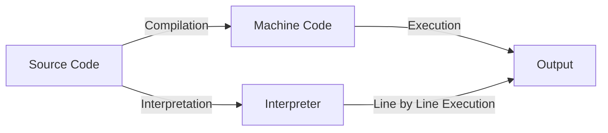

# JavaScript

---

## Brief History of JavaScript

- Created by Brendan Eich at Netscape in 1995 in Just 10 days.
- Originally called **Mocha**, then **LiveScript**, finally **JavaScript**
- Standardized as **ECMAScript**

---

## Compiled vs. Interpreted Languages

- **Compiled:** Code is translated to machine code before running (e.g., C, C++)
- **Interpreted:** Code is read and executed line by line (e.g., JavaScript, Python)
- **JavaScript** was traditionally interpreted, but now uses modern engines

---

## Compilation vs. Interpretation: Step-by-Step



- **Compilation:** Source code is fully translated to machine code before execution.
- **Interpretation:** Source code is executed line by line by an interpreter.

---

## The V8 Engine

- **V8** is Google Chrome’s JavaScript engine (also used in Node.js)
- Translates JS code into machine code using **JIT (Just-In-Time) compilation**
- **Why is it fast?**
    - Uses JIT (Just-In-Time) compilation to turn JS into machine code while running
    - Optimizes code that runs often
- Google Chrome and why google dominates the web

---

## Ways to Add JavaScript to a Page

- **Inline:**
    ```html
    <button onclick="alert('Hello!')">Click me</button>
    ```
- **Internal:**
    ```html
    <script>
        console.log("Hello from internal JS!");
    </script>
    ```
- **External:**
    ```html
    <script src="script.js"></script>
    ```

---

## `alert` & `console.log`

- **alert(message):**
    - Displays a popup dialog with the message.
    - Pauses script execution until the user closes the dialog.
    - `alert` is a method of the `window` object in browsers.
    - Example: `alert('Hello!');`
- **console.log(message):**
    - Prints the message to the browser's console.
    - `console` is a global object available in browsers.
        - `log` is a method of the `console` object.
    - Does not interrupt the user or pause execution.
    - Example: `console.log('Hello!');`

---

## JavaScript Operators

- **Arithmetic:** `+`, `-`, `*`, `/`, `%`, `++`, `--`
- **Assignment:** `=`, `+=`, `-=`, `*=`, `/=`, `%=`
    ```js
    var x = 5;
    x += 2; // x = 7
    ```
- **String Concatenation:**
    ```js
    var name = "Ali";
    var msg = "Hello, " + name + "!";
    ```

---

## Data Types & Loosely Typed Nature

- **Primitive Types:** `number`, `string`, `boolean`, `undefined`, `null`
- **Objects:** arrays, functions, objects
- **Loosely Typed:**
    - Variables can hold any type
    - Types can change at runtime
    ```js
    var x = 5;
    x = "now a string";
    ```

---

## Ways to Add Strings

- **Single quotes:** `'hello'`
- **Double quotes:** `"hello"`

---

## Comparison Operators

- `==` (loose equality, type coercion)
- `===` (strict equality, no type coercion)
- `!=`, `!==`
- `>`, `<`, `>=`, `<=`

---

## Logical Operators

- `&&` (AND)
- `||` (OR)
- `!` (NOT)

---

## Truthy and Falsy Values

- **Falsy:** `false`, `0`, `""`, `null`, `undefined`, `NaN`
- **Truthy:** Everything else

```js
if ("hello") {
    /* truthy */
}
if (0) {
    /* falsy */
}
```

---

## NaN, null, and undefined

### What is NaN?

- **NaN** stands for "Not-a-Number".
- It is the result of an invalid or undefined mathematical operation.
- Example cases:
    ```js
    var a = 0 / 0; // NaN
    var b = parseInt("hello"); // NaN
    var c = Math.sqrt(-1); // NaN
    var d = "abc" - 5; // NaN
    ```

---

### What is null?

- **null** is an assignment value that represents "no value" or "nothing".
- It is set intentionally by the programmer.
- Example:
    ```js
    var x = null;
    var y = document.getElementById("notfound"); // returns null if not found
    ```

---

### What is undefined?

- **undefined** means a variable has been declared but not assigned a value.
- It is the default value for uninitialized variables.
- Example:
    ```js
    var z;
    console.log(z); // undefined
    function foo() {}
    var result = foo(); // undefined (no return)
    var obj = {};
    console.log(obj.prop); // undefined
    ```

---

### Differences

- **NaN**: Result of invalid math; type is number.
- **null**: Intentional absence of value; type is object.
- **undefined**: Variable declared but not assigned; type is undefined.

---

## Conditional Statements

- **if / else if / else:**
    ```js
    if (score > 90) {
        console.log("Excellent");
    } else if (score > 70) {
        console.log("Good");
    } else {
        console.log("Try again");
    }
    ```
- **Nesting:**
    ```js
    if (age > 18) {
        if (hasID) {
            // allowed
        }
    }
    ```

---

## Switch Statements

```js
var color = "red";
switch (color) {
    case "red":
        console.log("Stop");
        break;
    case "green":
        console.log("Go");
        break;
    default:
        console.log("Unknown color");
}
```

- **Nesting:**
    ```js
    switch (type) {
        case "fruit":
            switch (name) {
                case "apple":
                    // ...
                    break;
            }
            break;
    }
    ```

---

## Loops in JavaScript

### for loop

```js
for (var i = 0; i < 5; i++) {
    console.log(i);
}
```

- **Initialization:** `var i = 0` (runs once at the start)
- **Condition:** `i < 5` (checked before each loop)
- **Step:** `i++` (runs after each loop)

#### What if you remove parts?

- **No initialization:**
    ```js
    var i = 0;
    for (; i < 5; i++) { ... }
    ```
- **No condition:** (infinite loop unless you break)
    ```js
    for (var i = 0;; i++) { ... }
    ```
- **No step:**
    ```js
    for (var i = 0; i < 5;) { ... i++; }
    ```
- **All omitted:**
    ```js
    for (;;) { ... } // infinite loop
    ```

### while loop

```js
var i = 0;
while (i < 5) {
    console.log(i);
    i++;
}
```

### do...while loop

```js
var i = 0;
do {
    console.log(i);
    i++;
} while (i < 5);
```

---

## Assignment

- Write an HTML file with a button. When the button is clicked, show an alert with your name.
- Create a variable and change its value from a number to a string. Print both values using `console.log`.
- Write a function that takes two numbers and prints their sum using `console.log`.
- Use an if/else statement to check if a number is positive, negative, or zero. Print the result.
- Write a for loop that prints numbers from 1 to 10.
- Write a while loop that prints numbers from 10 down to 1.
- Use a switch statement to print a message for different colors (red, green, blue, other).
- Write code that produces NaN, null, and undefined, and print their values using `console.log`.
- Write a function that takes a string and tries to convert it to a number. Print the result and check if it is NaN.
- Create an object and try to access a property that does not exist. Print the result.

---

- Write a function with no return statement. Call it and print the result.
- Write a nested if statement to check if a number is even and positive. Print a message for each case.
- Write a loop that sums all numbers from 1 to 100 and prints the result.
