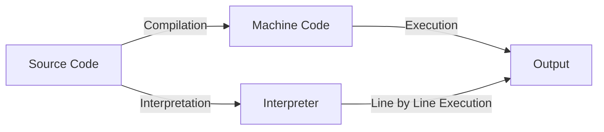

# JavaScript

---

## Brief History of JavaScript

- Created by Brendan Eich at Netscape in 1995 in Just 10 days.
- Originally called **Mocha**, then **LiveScript**, finally **JavaScript**
- Standardized as **ECMAScript**

---

## Compiled vs. Interpreted Languages

- **Compiled:** Code is translated to machine code before running (e.g., C, C++)
- **Interpreted:** Code is read and executed line by line (e.g., JavaScript, Python)
- **JavaScript** was traditionally interpreted, but now uses modern engines

---

## Compilation vs. Interpretation: Step-by-Step



- **Compilation:** Source code is fully translated to machine code before execution.
- **Interpretation:** Source code is executed line by line by an interpreter.

---

## The V8 Engine

- **V8** is Google Chrome’s JavaScript engine (also used in Node.js)
- Translates JS code into machine code using **JIT (Just-In-Time) compilation**
- **Why is it fast?**
    - Uses JIT (Just-In-Time) compilation to turn JS into machine code while running
    - Optimizes code that runs often
- Google Chrome and why google dominates the web

---

## Ways to Add JavaScript to a Page

- **Inline:**
    ```html
    <button onclick="alert('Hello!')">Click me</button>
    ```
- **Internal:**
    ```html
    <script>
        console.log("Hello from internal JS!");
    </script>
    ```
- **External:**
    ```html
    <script src="script.js"></script>
    ```

---

## `alert` & `console.log`

- **alert(message):**
    - Displays a popup dialog with the message.
    - Pauses script execution until the user closes the dialog.
    - `alert` is a method of the `window` object in browsers.
    - Example: `alert('Hello!');`
- **console.log(message):**
    - Prints the message to the browser's console.
    - `console` is a global object available in browsers.
        - `log` is a method of the `console` object.
    - Does not interrupt the user or pause execution.
    - Example: `console.log('Hello!');`

---

## JavaScript Operators

- **Arithmetic:** `+`, `-`, `*`, `/`, `%`, `++`, `--`
- **Assignment:** `=`, `+=`, `-=`, `*=`, `/=`, `%=`
    ```js
    var x = 5;
    x += 2; // x = 7
    ```
- **String Concatenation:**
    ```js
    var name = "Ali";
    var msg = "Hello, " + name + "!";
    ```

---

## Data Types & Loosely Typed Nature

- **Primitive Types:** `number`, `string`, `boolean`, `undefined`, `null`
- **Objects:** arrays, functions, objects
- **Loosely Typed:**
    - Variables can hold any type
    - Types can change at runtime
    ```js
    var x = 5;
    x = "now a string";
    ```

---

## Ways to Add Strings

- **Single quotes:** `'hello'`
- **Double quotes:** `"hello"`

---

## Comparison Operators

- `==` (loose equality, type coercion)
- `===` (strict equality, no type coercion)
- `!=`, `!==`
- `>`, `<`, `>=`, `<=`

---

## Logical Operators

- `&&` (AND)
- `||` (OR)
- `!` (NOT)

---

## Truthy and Falsy Values

- **Falsy:** `false`, `0`, `""`, `null`, `undefined`, `NaN`
- **Truthy:** Everything else

```js
if ("hello") {
    /* truthy */
}
if (0) {
    /* falsy */
}
```

---

## NaN, null, and undefined

### What is NaN?

- **NaN** stands for "Not-a-Number".
- It is the result of an invalid or undefined mathematical operation.
- Example cases:
    ```js
    var a = 0 / 0; // NaN
    var b = parseInt("hello"); // NaN
    var c = Math.sqrt(-1); // NaN
    var d = "abc" - 5; // NaN
    ```

---

### What is null?

- **null** is an assignment value that represents "no value" or "nothing".
- It is set intentionally by the programmer.
- Example:
    ```js
    var x = null;
    var y = document.getElementById("notfound"); // returns null if not found
    ```

---

### What is undefined?

- **undefined** means a variable has been declared but not assigned a value.
- It is the default value for uninitialized variables.
- Example:
    ```js
    var z;
    console.log(z); // undefined
    function foo() {}
    var result = foo(); // undefined (no return)
    var obj = {};
    console.log(obj.prop); // undefined
    ```

---

### Differences

- **NaN**: Result of invalid math; type is number.
- **null**: Intentional absence of value; type is object.
- **undefined**: Variable declared but not assigned; type is undefined.

---

## Conditional Statements

- **if / else if / else:**
    ```js
    if (score > 90) {
        console.log("Excellent");
    } else if (score > 70) {
        console.log("Good");
    } else {
        console.log("Try again");
    }
    ```

---

- **Nesting:**
    ```js
    if (age > 18) {
        if (hasID) {
            // allowed
        }
    }
    ```

---

## Switch Statements

```js
var color = "red";
switch (color) {
    case "red":
        console.log("Stop");
        break;
    case "green":
        console.log("Go");
        break;
    default:
        console.log("Unknown color");
}
```

---

- **Nesting:**
    ```js
    switch (type) {
        case "fruit":
            switch (name) {
                case "apple":
                    // ...
                    break;
            }
            break;
    }
    ```

---

## Loops in JavaScript

### for loop

```js
for (var i = 0; i < 5; i++) {
    console.log(i);
}
```

- **Initialization:** `var i = 0` (runs once at the start)
- **Condition:** `i < 5` (checked before each loop)
- **Step:** `i++` (runs after each loop)

#### What if you remove parts?

- **No initialization:**
    ```js
    var i = 0;
    for (; i < 5; i++) { ... }
    ```
- **No condition:** (infinite loop unless you break)
    ```js
    for (var i = 0;; i++) { ... }
    ```

---

- **No step:**
    ```js
    for (var i = 0; i < 5;) { ... i++; }
    ```
- **All omitted:**
    ```js
    for (;;) { ... } // infinite loop
    ```

---

### while loop

```js
var i = 0;
while (i < 5) {
    console.log(i);
    i++;
}
```

### do...while loop

```js
var i = 0;
do {
    console.log(i);
    i++;
} while (i < 5);
```

---

### `continue` vs `break` in Loops

- **`break`:** Exits the loop immediately.
- **`continue`:** Skips the current iteration and continues with the next one.

```js {monaco-run}
for (var i = 0; i < 5; i++) {
    if (i === 2) continue; // skips 2
    if (i === 4) break; // stops at 4
    console.log(i);
}
```

---

## Assignment

- Write an HTML file with a button. When the button is clicked, show an alert with your name.
- Create a variable and change its value from a number to a string. Print both values using `console.log`.
- Write a function that takes two numbers and prints their sum using `console.log`.
- Use an if/else statement to check if a number is positive, negative, or zero. Print the result.
- Write a for loop that prints numbers from 1 to 10.
- Write a while loop that prints numbers from 10 down to 1.
- Use a switch statement to print a message for different colors (red, green, blue, other).
- Write code that produces NaN, null, and undefined, and print their values using `console.log`.
- Write a function that takes a string and tries to convert it to a number. Print the result and check if it is NaN.
- Create an object and try to access a property that does not exist. Print the result.

---

- Write a function with no return statement. Call it and print the result.
- Write a nested if statement to check if a number is even and positive. Print a message for each case.
- Write a loop that sums all numbers from 1 to 100 and prints the result.

---

## confirm & prompt

- **confirm(message):** Shows OK/Cancel dialog, returns true/false.
    ```js
    var ok = confirm("Are you sure?");
    ```
- **prompt(message, default):** Shows input dialog, returns string or null.
    ```js
    var name = prompt("Enter your name:", "Ali");
    ```

---

## Functions

- **Parameters:** Variables in function definition.
- **Arguments:** Values passed to the function when called.

- **Function Declaration:**
    ```js
    function add(a, b) {
        return a + b;
    }
    ```
- **Function Expression:**
    ```js
    var multiply = function (a, b) {
        return a * b;
    };
    ```

---

### Functional Programming

JS supports functional programming with first-class functions, closures, and higher-order functions.

This means functions can be passed as arguments, returned from other functions, and assigned to variables.

---

First-class functions means that functions can be:

- Assigned to a variable
- Passed as an argument to another function
- Returned from another function
- Stored in arrays or objects

```js
function greet(name) {
    return function () {
        console.log("Hello, " + name);
    };
}

var greetAli = greet("Ali");
greetAli(); // "Hello, Ali"
```

---

## `var` Scope

- `var` is function-scoped, not block-scoped.

```js {monaco-run}
function test() {
    if (true) {
        var x = 10;
    }
    console.log(x); // 10
}
test();
```

---

Closure

```js {monaco-run}
function outer() {
    var x = 10;
    function inner() {
        console.log(x); // inner "remembers" x
    }
    return inner;
}
var fn = outer();
fn(); // prints 10
```

---

## Objects

- **Definition:**
    ```js
    var person = {
        name: "Ali",
        age: 25,
        greet: function () {
            console.log("Hello!");
        },
    };
    ```
- **Accessing Properties:**
    ```js
    console.log(person.name);
    console.log(person["age"]);
    ```

---

## `Math` Object

- Provides mathematical constants and functions.
    ```js
    Math.PI; // 3.1415...
    Math.round(2.7); // 3
    Math.random(); // random number 0-1
    Math.max(1, 5, 3); // 5
    ```

---

## `parseInt` vs `Number`

- **`parseInt(string)`:** Parses up to first non-digit, returns integer.
    ```js
    parseInt("42px"); // 42
    parseInt("abc"); // NaN
    ```
- **`Number(string)`:** Converts entire string, returns number or `NaN`.
    ```js
    Number("42"); // 42
    Number("42px"); // NaN
    ```

---

## `toString` vs `toFixed`

- **`toString()`:** Converts value to string.
    ```js
    var n = 123;
    n.toString(); // "123"
    ```
- **`toFixed(digits)`:** Formats number with fixed decimals.
    ```js
    var n = 3.14159;
    n.toFixed(2); // "3.14"
    ```

---

## `NaN`, `isNaN`, and `Infinity`

- **`NaN`:** Not-a-Number, result of invalid math.
- **`isNaN(value)`:** Checks if value is `NaN`.
    ```js
    isNaN("abc"); // true
    ```
- **Infinity:** Result of dividing by zero.
    ```js
    1 / 0; // Infinity
    -1 / 0; // -Infinity
    ```

---

## `NaN` Operations

- **`Infinity * 0`:** `NaN`
- **`Infinity / Infinity`:** `NaN`
- **`Infinity - Infinity`:** `NaN`
    ```js
    Infinity * 0; // NaN
    Infinity / Infinity; // NaN
    Infinity - Infinity; // NaN
    ```

---

## Negative Zero

- JavaScript has `-0` and `0`.
    ```js
    var a = -0;
    var b = 0;
    a === b; // true
    1 / a; // -Infinity
    1 / b; // Infinity
    ```

---

## Ternary Operator `? :`

- Short form of if/else.
    ```js
    var result = score > 50 ? "Pass" : "Fail";
    ```

---

## Data Type Functions

- **String Methods:**
    - `length`: Returns the length of the string.
    - `toUpperCase()`: Converts to uppercase.
    - `toLowerCase()`: Converts to lowercase.
    - `indexOf(substring)`: Finds the index of a substring.
    - `substring(start, end)`: Extracts part of a string.
    - `replace(search, replacement)`: Replaces part of a string.
    - Example:
        ```js
        var s = "Hello World";
        s.length; // 11
        s.toUpperCase(); // "HELLO WORLD"
        s.indexOf("World"); // 6
        s.replace("World", "JS"); // "Hello JS"
        ```

---

- **Number Methods:**
    - `toFixed(digits)`: Formats with fixed decimals.
    - `toString()`: Converts number to string.
    - `parseInt(string)`: Parses string to integer.
    - `parseFloat(string)`: Parses string to float.
    - Example:
        ```js
        var n = 3.14159;
        n.toFixed(2); // "3.14"
        n.toString(); // "3.14159"
        parseInt("42px"); // 42
        parseFloat("3.14abc"); // 3.14
        ```

---

- **Array Methods:**
    - `push(item)`: Adds to end.
    - `pop()`: Removes from end.
    - `shift()`: Removes from start.
    - `unshift(item)`: Adds to start.
    - `slice(start, end)`: Returns shallow copy.
    - `splice(start, deleteCount, ...items)`: Changes array.
    - `join(separator)`: Joins elements into string.
    - Example:
        ```js
        var arr = [1, 2, 3];
        arr.push(4); // [1,2,3,4]
        arr.slice(1, 3); // [2,3]
        arr.join(","); // "1,2,3,4"
        ```

---

- **Object Methods:**
    - `Object.keys(obj)`: Returns array of property names.
    - `Object.values(obj)`: Returns array of property values.
    - `Object.entries(obj)`: Returns array of [key, value] pairs.
    - Example:
        ```js
        var person = { name: "Ali", age: 25 };
        Object.keys(person); // ["name", "age"]
        Object.values(person); // ["Ali", 25]
        Object.entries(person); // [["name", "Ali"], ["age", 25]]
        ```

---

## `for ... in`

- Used to iterate over object properties.
    ```js
    var obj = { a: 1, b: 2 };
    for (var key in obj) {
        console.log(key, obj[key]);
    }
    ```

---

## Assignment

1. Write a program to check if a given number is positive, negative, or zero using if-else.
2. Write a program that uses `confirm()` to ask the user: "Do you want to proceed?" If the user clicks OK, display "You chose to proceed" in an alert. If the user clicks Cancel, display "Action canceled."
3. Modify this code to use a ternary operator instead of if-else:

```js
var num = 10;
if (num % 2 === 0) {
    console.log("hi");
} else {
    console.log("hello");
}
```

---

4. Ask the user to enter their age. You must validate the user input (positive numbers only). Show the status of the user knowing that:
    - Child is between 1-10
    - Teenager is between 11-18
    - Grown up is between 19-50
    - Old is greater than 50  
      Keep asking the user to enter another age until they click cancel.
5. Ask the user to enter a string. Count the number of vowels in that string (`a`, `e`, `o`, `u`, `i`).
6. Write a JavaScript program to convert the 24-hour clock to 12-hour, adding AM or PM based on its value. Use `prompt()` to get the value from the user.  
   Examples:  
   `0 -> 12AM`  
   `11 -> 11AM`  
   `13 -> 1PM`

---

7. Write a JavaScript program to convert the first letter of a string to uppercase. Ask the user to enter the string and show the result.
8. Write a script where the user confirms their choice of color:
    - First, use `prompt()` to let the user type their favorite color.
    - Then, use `confirm()` to ask: "You chose [color]. Is that correct?"
    - If OK, display an alert: "Great choice!"
    - If Cancel, display: "Let's try again."
9. Write a while loop that keeps prompting the user for a password until they enter the correct one.
10. How do you compare two dates in JavaScript to see if one is earlier than the other?
11. Write a JavaScript program to calculate the number of days between two given dates.
12. Use a for loop to calculate the sum of all even numbers between 1 and 100.
13. How can you extract the substring "World" from the string "Hello World!"?
14. How can you round the number 5.678 to two decimal places?
15. Write a JavaScript program that returns `true` if a number is divisible by both 3 and 5, otherwise `false`.

---

## Date in JavaScript

### Date Constructor

The JavaScript `Date` constructor can create date objects using the following [parameters](https://developer.mozilla.org/en-US/docs/Web/JavaScript/Reference/Global_Objects/Date/Date#syntax):

- Date strings in various formats (e.g., `"Oct 4 1990"`, `"1990-10-4"`, `"10/4/1990"`, `"1990"`, `"90"`, `"1990 10"`).
- Timestamp (e.g., `"1990-10-25T06:10:00Z"`).
- Numeric values for year, month (0-based), day, hour, minute, second, millisecond (e.g., `new Date(1990, 9, 4)`).
    - Number of milliseconds since Jan 1, 1970 (Epoch time).

[**Valid datetime values**](https://developer.mozilla.org/en-US/docs/Web/HTML/Reference/Elements/time#valid_datetime_values)

---

### `Date.now()`

Returns current timestamp in milliseconds since Jan 1, 1970 (Epoch Time).

```js
console.log(Date.now()); // 1752353340443
```

<br>
<br>

### Epoch Time / Unix Time

- Number of seconds since January 1, 1970.
- Used as a starting point for time calculations in computers.
- Important for tracking and comparing dates.
- **Year 2038 Problem:** Limitation in 32-bit systems for storing time.

---

<h3 class="mt-55"> Date Methods (Getters)</h3>

---

| Method          | Description                              | Return Value / Range |
| --------------- | ---------------------------------------- | -------------------- |
| `getTime()`     | Number of milliseconds since Jan 1, 1970 | Number               |
| `getDate()`     | Day of the month                         | 1-31                 |
| `getFullYear()` | Four-digit year                          | e.g., 2025           |
| `getMonth()`    | Month (zero-based)                       | 0-11 (Jan=0, Dec=11) |
| `getDay()`      | Day of the week (Sunday=0)               | 0-6                  |
| `getHours()`    | Hour                                     | 0-23                 |
| `getMinutes()`  | Minutes                                  | 0-59                 |
| `getSeconds()`  | Seconds                                  | 0-59                 |

---

<h3 class="mt-55"> Date Methods (Setters)</h3>

---

| Method                                     | Description                                      | Parameters                     |
| ------------------------------------------ | :----------------------------------------------- | ------------------------------ |
| `setTime(milliseconds)`                    | Sets time using milliseconds since Jan 1, 1970   | milliseconds (Number)          |
| `setDate(day)`                             | Sets day of the month (can be negative/positive) | day (Number)                   |
| `setFullYear(year, month?, day?)`          | Sets year, optional month and day                | year (Number), month?, day?    |
| `setMonth(month, day?)`                    | Sets month (0-11), optional day                  | month (Number), day?           |
| `setHours(hours, minutes?, seconds?, ms?)` | Sets hour and optionally minutes, seconds, ms    | hours, minutes?, seconds?, ms? |

There is also `setMinutes`, and `setSeconds` which work in a similar way to `setHours`

---

### Date Parsing & Formatting

- `Date.parse(string)`: Parses a date string and returns timestamp.
- `toLocaleString(locale, options)`: Formats date/time for a specific locale.
    - Options: `weekday`, `day`, `month`, `year`, `timeZone`, etc.

---

### Comparing Dates

- Dates can be compared using subtraction or relational operators.
    - Example: `date1 < date2` checks if date1 is earlier than date2.
    - Subtracting two dates gives the difference in milliseconds.

---

### Calculating Age or Duration

- Subtract two dates to get the difference in milliseconds.
- Convert milliseconds to seconds, minutes, hours, days, or years as needed.

<br>
<br>

### Measuring Code Execution Time

- Use `Date.now()` before and after code execution.
- Subtract start time from end time to get duration in milliseconds or seconds.

---

## DOM (Document Object Model)

- The DOM is a tree-like structure representing the document as nodes and objects.
- HTML is the initial page content; the DOM is the current content in memory.
- JavaScript interacts with the DOM to change, add, or remove elements.

---

### Selecting Elements in the DOM

- `getElementById('id')`: Returns the element with the specified ID.
- `getElementsByClassName('class')`: Returns a **collection** of elements with the class name.
- `getElementsByTagName('tag')`: Returns a **collection** of elements with the tag name.
- `getElementsByName('name')`: Returns a **node list** of elements with the name attribute.
- `querySelector('selector')`: Returns the first element matching the CSS selector.
- `querySelectorAll('selector')`: Returns a **node list** of all elements matching the selector.

```js
var element = document.getElementById("myElement");
var elements = document.getElementsByClassName("myClass");
var elementsArray = Array.from(elements); // Convert HTMLCollection to array
```

---

### Built-in Document Properties

- `document.documentElement`: `<html>` element
- `document.head`: `<head>` element
- `document.body`: `<body>` element
- `document.title`: Title of the document
- `document.images`: Collection of `` elements
- `document.links`: Collection of `<a>` elements with `href`
- `document.forms`: Collection of `<form>` elements
- `document.scripts`: Collection of `<script>` elements
- `document.styleSheets`: Collection of stylesheets

---

### Event Listeners

- Listen for events and execute functions when events occur.
- Syntax: `element.addEventListener(event, function)`
- Example:

```html
<button id="myButton">Click me</button>
```

```js
function sayHello() {
    console.log("Hello!");
}
document.getElementById("myButton").addEventListener("click", sayHello);
```

- Use anonymous functions to pass parameters:

```js
button.addEventListener("click", function () {
    sayHello("John");
});
```

---

### addEventListener vs element.event

- `addEventListener` allows multiple listeners for the same event.
- `element.onclick = ...` only allows one listener per event type.

---

### Event Object

- Contains info about the event: `type`, `target`, `clientX`, `clientY`, `keyCode`, etc.
- Example:

```js
document.getElementById("myButton").addEventListener("click", function (event) {
    console.log(event);
});
```

---

### Common Events

- Mouse: `click`, `dblclick`, `mousemove`, `mouseenter`, `mouseleave`, `mouseup`, `mousedown`, `mouseover`, `mouseout`, `scroll`, `drag`, `dragstart`, `dragend`
- Keyboard: `keyup`, `keydown`, `keypress`
- Input/Form: `input`, `change`, `submit`
- Focus: `focus`, `blur`

---

### Changing Element Styles

- Use the `style` property:

```js
var element = document.getElementById("myElement");
element.style.backgroundColor = "red";
element.style.cssText = "background-color: red; color: white; font-size: 20px;";
```

- Inline styles override external CSS unless `!important` is used.

---

### Get, Set, Remove Attributes

- `setAttribute(name, value)`, `getAttribute(name)`, `removeAttribute(name)`

```js
var img = document.getElementById("myImage");
img.setAttribute("src", "image.jpg");
img.setAttribute("alt", "My Image");
console.log(img.getAttribute("src"));
img.removeAttribute("alt");
```

---

### classList Property

- `add`, `remove`, `toggle`, `replace`, `contains` classes on an element.

```js
var element = document.getElementById("myElement");
element.classList.add("myClass");
element.classList.remove("myClass");
element.classList.toggle("myClass");
var hasClass = element.classList.contains("myClass");
element.classList.replace("oldClass", "newClass");
```

---

### Event Propagation

- **Bubbling:** Event starts at target and bubbles up to root.
- **Capturing:** Event starts at root and goes down to target.
- Use `addEventListener(event, handler, useCapture)` to control propagation.
- Stop propagation with `event.stopPropagation()`.

---

### innerHTML vs innerText

- `innerHTML`: Gets/sets HTML content (renders tags).
- `innerText`: Gets/sets text content (renders tags as text).

```html
<p id="example">My <strong>example</strong> paragraph</p>
```

```js
var example = document.getElementById("example");
console.log(example.innerHTML); // My <strong>example</strong> paragraph
console.log(example.innerText); // My example paragraph
```

---

### Creating Elements

- Use `document.createElement('tag')` to create new elements.
- Set attributes with `setAttribute` or dot notation.
- Append/prepend with `append()`, `prepend()`.
- Add before/after with `before()`, `after()`.

```js
var parent = document.getElementById("parent");
var newElement = document.createElement("p");
newElement.innerText = "New paragraph";
parent.append(newElement);
```

---

### Traversing the DOM

<!-- - `parentElement`, `parentNode`: Get parent
- `firstElementChild`, `lastElementChild`: Get first/last child element
- `children`: HTMLCollection of child elements
- `childNodes`: NodeList of child nodes
- `nextElementSibling`, `previousElementSibling`: Next/previous sibling element
- `nextSibling`, `previousSibling`: Next/previous sibling node -->

---

### NodeList vs HTMLCollection

| NodeList                                     | HTMLCollection                                 |
| -------------------------------------------- | ---------------------------------------------- |
| Static (does not update)                     | Live (updates with DOM)                        |
| List of nodes                                | List of elements                               |
| Can include text, comment nodes              | Only elements                                  |
| Returned by `querySelectorAll`, `childNodes` | Returned by `getElementsByTagName`, `children` |
