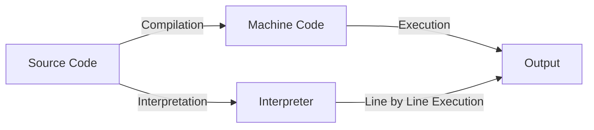

# JavaScript

---

## Brief History of JavaScript

- Created by Brendan Eich at Netscape in 1995 in Just 10 days.
- Originally called **Mocha**, then **LiveScript**, finally **JavaScript**
- Standardized as **ECMAScript**

---

## Compiled vs. Interpreted Languages

- **Compiled:** Code is translated to machine code before running (e.g., C, C++)
- **Interpreted:** Code is read and executed line by line (e.g., JavaScript, Python)
- **JavaScript** was traditionally interpreted, but now uses modern engines

---

## Compilation vs. Interpretation: Step-by-Step



- **Compilation:** Source code is fully translated to machine code before execution.
- **Interpretation:** Source code is executed line by line by an interpreter.

---

## The V8 Engine

- **V8** is Google Chrome’s JavaScript engine (also used in Node.js)
- Translates JS code into machine code using **JIT (Just-In-Time) compilation**
- **Why is it fast?**
    - Uses JIT (Just-In-Time) compilation to turn JS into machine code while running
    - Optimizes code that runs often
- Google Chrome and why google dominates the web

---

## Ways to Add JavaScript to a Page

- **Inline:**
    ```html
    <button onclick="alert('Hello!')">Click me</button>
    ```
- **Internal:**
    ```html
    <script>
        console.log("Hello from internal JS!");
    </script>
    ```
- **External:**
    ```html
    <script src="script.js"></script>
    ```

---

## `alert` & `console.log`

- **alert(message):**
    - Displays a popup dialog with the message.
    - Pauses script execution until the user closes the dialog.
    - `alert` is a method of the `window` object in browsers.
    - Example: `alert('Hello!');`
- **console.log(message):**
    - Prints the message to the browser's console.
    - `console` is a global object available in browsers.
        - `log` is a method of the `console` object.
    - Does not interrupt the user or pause execution.
    - Example: `console.log('Hello!');`

---

## JavaScript Operators

- **Arithmetic:** `+`, `-`, `*`, `/`, `%`, `++`, `--`
- **Assignment:** `=`, `+=`, `-=`, `*=`, `/=`, `%=`
    ```js
    var x = 5;
    x += 2; // x = 7
    ```
- **String Concatenation:**
    ```js
    var name = "Ali";
    var msg = "Hello, " + name + "!";
    ```

---

## Data Types & Loosely Typed Nature

- **Primitive Types:** `number`, `string`, `boolean`, `undefined`, `null`
- **Objects:** arrays, functions, objects
- **Loosely Typed:**
    - Variables can hold any type
    - Types can change at runtime
    ```js
    var x = 5;
    x = "now a string";
    ```

---

## Ways to Add Strings

- **Single quotes:** `'hello'`
- **Double quotes:** `"hello"`

---

## Comparison Operators

- `==` (loose equality, type coercion)
- `===` (strict equality, no type coercion)
- `!=`, `!==`
- `>`, `<`, `>=`, `<=`

---

## Logical Operators

- `&&` (AND)
- `||` (OR)
- `!` (NOT)

---

## Truthy and Falsy Values

- **Falsy:** `false`, `0`, `""`, `null`, `undefined`, `NaN`
- **Truthy:** Everything else

```js
if ("hello") {
    /* truthy */
}
if (0) {
    /* falsy */
}
```

---

## NaN, null, and undefined

### What is NaN?

- **NaN** stands for "Not-a-Number".
- It is the result of an invalid or undefined mathematical operation.
- Example cases:
    ```js
    var a = 0 / 0; // NaN
    var b = parseInt("hello"); // NaN
    var c = Math.sqrt(-1); // NaN
    var d = "abc" - 5; // NaN
    ```

---

### What is null?

- **null** is an assignment value that represents "no value" or "nothing".
- It is set intentionally by the programmer.
- Example:
    ```js
    var x = null;
    var y = document.getElementById("notfound"); // returns null if not found
    ```

---

### What is undefined?

- **undefined** means a variable has been declared but not assigned a value.
- It is the default value for uninitialized variables.
- Example:
    ```js
    var z;
    console.log(z); // undefined
    function foo() {}
    var result = foo(); // undefined (no return)
    var obj = {};
    console.log(obj.prop); // undefined
    ```

---

### Differences

- **NaN**: Result of invalid math; type is number.
- **null**: Intentional absence of value; type is object.
- **undefined**: Variable declared but not assigned; type is undefined.

---

## Conditional Statements

- **if / else if / else:**
    ```js
    if (score > 90) {
        console.log("Excellent");
    } else if (score > 70) {
        console.log("Good");
    } else {
        console.log("Try again");
    }
    ```

---

- **Nesting:**
    ```js
    if (age > 18) {
        if (hasID) {
            // allowed
        }
    }
    ```

---

## Switch Statements

```js
var color = "red";
switch (color) {
    case "red":
        console.log("Stop");
        break;
    case "green":
        console.log("Go");
        break;
    default:
        console.log("Unknown color");
}
```

---

- **Nesting:**
    ```js
    switch (type) {
        case "fruit":
            switch (name) {
                case "apple":
                    // ...
                    break;
            }
            break;
    }
    ```

---

## Loops in JavaScript

### for loop

```js
for (var i = 0; i < 5; i++) {
    console.log(i);
}
```

- **Initialization:** `var i = 0` (runs once at the start)
- **Condition:** `i < 5` (checked before each loop)
- **Step:** `i++` (runs after each loop)

#### What if you remove parts?

- **No initialization:**
    ```js
    var i = 0;
    for (; i < 5; i++) { ... }
    ```
- **No condition:** (infinite loop unless you break)
    ```js
    for (var i = 0;; i++) { ... }
    ```

---

- **No step:**
    ```js
    for (var i = 0; i < 5;) { ... i++; }
    ```
- **All omitted:**
    ```js
    for (;;) { ... } // infinite loop
    ```

---

### while loop

```js
var i = 0;
while (i < 5) {
    console.log(i);
    i++;
}
```

### do...while loop

```js
var i = 0;
do {
    console.log(i);
    i++;
} while (i < 5);
```

---

### `continue` vs `break` in Loops

- **`break`:** Exits the loop immediately.
- **`continue`:** Skips the current iteration and continues with the next one.

```js {monaco-run}
for (var i = 0; i < 5; i++) {
    if (i === 2) continue; // skips 2
    if (i === 4) break; // stops at 4
    console.log(i);
}
```

---

## Assignment

- Write an HTML file with a button. When the button is clicked, show an alert with your name.
- Create a variable and change its value from a number to a string. Print both values using `console.log`.
- Write a function that takes two numbers and prints their sum using `console.log`.
- Use an if/else statement to check if a number is positive, negative, or zero. Print the result.
- Write a for loop that prints numbers from 1 to 10.
- Write a while loop that prints numbers from 10 down to 1.
- Use a switch statement to print a message for different colors (red, green, blue, other).
- Write code that produces NaN, null, and undefined, and print their values using `console.log`.
- Write a function that takes a string and tries to convert it to a number. Print the result and check if it is NaN.
- Create an object and try to access a property that does not exist. Print the result.

---

- Write a function with no return statement. Call it and print the result.
- Write a nested if statement to check if a number is even and positive. Print a message for each case.
- Write a loop that sums all numbers from 1 to 100 and prints the result.

---

## confirm & prompt

- **confirm(message):** Shows OK/Cancel dialog, returns true/false.
    ```js
    var ok = confirm("Are you sure?");
    ```
- **prompt(message, default):** Shows input dialog, returns string or null.
    ```js
    var name = prompt("Enter your name:", "Ali");
    ```

---

## Functions

- **Parameters:** Variables in function definition.
- **Arguments:** Values passed to the function when called.

- **Function Declaration:**
    ```js
    function add(a, b) {
        return a + b;
    }
    ```
- **Function Expression:**
    ```js
    var multiply = function (a, b) {
        return a * b;
    };
    ```

---

### Functional Programming

JS supports functional programming with first-class functions, closures, and higher-order functions.

This means functions can be passed as arguments, returned from other functions, and assigned to variables.

---

First-class functions means that functions can be:

- Assigned to a variable
- Passed as an argument to another function
- Returned from another function
- Stored in arrays or objects

```js
function greet(name) {
    return function () {
        console.log("Hello, " + name);
    };
}

var greetAli = greet("Ali");
greetAli(); // "Hello, Ali"
```

---

## `var` Scope

- `var` is function-scoped, not block-scoped.

```js {monaco-run}
function test() {
    if (true) {
        var x = 10;
    }
    console.log(x); // 10
}
test();
```

---

Closure

```js {monaco-run}
function outer() {
    var x = 10;
    function inner() {
        console.log(x); // inner "remembers" x
    }
    return inner;
}
var fn = outer();
fn(); // prints 10
```

---

## Objects

- **Definition:**
    ```js
    var person = {
        name: "Ali",
        age: 25,
        greet: function () {
            console.log("Hello!");
        },
    };
    ```
- **Accessing Properties:**
    ```js
    console.log(person.name);
    console.log(person["age"]);
    ```

---

## `Math` Object

- Provides mathematical constants and functions.
    ```js
    Math.PI; // 3.1415...
    Math.round(2.7); // 3
    Math.random(); // random number 0-1
    Math.max(1, 5, 3); // 5
    ```

---

## `parseInt` vs `Number`

- **`parseInt(string)`:** Parses up to first non-digit, returns integer.
    ```js
    parseInt("42px"); // 42
    parseInt("abc"); // NaN
    ```
- **`Number(string)`:** Converts entire string, returns number or `NaN`.
    ```js
    Number("42"); // 42
    Number("42px"); // NaN
    ```

---

## `toString` vs `toFixed`

- **`toString()`:** Converts value to string.
    ```js
    var n = 123;
    n.toString(); // "123"
    ```
- **`toFixed(digits)`:** Formats number with fixed decimals.
    ```js
    var n = 3.14159;
    n.toFixed(2); // "3.14"
    ```

---

## `NaN`, `isNaN`, and `Infinity`

- **`NaN`:** Not-a-Number, result of invalid math.
- **`isNaN(value)`:** Checks if value is `NaN`.
    ```js
    isNaN("abc"); // true
    ```
- **Infinity:** Result of dividing by zero.
    ```js
    1 / 0; // Infinity
    -1 / 0; // -Infinity
    ```

---

## `NaN` Operations

- **`Infinity * 0`:** `NaN`
- **`Infinity / Infinity`:** `NaN`
- **`Infinity - Infinity`:** `NaN`
    ```js
    Infinity * 0; // NaN
    Infinity / Infinity; // NaN
    Infinity - Infinity; // NaN
    ```

---

## Negative Zero

- JavaScript has `-0` and `0`.
    ```js
    var a = -0;
    var b = 0;
    a === b; // true
    1 / a; // -Infinity
    1 / b; // Infinity
    ```

---

## Ternary Operator `? :`

- Short form of if/else.
    ```js
    var result = score > 50 ? "Pass" : "Fail";
    ```

---

## Data Type Functions

- **String Methods:**
    - `length`: Returns the length of the string.
    - `toUpperCase()`: Converts to uppercase.
    - `toLowerCase()`: Converts to lowercase.
    - `indexOf(substring)`: Finds the index of a substring.
    - `substring(start, end)`: Extracts part of a string.
    - `replace(search, replacement)`: Replaces part of a string.
    - Example:
        ```js
        var s = "Hello World";
        s.length; // 11
        s.toUpperCase(); // "HELLO WORLD"
        s.indexOf("World"); // 6
        s.replace("World", "JS"); // "Hello JS"
        ```

---

- **Number Methods:**
    - `toFixed(digits)`: Formats with fixed decimals.
    - `toString()`: Converts number to string.
    - `parseInt(string)`: Parses string to integer.
    - `parseFloat(string)`: Parses string to float.
    - Example:
        ```js
        var n = 3.14159;
        n.toFixed(2); // "3.14"
        n.toString(); // "3.14159"
        parseInt("42px"); // 42
        parseFloat("3.14abc"); // 3.14
        ```

---

- **Array Methods:**
    - `push(item)`: Adds to end.
    - `pop()`: Removes from end.
    - `shift()`: Removes from start.
    - `unshift(item)`: Adds to start.
    - `slice(start, end)`: Returns shallow copy.
    - `splice(start, deleteCount, ...items)`: Changes array.
    - `join(separator)`: Joins elements into string.
    - Example:
        ```js
        var arr = [1, 2, 3];
        arr.push(4); // [1,2,3,4]
        arr.slice(1, 3); // [2,3]
        arr.join(","); // "1,2,3,4"
        ```

---

- **Object Methods:**
    - `Object.keys(obj)`: Returns array of property names.
    - `Object.values(obj)`: Returns array of property values.
    - `Object.entries(obj)`: Returns array of [key, value] pairs.
    - Example:
        ```js
        var person = { name: "Ali", age: 25 };
        Object.keys(person); // ["name", "age"]
        Object.values(person); // ["Ali", 25]
        Object.entries(person); // [["name", "Ali"], ["age", 25]]
        ```

---

## `for ... in`

- Used to iterate over object properties.
    ```js
    var obj = { a: 1, b: 2 };
    for (var key in obj) {
        console.log(key, obj[key]);
    }
    ```

---

## Assignment

1. Write a program to check if a given number is positive, negative, or zero using if-else.
2. Write a program that uses `confirm()` to ask the user: "Do you want to proceed?" If the user clicks OK, display "You chose to proceed" in an alert. If the user clicks Cancel, display "Action canceled."
3. Modify this code to use a ternary operator instead of if-else:

```js
var num = 10;
if (num % 2 === 0) {
    console.log("hi");
} else {
    console.log("hello");
}
```

---

4. Ask the user to enter their age. You must validate the user input (positive numbers only). Show the status of the user knowing that:
    - Child is between 1-10
    - Teenager is between 11-18
    - Grown up is between 19-50
    - Old is greater than 50  
      Keep asking the user to enter another age until they click cancel.
5. Ask the user to enter a string. Count the number of vowels in that string (`a`, `e`, `o`, `u`, `i`).
6. Write a JavaScript program to convert the 24-hour clock to 12-hour, adding AM or PM based on its value. Use `prompt()` to get the value from the user.  
   Examples:  
   `0 -> 12AM`  
   `11 -> 11AM`  
   `13 -> 1PM`

---

7. Write a JavaScript program to convert the first letter of a string to uppercase. Ask the user to enter the string and show the result.
8. Write a script where the user confirms their choice of color:
    - First, use `prompt()` to let the user type their favorite color.
    - Then, use `confirm()` to ask: "You chose [color]. Is that correct?"
    - If OK, display an alert: "Great choice!"
    - If Cancel, display: "Let's try again."
9. Write a while loop that keeps prompting the user for a password until they enter the correct one.
10. How do you compare two dates in JavaScript to see if one is earlier than the other?
11. Write a JavaScript program to calculate the number of days between two given dates.
12. Use a for loop to calculate the sum of all even numbers between 1 and 100.
13. How can you extract the substring "World" from the string "Hello World!"?
14. How can you round the number 5.678 to two decimal places?
15. Write a JavaScript program that returns `true` if a number is divisible by both 3 and 5, otherwise `false`.

---

## Date in JavaScript

### Date Constructor

The JavaScript `Date` constructor can create date objects using the following [parameters](https://developer.mozilla.org/en-US/docs/Web/JavaScript/Reference/Global_Objects/Date/Date#syntax):

- Date strings in various formats (e.g., `"Oct 4 1990"`, `"1990-10-4"`, `"10/4/1990"`, `"1990"`, `"90"`, `"1990 10"`).
- Timestamp (e.g., `"1990-10-25T06:10:00Z"`).
- Numeric values for year, month (0-based), day, hour, minute, second, millisecond (e.g., `new Date(1990, 9, 4)`).
    - Number of milliseconds since Jan 1, 1970 (Epoch time).

[**Valid datetime values**](https://developer.mozilla.org/en-US/docs/Web/HTML/Reference/Elements/time#valid_datetime_values)

---

### `Date.now()`

Returns current timestamp in milliseconds since Jan 1, 1970 (Epoch Time).

```js
console.log(Date.now()); // 1752353340443
```

<br>
<br>

### Epoch Time / Unix Time

- Number of seconds since January 1, 1970.
- Used as a starting point for time calculations in computers.
- Important for tracking and comparing dates.
- **Year 2038 Problem:** Limitation in 32-bit systems for storing time.

---

<h3 class="mt-55"> Date Methods (Getters)</h3>

---

| Method          | Description                              | Return Value / Range |
| --------------- | ---------------------------------------- | -------------------- |
| `getTime()`     | Number of milliseconds since Jan 1, 1970 | Number               |
| `getDate()`     | Day of the month                         | 1-31                 |
| `getFullYear()` | Four-digit year                          | e.g., 2025           |
| `getMonth()`    | Month (zero-based)                       | 0-11 (Jan=0, Dec=11) |
| `getDay()`      | Day of the week (Sunday=0)               | 0-6                  |
| `getHours()`    | Hour                                     | 0-23                 |
| `getMinutes()`  | Minutes                                  | 0-59                 |
| `getSeconds()`  | Seconds                                  | 0-59                 |

---

<h3 class="mt-55"> Date Methods (Setters)</h3>

---

| Method                                     | Description                                      | Parameters                     |
| ------------------------------------------ | :----------------------------------------------- | ------------------------------ |
| `setTime(milliseconds)`                    | Sets time using milliseconds since Jan 1, 1970   | milliseconds (Number)          |
| `setDate(day)`                             | Sets day of the month (can be negative/positive) | day (Number)                   |
| `setFullYear(year, month?, day?)`          | Sets year, optional month and day                | year (Number), month?, day?    |
| `setMonth(month, day?)`                    | Sets month (0-11), optional day                  | month (Number), day?           |
| `setHours(hours, minutes?, seconds?, ms?)` | Sets hour and optionally minutes, seconds, ms    | hours, minutes?, seconds?, ms? |

There is also `setMinutes`, and `setSeconds` which work in a similar way to `setHours`

---

### Date Parsing & Formatting

- `Date.parse(string)`: Parses a date string and returns timestamp.
- `toLocaleString(locale, options)`: Formats date/time for a specific locale.
    - Options: `weekday`, `day`, `month`, `year`, `timeZone`, etc.

---

### Comparing Dates

- Dates can be compared using subtraction or relational operators.
    - Example: `date1 < date2` checks if date1 is earlier than date2.
    - Subtracting two dates gives the difference in milliseconds.

---

### Calculating Age or Duration

- Subtract two dates to get the difference in milliseconds.
- Convert milliseconds to seconds, minutes, hours, days, or years as needed.

<br>
<br>

### Measuring Code Execution Time

- Use `Date.now()` before and after code execution.
- Subtract start time from end time to get duration in milliseconds or seconds.

---

## DOM (Document Object Model)

- The DOM is a tree-like structure representing the document as nodes and objects.
- HTML is the initial page content; the DOM is the current content in memory.
- JavaScript interacts with the DOM to change, add, or remove elements.

---

### Selecting Elements in the DOM

- `getElementById('id')`: Returns the element with the specified ID.
- `getElementsByClassName('class')`: Returns a **collection** of elements with the class name.
- `getElementsByTagName('tag')`: Returns a **collection** of elements with the tag name.
- `getElementsByName('name')`: Returns a **node list** of elements with the name attribute.
- `querySelector('selector')`: Returns the first element matching the CSS selector.
- `querySelectorAll('selector')`: Returns a **node list** of all elements matching the selector.

```js
var element = document.getElementById("myElement");
var elements = document.getElementsByClassName("myClass");
var elementsArray = Array.from(elements); // Convert HTMLCollection to array
```

---

### Built-in Document Properties

- `document.documentElement`: `<html>` element
- `document.head`: `<head>` element
- `document.body`: `<body>` element
- `document.title`: Title of the document
- `document.images`: Collection of `` elements
- `document.links`: Collection of `<a>` elements with `href`
- `document.forms`: Collection of `<form>` elements
- `document.scripts`: Collection of `<script>` elements
- `document.styleSheets`: Collection of stylesheets

---

### Event Listeners

- Listen for events and execute functions when events occur.
- Syntax: `element.addEventListener(event, function)`
- Example:

```html
<button id="myButton">Click me</button>
```

```js
function sayHello() {
    console.log("Hello!");
}
document.getElementById("myButton").addEventListener("click", sayHello);
```

- Use anonymous functions to pass parameters:

```js
button.addEventListener("click", function () {
    sayHello("John");
});
```

---

### addEventListener vs element.event

- `addEventListener` allows multiple listeners for the same event.
- `element.onclick = ...` only allows one listener per event type.

---

### Event Object

- Contains info about the event: `type`, `target`, `clientX`, `clientY`, `keyCode`, etc.
- Example:

```js
document.getElementById("myButton").addEventListener("click", function (event) {
    console.log(event);
});
```

---

### Common Events

- Mouse: `click`, `dblclick`, `mousemove`, `mouseenter`, `mouseleave`, `mouseup`, `mousedown`, `mouseover`, `mouseout`, `scroll`, `drag`, `dragstart`, `dragend`
- Keyboard: `keyup`, `keydown`, `keypress`
- Input/Form: `input`, `change`, `submit`
- Focus: `focus`, `blur`

---

### Changing Element Styles

- Use the `style` property:

```js
var element = document.getElementById("myElement");
element.style.backgroundColor = "red";
element.style.cssText = "background-color: red; color: white; font-size: 20px;";
```

- Inline styles override external CSS unless `!important` is used.

---

### Get, Set, Remove Attributes

- `setAttribute(name, value)`, `getAttribute(name)`, `removeAttribute(name)`

```js
var img = document.getElementById("myImage");
img.setAttribute("src", "image.jpg");
img.setAttribute("alt", "My Image");
console.log(img.getAttribute("src"));
img.removeAttribute("alt");
```

---

### classList Property

- `add`, `remove`, `toggle`, `replace`, `contains` classes on an element.

```js
var element = document.getElementById("myElement");
element.classList.add("myClass");
element.classList.remove("myClass");
element.classList.toggle("myClass");
var hasClass = element.classList.contains("myClass");
element.classList.replace("oldClass", "newClass");
```

---

### Event Propagation

- **Bubbling:** Event starts at target and bubbles up to root.
- **Capturing:** Event starts at root and goes down to target.
- Use `addEventListener(event, handler, useCapture)` to control propagation.
- Stop propagation with `event.stopPropagation()`.

---

### innerHTML vs innerText

- `innerHTML`: Gets/sets HTML content (renders tags).
- `innerText`: Gets/sets text content (renders tags as text).

```html
<p id="example">My <strong>example</strong> paragraph</p>
```

```js
var example = document.getElementById("example");
console.log(example.innerHTML); // My <strong>example</strong> paragraph
console.log(example.innerText); // My example paragraph
```

---

### Creating Elements

- Use `document.createElement('tag')` to create new elements.
- Set attributes with `setAttribute` or dot notation.
- Append/prepend with `append()`, `prepend()`.
- Add before/after with `before()`, `after()`.

```js
var parent = document.getElementById("parent");
var newElement = document.createElement("p");
newElement.innerText = "New paragraph";
parent.append(newElement);
```

---

### Traversing the DOM

- `parentElement`, `parentNode`: Get parent
- `firstElementChild`, `lastElementChild`: Get first/last child element
- `children`: HTMLCollection of child elements
- `childNodes`: NodeList of child nodes
- `nextElementSibling`, `previousElementSibling`: Next/previous sibling element
- `nextSibling`, `previousSibling`: Next/previous sibling node

In most cases `parentElement`, returns the same as `parentNode`, but if the element doesn't have a parent, `parentElement` will return `null`, while `parentNode` will return document node.

---

### NodeList vs HTMLCollection

| NodeList                                     | HTMLCollection                                 |
| -------------------------------------------- | ---------------------------------------------- |
| Static or Live                               | Live (updates with DOM)                        |
| List of nodes                                | List of elements                               |
| Can include text, comment nodes              | Only elements                                  |
| Returned by `querySelectorAll`, `childNodes` | Returned by `getElementsByTagName`, `children` |

---

```html
<ul id="fruits">
    <li>Apple</li>
    <!-- Comment -->
    <li>Banana</li>
</ul>

<script>
    var itemsNode = document.querySelectorAll("#fruits li"); // static NodeList
    var itemsCollection = document
        .getElementById("fruits")
        .getElementsByTagName("li"); // live HTMLCollection

    console.log(itemsNode, itemsNode.length);
    console.log(itemsCollection, itemsCollection.length);

    var newItem = document.createElement("li");
    newItem.textContent = "Cherry";
    document.getElementById("fruits").appendChild(newItem);

    console.log(itemsNode, itemsNode.length);
    console.log(itemsCollection, itemsCollection.length);

    console.log("====================================");

    var fruits = document.querySelector("#fruits");
    console.log("children = ", fruits.children.length, fruits.children);
    console.log("childNodes = ", fruits.childNodes.length, fruits.childNodes);

    var newFruit = document.createElement("li");
    newFruit.textContent = "Mango";
    fruits.appendChild(newFruit);

    console.log("children = ", fruits.children.length, fruits.children);
    console.log(
        "childNodes = ",
        fruits.childNodes.length,
        fruits.childNodes // childNodes is a live NodeList
    );
</script>
```

---

### `TextContent` vs `innerText` vs `innerHTML` Example

```html
<div id="example">
    <style>
        .hidden {
            display: none;
        }
    </style>

    Hello
    <span class="hidden">Hidden text</span>
    <span> Multiple Spaces </span>
</div>

<script>
    var div = document.getElementById("example");

    console.log(div.innerText); // "Hello Multiple Spaces"
    console.log(div.innerHTML);
    // .hidden { display: none; }  Hello  Hidden text Multiple Spaces
    console.log(div.textContent);

    // div.textContent = "Hello   <b>World</b>\n\n!";
    // div.innerText = "Hello   <b>World</b>\n\n!";
    // div.innerHTML = "Hello   <b>World</b>\n\n!";
</script>
```

---

## BOM (Browser Object Model)

Browser Object Model or BOM is a set of objects provided by the browser to interact with the browser itself.

DOM can be accessed from the BOM using `window.document`.

`window` is a **super global object**.

---

Because `window` a super global object, you can access its properties and methods directly without referencing `window`:

```js
// These are equivalent:
window.alert("Hello");
alert("Hello");

// Global variables become window properties
var message = "Hi";
console.log(window.message); // "Hi"

// Global functions become window methods
function greet() {
    console.log("Hello");
}
window.greet(); // Same as just calling greet()
```

---

## BOM Methods & Properties

Some of the BOM methods include:

### `setInterval`

`setInterval()`: Calls a function or evaluates an expression each time a specified number of milliseconds elapses.

```js
function incrementCounter() {
    console.log(counter);
    counter++;
}

var counter = 0;
var interval = setInterval(incrementCounter, 1000);
```

---

### `clearInterval`

`clearInterval()`: Stops the intervals set by `setInterval()`.

```js
var button = document.getElementById("stop");

button.addEventListener("click", function () {
    console.log("Counter stopped");
    clearInterval(interval);
});
```

---

### `setTimeout`

`setTimeout()`: Calls a function or evaluates an expression **once** after a specified number of milliseconds.

```js
function showMessage() {
    console.log("Hello, world!");
}

setTimeout(showMessage, 3000);
```

---

### `alert`

`alert()`: Displays an alert box with a message and an OK button.

```js
alert("Hello, world!");
```

---

### `open`

`open()`: Opens a new browser window or a new tab.

```js
var googleBtn = document.getElementById("open");
googleBtn.addEventListener("click", function () {
    open("https://www.google.com", "_blank");
});
```

`_blank` is the name of the target window. It specifies that the URL should be opened in a new tab and it's the default value. To open the URL in the same tab, use `_self`.

`open` also has other parameters like `width`, `height`, `top`, `left`, etc.

```js
open(
    "https://www.google.com", // or a local file path like "more-info.html"
    "_blank",
    "width=500,height=500,top=100,left=100"
);
```

---

### `close`

`close()`: Closes the current window.

```js
// Global variable to store a reference to the opened window
var openedWindow;

function openWindow() {
    openedWindow = window.open("more-info.htm");
}

function closeOpenedWindow() {
    openedWindow.close();
}
```

---

### `innerWidth` and `innerHeight`

These properties return the width and height of the browser's viewport (the visible area of the web page).

```js
console.log(window.innerWidth);
console.log(window.innerHeight);
```

---

### `screen` Object

The `screen` object provides information about the user's screen.

```js
// Screen dimensions
console.log(screen.width);
console.log(screen.height);

// Available screen area (excluding taskbar)
console.log(screen.availWidth);
console.log(screen.availHeight);

// Show available screen positioning
console.log(screen.availTop);
console.log(screen.availLeft);
```

---

### `location` Object

The `location` object contains information about the current URL:

- `location.href`: Returns the entire URL (eg. `https://example.com/path?query=123`)
- `location.hostname`: Returns the domain name (eg. `example.com`)
- `location.pathname`: Returns the path/filename (eg. `/path`)
- `location.protocol`: Returns the protocol (eg. `https:`)
- `location.search`: Returns the part after the pathname (eg. `?q=....`)

---

### `history` Object

The `history` object allows you to interact with the browser's session history.

- `history.back()`: Goes back one page in history.
- `history.forward()`: Goes forward one page in history.

---

## Higher-Order Functions

A higher-order function is a function that takes one or more functions as arguments or returns a function as its result.

Higher-order functions take anonymous functions or arrow functions as arguments and use them to perform some operation.

Examples of higher-order functions in JavaScript include:

- `forEach`
- `map`
- `filter`
- `reduce`
- `find`

---

### `forEach`

The `forEach` method is used to iterate over an array and execute a function for each element.

```js
var numbers = [1, 2, 3, 4, 5];

// Using anonymous function
numbers.forEach(function (number) {
    console.log(number);
});
```

The code above is equivalent to:

```js
for (var i = 0; i < numbers.length; i++) {
    console.log(numbers[i]);
}
```

---

Example of getting the sum using `forEach`:

```js
var numbers = [1, 2, 3, 4, 5];
var sum = 0;

numbers.forEach(function (number) {
    return (sum += number);
});

console.log(sum); // 15
```

---

Example with `getElementsByTagName`:

```html
<ul>
    <li>Item 1</li>
    <li>Item 2</li>
    <li>Item 3</li>
</ul>
```

```js
var items = document.getElementsByTagName("li");

items.forEach(function (item) {
    item.addEventListener("click", function () {
        console.log(item.textContent);
    });
});
```

> **Note:** The `forEach` works with NodeLists but not with HTMLCollections. If you want to use `forEach` with `getElementsByTagName`, you need to convert the HTMLCollection to an array first or just use `querySelectorAll` instead or convert the HTMLCollection to an array using `Array.from()`.

---

### `map`

The `map` method creates and returns a **new array** by applying a function to each element of an existing array.

```js
var numbers = [1, 2, 3, 4, 5];
var doubled = numbers.map(function (number) {
    return number * 2;
});
console.log(doubled); // [2, 4, 6, 8, 10]
```

---

Example with objects:

```js
var products = [
    { name: "iPhone", price: 1000 },
    { name: "iPad", price: 500 },
    { name: "MacBook", price: 2000 },
];

var prices = products.map(function (product) {
    return product.name + " Price is " + product.price;
});

console.log(prices); // ["iPhone Price is $1000", ...]
```

---

### `filter`

The `filter` method creates and returns a **new array** with elements that pass a test function.

```js
var numbers = [1, 2, 3, 4, 5];
var even = numbers.filter(function (number) {
    return number % 2 === 0;
});
console.log(even); // [2, 4]
```

<br>

### `find`

The `find` method returns the first element that satisfies a test function.

```js
var words = ["apple", "banana", "cherry"];
var found = words.find(function (word) {
    return word.length > 5;
});
console.log(found); // 'banana'
```

---

### `reduce`

The `reduce` method reduces an array to a **single value** by executing a function on each element.

```js
arr.reduce(callback, initialValue);
```

The reducer callback function takes four arguments:

1. Accumulator
2. Current Value
3. Current Index
4. Source Array

```js
var numbers = [1, 2, 3, 4, 5];
var sum = numbers.reduce(function (acc, curr) {
    return acc + curr;
}, 0);
console.log(sum); // 15
```

---

## APIs

API (Application Programming Interface) is a universal way for different software applications to communicate with each other.

- **Receive** data from a server
- **Send** data to a server
- **Modify** data on a server
- **Delete** data from a server

The API comes in the form of a URL that you can send a request to and get a response from.

---

### Working with APIs

- Front-end developers use APIs provided by back-end developers
- APIs come with documentation ([Example API documentation](https://forkify-api.herokuapp.com/))
- Tools like [Postman](https://www.postman.com/), and Thunder Client extension on VSCode can be used to test APIs

---

### JSON

JSON (JavaScript Object Notation) is the common format for API responses:

- Human-readable key/value pairs
- Can be parsed by JavaScript
- Can be objects or arrays of objects

Example:

```json
{
    "name": "Mohamed",
    "age": 30,
    "city": "Cairo"
}
```

---

### Free APIs for Practice

Some popular free APIs:

- [JSONPlaceholder](https://jsonplaceholder.typicode.com/)
- [Forkify Meals API](https://forkify-api.herokuapp.com/)
- [Random User Generator](https://randomuser.me/documentation)
- [Weather API](https://www.weatherapi.com/)
- [News API](https://newsapi.org/)
- [MovieDB API](https://www.themoviedb.org/documentation/api)
- [Fake Store API](https://fakestoreapi.com/)

Find more on [public-apis GitHub repo](https://github.com/public-apis/public-apis)

---

### API Terminology

Using `https://api.github.com/users/Microsoft` as an example:

- **Base URL**: Main URL (`https://api.github.com/`)
- **Endpoint**: Resource path (`/users/Microsoft`)
- **Response**: Data returned by API
- **Status Code**: Result indicator (200, 404, etc.)
- **Method**: Type of request (`GET`, `POST`, etc.)

---

### HTTP Methods

Common API request methods:

- `GET`: Retrieve data
- `POST`: Create new data
- `PUT`: Update entire resource
- `PATCH`: Partial update
- `DELETE`: Remove data

---

### Using `XMLHttpRequest`

Basic structure for making API requests:

```js
var xhr = new XMLHttpRequest();
xhr.open("GET", "API_URL");
xhr.send();

xhr.addEventListener("load", function () {
    var data = JSON.parse(xhr.response);
    console.log(data);
});
```

---

### Request States

`readyState` values:

```js
0: // request not initialized
1: // server connection established
2: // request sent
3: // processing request
4: // request finished and response ready
```

Status codes:

```js
200: // OK (success)
403: // Forbidden
404: // Not Found
500: // Server Error
```

---

### Complete API Request Example

```js
var xhr = new XMLHttpRequest();
xhr.open("GET", "https://forkify-api.herokuapp.com/api/search?q=pizza");
xhr.send();

xhr.addEventListener("readystatechange", function () {
    if (xhr.readyState === 4 && xhr.status === 200) {
        var data = JSON.parse(xhr.response);
        console.log(data.recipes);
    }
});

xhr.addEventListener("error", function () {
    console.log("An error occurred");
});
```

---

### Displaying API Data

HTML: `<div class="container"></div>`

JavaScript:

```js
var xhr = new XMLHttpRequest();
var allRecipes = [];

xhr.open("GET", "https://forkify-api.herokuapp.com/api/search?q=pizza");
xhr.send();

xhr.addEventListener("readystatechange", function () {
    if (xhr.readyState == 4 && xhr.status == 200) {
        allRecipes = JSON.parse(xhr.response).recipes;
        display();
    }
});
```

---

Display function:

```js
function display() {
    var content = "<ul>";
    for (var i = 0; i < allRecipes.length; i++) {
        content += "<li>" + allRecipes[i].title + "</li>";
    }
    content += "</ul>";
    document.getElementsByClassName("container")[0].innerHTML = content;
}
```

---

## Error Handling

### try, catch, and finally

JavaScript provides error handling mechanisms through:

- `try`: Define code to test for errors
- `catch`: Handle any errors that occur
- `finally`: Execute code after try/catch, regardless of outcome

Basic syntax:

```js
try {
    // Code that might throw an error
} catch (error) {
    // Handle the error
} finally {
    // Always executes
}
```

---

### Error Handling with Async Code

Commonly used with asynchronous operations:

```js
try {
    var xhr = new XMLHttpRequest();
    xhr.open("GET", "https://api.example.com/data");
    xhr.send();

    xhr.addEventListener("readystatechange", function () {
        try {
            if (xhr.readyState === 4) {
                if (xhr.status === 200) {
                    var data = JSON.parse(xhr.response);
                    console.log(data);
                } else {
                    throw new Error(
                        "Request failed with status: " + xhr.status
                    );
                }
            }
        } catch (error) {
            console.error("Error processing response:", error);
        }
    });
} catch (error) {
    console.error("Error setting up request:", error);
}
```

---

### Error Object Properties

The error object provides useful information:

```js
try {
    console.log(x); // undefined variable
} catch (error) {
    console.error(error); // ReferenceError: x is not defined
    console.log(error.name); // "ReferenceError"
    console.log(error.message); // "x is not defined"
} finally {
    console.log("Finally block executed");
}
```

---

### Throwing Custom Errors

You can throw specific types of errors:

```js
try {
    throw new ReferenceError("This is a reference error");
} catch (error) {
    console.error(error); // ReferenceError: This is a reference error
    console.error(error.name); // "ReferenceError"
    console.error(error.message); // "This is a reference error"
}
```

Common error types:

- `Error()`
- `ReferenceError()`
- `TypeError()`
- `RangeError()`
- `SyntaxError()`

---

```js
// Error()
// Base class for all errors
// Used for generic errors when no specific error type is more appropriate
try {
    throw new Error("This is a generic error");
} catch (e) {
    console.log("Error example:", e.message);
}

// ReferenceError()
// Thrown when trying to access a variable that doesn't exist
try {
    console.log(undefinedVariable); // Variable doesn't exist
} catch (e) {
    console.log("ReferenceError example:", e.message);
}

// TypeError()
// Thrown when an operation is performed on a value of the wrong type
try {
    var num = 42;
    num.toLowerCase(); // Can't call toLowerCase() on a number
} catch (e) {
    console.log("TypeError example:", e.message);
}

// RangeError()
// Thrown when a numeric value is outside the allowable range
try {
    var arr = new Array(-1); // Can't create array with negative length
} catch (e) {
    console.log("RangeError example:", e.message);
}

// SyntaxError()
// Thrown when there's a syntax error in the code
// Note: Most syntax errors can't be caught because they prevent the code from executing
try {
    eval("if (true) {"); // Incomplete if statement
} catch (e) {
    console.log("SyntaxError example:", e.message);
}
```

---

## Web Storage

### Local Storage vs Session Storage

Both Web Storage APIs provide client-side storage mechanisms:

- **Local Storage:** Persists even after browser closes
- **Session Storage:** Cleared when page session ends

Both have 5MB storage limit.

---

### Local Storage Methods

```js
// Setting items
localStorage.setItem("username", "John");

// Getting items
var username = localStorage.getItem("username");

// Removing specific item
localStorage.removeItem("username");

// Clearing all items
localStorage.clear();

// Getting number of items
console.log(localStorage.length);

// Getting key by index
console.log(localStorage.key(0));
```

---

### Session Storage Methods

Same methods as Local Storage:

```js
// Setting items
sessionStorage.setItem("tempData", "value");

// Getting items
var data = sessionStorage.getItem("tempData");

// Removed when browser/tab closes
```

---

### Storing Complex Data Types

Objects and arrays must be stringified:

```js
// Storing object
var user = { name: "John", age: 30 };
localStorage.setItem("user", JSON.stringify(user));

// Retrieving object
var storedUser = JSON.parse(localStorage.getItem("user"));

// Storing array
var items = ["apple", "banana"];
localStorage.setItem("items", JSON.stringify(items));
```

---

### Best Practices

- Don't store sensitive data
- Use for non-critical data like:
    - User preferences
    - UI state
    - Non-sensitive form data
    - Theme settings

---

## Cookies

### What are Cookies?

- Small text files stored on client's computer
- Limited to about 4KB of data
- Can be secured and restricted to specific domains
- Have expiration dates

---

### Cookie Properties

```js
// Basic structure
document.cookie =
    "username=John; expires=Thu, 18 Dec 2025 12:00:00 UTC; path=/";
```

Key properties:

- **name=value**: The actual data
- **expires**: When the cookie should be deleted
- **path**: What pages can access the cookie
- **domain**: What domains can access the cookie
- **secure**: Only sent over HTTPS
- **HttpOnly**: Cannot be accessed by JavaScript

---

### Cookies vs Web Storage

| Feature                 | Cookies      | Local Storage | Session Storage |
| ----------------------- | ------------ | ------------- | --------------- |
| Capacity                | ~4KB         | ~5MB          | ~5MB            |
| Expiry                  | Configurable | Never         | Tab close       |
| Server Access           | Yes          | No            | No              |
| Auto-sent with Requests | Yes          | No            | No              |
| API Complexity          | Complex      | Simple        | Simple          |
| Storage Type            | String only  | String only   | String only     |

---

- **Cookies:**
    - Use `HttpOnly` for sensitive data
    - Set `Secure` flag for HTTPS (encrypted requests)
    - Be careful with expiration dates
    - More secure than so can be used to store Authentication tokens
    - Small amounts of data

- **Web Storage:**
    - No encryption by default
    - Never store sensitive data
    - Large amounts of data
    - Client-side only

---

## Object Oriented Programming (OOP)

OOP is a programming paradigm based on objects. It makes your code more organized, easier to read, and maintain.

The most important advantage of OOP is that it simulates the real world. It allows you to break down your software into smaller parts, making it easier to solve complex problems.

For example to model a hospital management system, you can create classes for `Doctor`, `Patient`, `Nurse`, `Receptionist`, etc.

There are two main ways to implement OOP:

- **Class based OOP** (Most Programming Languages): In this paradigm, we use classes to define objects. A class is a blueprint for creating objects. An object is an instance of a class.
- **Prototype based OOP** (Used in JS): In this paradigm, we use prototypes to define objects. A prototype is a template object that an object inherits properties and methods from.

---

### Class based OOP

In class based OOP, we create classes for the important entities in our application, and then we create objects from these classes.

For example, to model the hospital management system, we can create a class for `Doctor` and then create an object for each doctor, same with `Patient`, `Nurse`, etc.

Each doctor should have a `name`, `age`, and `salary`. We can define these properties in the `Doctor` class.

---

```js
class Doctor {
    constructor(name, age, salary) {
        this.name = name;
        this.age = age;
        this.salary = salary;
    }

    sayHi() {
        console.log("Hi, I am " + this.name);
    }

    getSalary() {
        console.log("My salary is " + this.salary);
    }
}

let drAhmed = new Doctor("Ahmed", 30, 5000);
let drAli = new Doctor("Ali", 35, 6000);
drAhmed.sayHi(); // Hi, I am Ahmed
drAli.sayHi(); // Hi, I am Ali
```

---

### Prototype based OOP

Consider this function:

```js
function Doctor(name, age, salary) {
    let doctor = {};
    doctor.name = name;
    doctor.age = age;
    doctor.salary = salary;
    return doctor;
}
let drAhmed = Doctor("Ahmed", 30, 5000);
```

In this example, `Doctor` is a function that creates a doctor object.

---

#### Constructor Functions

In JS, we use constructor functions to create objects. A constructor function is like a blueprint for creating objects.

```js
function Doctor(name, age, salary) {
    this.name = name;
    this.age = age;
    this.salary = salary;
}
let drAhmed = new Doctor("Ahmed", 30, 5000);
```

This is the same as the previous example, but we use the `new` operator to create the object, and `this` to refer to the object being created.

To create functions that are shared between all objects created from a constructor function, we use the `prototype` property.

---

```js
function Doctor(name, age, salary) {
    this.name = name;
    this.age = age;
    this.salary = salary;
}

Doctor.prototype.sayHi = function () {
    console.log("Hi, I am " + this.name);
};

Doctor.prototype.getSalary = function () {
    console.log("My salary is " + this.salary);
};

let drAhmed = new Doctor("Ahmed", 30, 5000);
let drAli = new Doctor("Ali", 35, 6000);
drAhmed.sayHi(); // Hi, I am Ahmed
drAli.sayHi(); // Hi, I am Ali
```

---

**But why not to just add the functions directly to the object like what we did with the properties?**

- Because if we have many objects, each object will have its own copy of the function which is a waste of memory.
- With properties it's fine because each object has its own values for the properties, for example the `name` is different for each object, but with functions it's the same implementation for all objects, so no need to have a copy for each object.

---

### Main OOP Concepts

#### Inheritance

Inheritance is a mechanism that allows you to eliminate redundant code by reusing existing classes. It allows you to create a new class that is based on an existing class.

For example, we can create a class for `Employee` and then create a class for `Doctor` that inherits from `Employee`.

---

```js
class Employee {
    constructor(name, age) {
        this.name = name;
        this.age = age;
    }

    sayHi() {
        console.log("Hi, I am " + this.name);
    }
}

class Doctor extends Employee {
    constructor(name, age, salary) {
        super(name, age);
        this.salary = salary;
    }

    getSalary() {
        console.log("My salary is " + this.salary);
    }
}

let drAhmed = new Doctor("Ahmed", 30, 5000);
drAhmed.sayHi(); // Hi, I am Ahmed
drAhmed.getSalary(); // My salary is 5000
```

---

If we have the same variable or function in both the parent and child class, the variable or function in the child class will override the variable or function in the parent class (Polymorphism).

---

#### Polymorphism

Polymorphism is a feature that allows you to use a single interface to represent different data types.

For example, we can have a `sayHi` function in the `Employee` class and a `sayHi` function in the `Doctor` class. When we call `sayHi` on a `Doctor` object, it will call the `sayHi` function in the `Doctor` class, not the one in the `Employee` class.

---

```js
class Employee {
    sayHi() {
        console.log("Hi, I am an employee");
    }
}

class Doctor extends Employee {
    sayHi() {
        console.log("Hi, I am a doctor");
    }
}

let drAhmed = new Doctor();
drAhmed.sayHi(); // Hi, I am a doctor
```

Polymorphism has two types:

- **Overloading**: Same function name with different parameters.
- **Overriding**: Same function name with the same parameters. (In JS we only have overriding).

---

#### Access Modifiers

Access modifiers are keywords that set the accessibility of properties and methods in a class.

- **Public**: Accessible from anywhere. (Default).
- **Private**: Not accessible from outside the class. (use `#` before the property or method name ex: `this.#name`).
- **Protected**: Accessible within the class and its subclasses. (Not available in JS).

---

```js
class Employee {
    #name; // Private property

    constructor(name, age) {
        this.#name = name;
        this.age = age;
    }

    #sayHi() {
        // Private method
        console.log("Hi, I am " + this.#name);
    }

    sayHi() {
        this.#sayHi();
    }
}

let emp = new Employee("Ahmed", 30);
console.log(emp.age); // 30
// console.log(emp.#name); // Syntax Error
emp.sayHi(); // Hi, I am Ahmed
```

---

Notice that we can't access the private property `#name` from outside the class.
